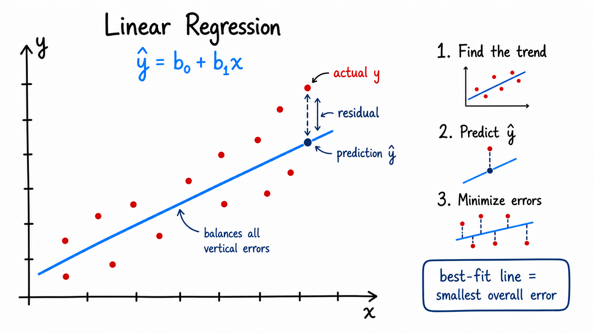
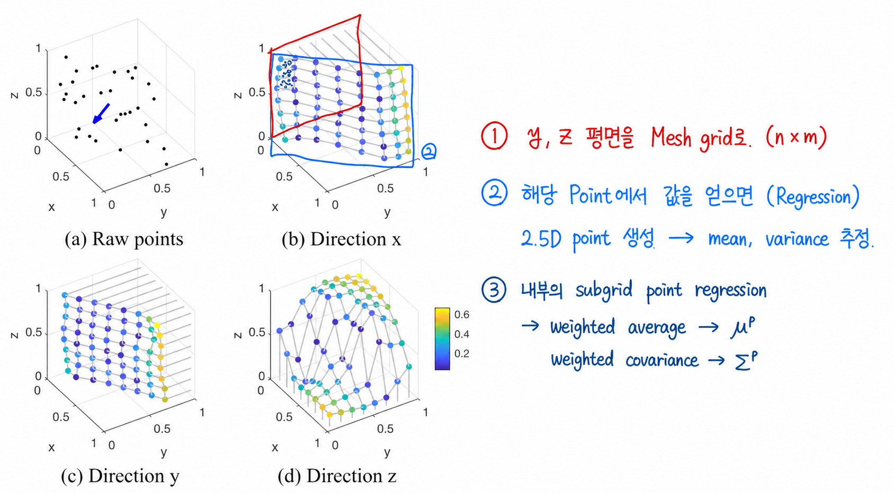

```{r setup, include=FALSE}
knitr::opts_chunk$set(echo = FALSE, warning = FALSE, message = FALSE)
```

<!-- class: title-slide
count: false -->
# Contents

.contents-list[
- Concept
- Properties of Gaussian 
- Marginalization
- Gaussian Process Regression
]

---
# Concept
#### What is Regression?
- We can say, **get unknown information** from observed data
- In 2D, we can visualize it as shown below using linear regression

.pull-left[
  - Goal of linear regression is to find optimal $b_0$, and $b_1$
    - Same as a line equation
    - $b_0$ : shift on y-axis
    - $b_1$ : slope of the regression line 
]

.pull-right.mt-02[

]

---
# Properties of Gaussian Distributions
- There are two important properties of gaussian distributions
- **First: Linearity**
  - Assume that a random vector $\mathbf{x}$ follows a multivariate Gaussian distribution.
$$\mathbf{x} \sim \mathcal{N}(\mu, \Sigma)$$

  - An affine transformation of a Gaussian random vector is also Gaussian.
        - We can think as linear transformation
        - Transformation matrix $\mathbf{T} = \begin{bmatrix} \mathbf{R} \ | \ \mathbf{t} \end{bmatrix}$ is given, then

$$\mathbf{y} = \mathbf{R}\mathbf{x} + \mathbf{t} \text{,} \quad \mathbf{y} \sim \mathcal{N}(\mathbf{R}\mu + \mathbf{t}, \mathbf{R} \Sigma \mathbf{R}^{\top})$$

  

---
# Properties of Gaussian Distributions

- **Second property: If the joint distribution is Gaussian, its marginal and conditional distributions are also Gaussian.**

- By the definition of conditional probability, the joint probability can be factorized as

$$\begin{aligned} 
p(\mathbf{y} \mid \mathbf{x}) = \frac{p(\mathbf{x},\mathbf{y})}{p(\mathbf{x})} \text{,} \quad
p(\mathbf{y} \mid \mathbf{x})p(\mathbf{x}) = \frac{p(\mathbf{x},\mathbf{y})}{p(\mathbf{x})}p(\mathbf{x}) = p(\mathbf{x},\mathbf{y})\text{,} \quad
\therefore\quad p(\mathbf{x},\mathbf{y}) = p(\mathbf{y} \mid \mathbf{x})p(\mathbf{x})
\end{aligned}$$

- Now, assume that $\mathbf{x}$ and $\mathbf{y}$ are Gaussian:

$$\begin{bmatrix}
\mathbf{x} \\ \mathbf{y}
\end{bmatrix} \sim
\mathcal{N}
(\begin{bmatrix} \boldsymbol{\mu}_{x} \\
\boldsymbol{\mu}_{y}
\end{bmatrix}
\text{,} \ 
\begin{bmatrix}
\boldsymbol{\Sigma}_{xx} & \boldsymbol{\Sigma}_{xy} \\
\boldsymbol{\Sigma}_{yx} & \boldsymbol{\Sigma}_{yy}
\end{bmatrix}
)$$

---
# Gaussian Process Regression
.center.nt-02[

]


<!-- xaringan::inf_mr('Mathmatics/Linear_Algebra/GPR/gpr.Rmd') -->
<!-- pagedown::chrome_print('Mathmatics/Linear_Algebra/GPR/gpr.html') -->
