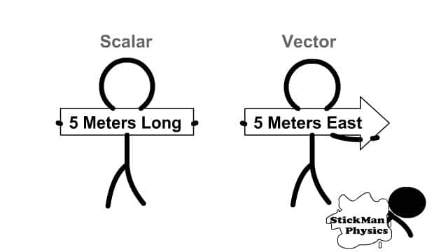

# Introduction of Linear Algebra for Robotics

### Computer Vision and Robotics LAB

##
## Minsu Kim

---
1. Scalars and Vectors
2. Matrices
3. Vector Products
4. Various type of Matrices

---
# 🔢 Scalars and Vectors
---

 Scalars and Vectors 
 

  
  

# 

 Vector always contains direction!

Is that ture..?

---

 Vectors always contains the direction! 

---

 Let's express in Spaces! 

|  |  |
|:--:|:--:|
| **기본 개념도** | **자동차 예시 포함** |

    

---
# ▦ Matrices

---

 Matrices 
 

---

# 🎯 Vector Products ✖️

---

 Vector Products 
 

---

# Various type of Matrices

---

 Various type of Matrices 
 

---