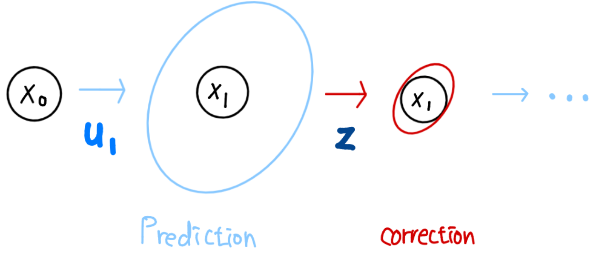
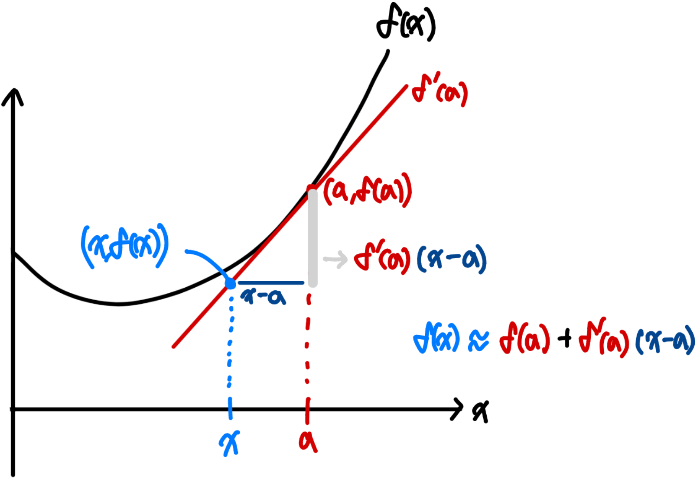
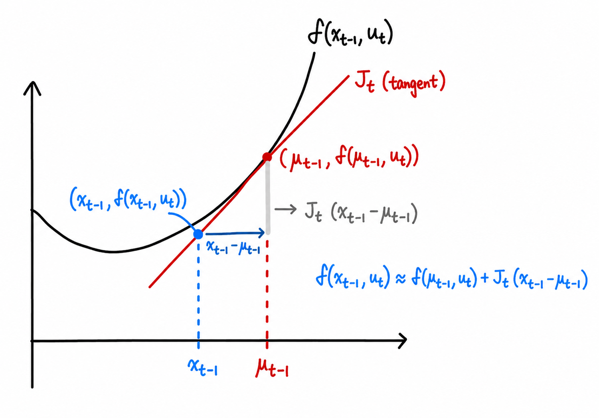

```{r setup, include=FALSE}
knitr::opts_chunk$set(echo = FALSE, warning = FALSE, message = FALSE)
```

class: title-slide
count: false


# Contents
.f-130[
- Review
  - Kalman Filter
  - Extended Kalman Filter

- Error State Kalman Filter
  - State Shift
  - ESKF
  - IESKF
]
    


<!-- ---
# Notations
- Scalars, Vectors, Matrices
  - Scalars: $x, y, z$
  - Vectors: $\mathbf{x}, \mathbf{y}, \mathbf{z}$
  - Matrices: $\mathbf{X}, \mathbf{Y}, \mathbf{Z}$ -->


---
# Review: Kalman Filter

.pull-left[


]

.pull-right[
- Linear motion and measurement model

$$\mathbf{x}_t = \mathbf{A}_t\mathbf{x}_{t-1} + \mathbf{B}_t\mathbf{u}_t + \mathbf{w}_t \text{,}
\qquad \mathbf{w}_t \sim \mathcal{N}(\mathbf{0},\mathbf{R}_t) \text{,}\\
\mathbf{z}_t = \mathbf{C}_t\mathbf{x}_t + \mathbf{v}_t\text{,}
\qquad \mathbf{v}_t \sim \mathcal{N}(\mathbf{0},\mathbf{Q}_t)$$

- Prediction model

$$\bar{\boldsymbol{\mu}}_t = \mathbf{A}_t \boldsymbol{\mu}_{t-1} + \mathbf{B}_t\mathbf{u}_t \text{,} \\
\bar{\boldsymbol{\Sigma}}_t = \mathbf{A}_t\boldsymbol{\Sigma}_{t-1}\mathbf{A}_t^{\top}  + \mathbf{R}_t$$

$$\boxed{
\begin{gathered}
\mathbf{K}_t
= \bar{\boldsymbol{\Sigma}}_t\mathbf{C}_t^\top
\left(\mathbf{C}_t\bar{\boldsymbol{\Sigma}}_t\mathbf{C}_t^\top
+\mathbf{Q}_t\right)^{-1},\\
\boldsymbol{\mu}_t
= \bar{\boldsymbol{\mu}}_t
+\mathbf{K}_t\left(\mathbf{z}_t-\mathbf{C}_t\bar{\boldsymbol{\mu}}_t\right),\\
\boldsymbol{\Sigma}_t
= \left(\mathbf{I}-\mathbf{K}_t\mathbf{C}_t\right)
\bar{\boldsymbol{\Sigma}}_t.
\end{gathered}}$$
]

---
# Review: Extended Kalman Filter

.pull-left[

]

.pull-right[
- Motion and measurement model in nonlinear case

$$\begin{gathered}
\mathbf{x}_t = f(\mathbf{x}_{t-1},\mathbf{u}_t)+\mathbf{w}_t,\\
\mathbf{z}_t = h(\mathbf{x}_t)+\mathbf{v}_t.
\end{gathered}$$

-First-order Taylor approximation

$$\boxed{
f(\mathbf{x}) \approx
f(\mathbf{a})
+\mathbf{J}_f(\mathbf{a})(\mathbf{x}-\mathbf{a})}$$

$$\mathbf{F}_t
=\left.\frac{\partial f}{\partial\mathbf{x}}\right|_{\boldsymbol{\mu}_{t-1}},
\qquad
\mathbf{H}_t
=\left.\frac{\partial h}{\partial\mathbf{x}}\right|_{\bar{\boldsymbol{\mu}}_t}$$

]

---
# Review: Extended Kalman Filter

.pull-left[

]

.pull-right[
Prediction

$$\begin{gathered}
\bar{\boldsymbol{\mu}}_t
= f(\boldsymbol{\mu}_{t-1},\mathbf{u}_t),\\
\bar{\boldsymbol{\Sigma}}_t
= \mathbf{F}_t\boldsymbol{\Sigma}_{t-1}\mathbf{F}_t^\top
+\mathbf{R}_t.
\end{gathered}$$

Correction

$$\begin{gathered}
\mathbf{K}_t
= \bar{\boldsymbol{\Sigma}}_t\mathbf{H}_t^\top
\left(\mathbf{H}_t\bar{\boldsymbol{\Sigma}}_t\mathbf{H}_t^\top
+\mathbf{Q}_t\right)^{-1},\\
\boldsymbol{\mu}_t
= \bar{\boldsymbol{\mu}}_t
+\mathbf{K}_t\left(\mathbf{z}_t-h(\bar{\boldsymbol{\mu}}_t)\right),\\
\boldsymbol{\Sigma}_t
= (\mathbf{I}-\mathbf{K}_t\mathbf{H}_t)
\bar{\boldsymbol{\Sigma}}_t.
\end{gathered}$$

]

---


  
    
class: center, middle

# Error-State Kalman Filter

### Nonlinear nominal state, locally linear error state

$$\mathbf{x}_t^{\mathrm{true}}
=\boldsymbol{\mu}_t\oplus\delta\mathbf{x}_t,
\qquad
\delta\mathbf{x}_t\sim
\mathcal{N}(\mathbf{0},\boldsymbol{\Sigma}_t)$$

---
# ESKF - Notation

- $\mathcal{M}$: state manifold
- $\boldsymbol{\mu}\in\mathcal{M}$: nominal state
- $\delta\mathbf{x}\in\mathbb{R}^{n}$: local error state

$$\begin{gathered}
\oplus:\mathcal{M}\times\mathbb{R}^{n}\rightarrow\mathcal{M},\\
\ominus:\mathcal{M}\times\mathcal{M}\rightarrow\mathbb{R}^{n},\\
\mathbf{x}^{\mathrm{true}}
=\boldsymbol{\mu}\oplus\delta\mathbf{x},\\
\delta\mathbf{x}
=\mathbf{x}^{\mathrm{true}}\ominus\boldsymbol{\mu}.
\end{gathered}$$

The operators satisfy the local identities

$$\boldsymbol{\mu}\oplus\mathbf{0}=\boldsymbol{\mu},
\qquad
(\boldsymbol{\mu}\oplus\delta\mathbf{x})\ominus\boldsymbol{\mu}
\simeq\delta\mathbf{x}$$

---
# ESKF - Why Error State?

The full state is generally not a vector.

$$\mathbf{R}+\delta\boldsymbol{\theta}
\notin\mathrm{SO}(3)$$

The error state remains small and lives in a local vector space.

$$\mathbf{R}^{\mathrm{true}}
=\bar{\mathbf{R}}\operatorname{Exp}
\left([\delta\boldsymbol{\theta}]_{\times}\right)$$

- Propagate the nonlinear nominal state without forcing it into a Gaussian vector.
- Propagate only the small error by a first-order linear model.
- Correct the nominal state by injecting the estimated error.

---
# ESKF - State on Manifold

.pull-left[

]

.pull-right[
The covariance describes uncertainty in the tangent space, not directly on the manifold.

$$\delta\mathbf{x}
\sim\mathcal{N}(\mathbf{0},\boldsymbol{\Sigma})$$

$$\mathbf{x}^{\mathrm{true}}
=\boldsymbol{\mu}\oplus\delta\mathbf{x}$$

For rotation with a right perturbation,

$$\mathbf{R}^{\mathrm{true}}
=\boldsymbol{\mu}_{\mathbf{R}}
\operatorname{Exp}
\left([\delta\boldsymbol{\theta}]_{\times}\right)$$

The nominal state may move far globally while the local error remains small.
]

---
# ESKF - IMU State Example

Nominal state

$$\boldsymbol{\mu}
=\left(
\mathbf{p},\mathbf{v},\mathbf{R},
\mathbf{b}_{a},\mathbf{b}_{g},\mathbf{g}
\right)$$

Error state

$$\delta\mathbf{x}
=\left(
\delta\mathbf{p}^{\top},
\delta\mathbf{v}^{\top},
\delta\boldsymbol{\theta}^{\top},
\delta\mathbf{b}_{a}^{\top},
\delta\mathbf{b}_{g}^{\top},
\delta\mathbf{g}^{\top}
\right)^{\top}$$

Injection rule

$$\begin{gathered}
\mathbf{p}^{+}=\mathbf{p}+\delta\mathbf{p},
\qquad
\mathbf{v}^{+}=\mathbf{v}+\delta\mathbf{v},\\
\mathbf{R}^{+}
=\mathbf{R}\operatorname{Exp}
\left([\delta\boldsymbol{\theta}]_{\times}\right),\\
\mathbf{b}_{a}^{+}=\mathbf{b}_{a}+\delta\mathbf{b}_{a},
\qquad
\mathbf{b}_{g}^{+}=\mathbf{b}_{g}+\delta\mathbf{b}_{g},
\qquad
\mathbf{g}^{+}=\mathbf{g}+\delta\mathbf{g}.
\end{gathered}$$

---
# ESKF - Overall Process

At time $t-1$,

$$\mathbf{x}_{t-1}^{\mathrm{true}}
=\boldsymbol{\mu}_{t-1}\oplus\delta\mathbf{x}_{t-1}$$

One ESKF step consists of

$$\boxed{
\text{Prediction}
\ \longrightarrow\
\text{Error correction}
\ \longrightarrow\
\text{Injection}
\ \longrightarrow\
\text{Reset}}$$

$$\begin{gathered}
(\boldsymbol{\mu}_{t-1},\boldsymbol{\Sigma}_{t-1})
\longrightarrow
(\bar{\boldsymbol{\mu}}_{t},\bar{\boldsymbol{\Sigma}}_{t}),\\
(\bar{\boldsymbol{\mu}}_{t},\bar{\boldsymbol{\Sigma}}_{t})
\longrightarrow
(\widehat{\delta\mathbf{x}}_{t},\boldsymbol{\Sigma}_{t}^{\mathrm{corr}}),\\
\boldsymbol{\mu}_{t}
=\bar{\boldsymbol{\mu}}_{t}\oplus\widehat{\delta\mathbf{x}}_{t},
\qquad
\delta\mathbf{x}_{t}\leftarrow\mathbf{0}.
\end{gathered}$$

---
# ESKF - Prediction Model

Nonlinear process model

$$\mathbf{x}_{t}^{\mathrm{true}}
=f\left(
\mathbf{x}_{t-1}^{\mathrm{true}},
\mathbf{u}_{t},\mathbf{w}_{t}
\right),
\qquad
\mathbf{w}_{t}\sim\mathcal{N}(\mathbf{0},\mathbf{R}_{t})$$

Nominal propagation

$$\bar{\boldsymbol{\mu}}_{t}
=f\left(
\boldsymbol{\mu}_{t-1},\mathbf{u}_{t},\mathbf{0}
\right)$$

Local Jacobians

$$\begin{gathered}
\mathbf{F}_{t}
=\left.
\frac{\partial
\left[
f(\boldsymbol{\mu}_{t-1}\oplus\delta\mathbf{x},
\mathbf{u}_{t},\mathbf{0})
\ominus\bar{\boldsymbol{\mu}}_{t}
\right]}
{\partial\delta\mathbf{x}}
\right|_{\delta\mathbf{x}=\mathbf{0}},\\
\mathbf{L}_{t}
=\left.
\frac{\partial
\left[
f(\boldsymbol{\mu}_{t-1},\mathbf{u}_{t},\mathbf{w})
\ominus\bar{\boldsymbol{\mu}}_{t}
\right]}
{\partial\mathbf{w}}
\right|_{\mathbf{w}=\mathbf{0}}.
\end{gathered}$$

---
# ESKF - Error Dynamics Derivation

Substitute the true state into the process model.

$$\delta\mathbf{x}_{t}
=f\left(
\boldsymbol{\mu}_{t-1}\oplus\delta\mathbf{x}_{t-1},
\mathbf{u}_{t},\mathbf{w}_{t}
\right)
\ominus
f\left(
\boldsymbol{\mu}_{t-1},\mathbf{u}_{t},\mathbf{0}
\right)$$

First-order expansion around
$\delta\mathbf{x}_{t-1}=\mathbf{0}$ and $\mathbf{w}_{t}=\mathbf{0}$ gives

$$\boxed{
\delta\mathbf{x}_{t}
\simeq
\mathbf{F}_{t}\delta\mathbf{x}_{t-1}
+\mathbf{L}_{t}\mathbf{w}_{t}}$$

Therefore,

$$\mathbb{E}[\delta\mathbf{x}_{t}]=\mathbf{0}$$

when the previous error and process noise are zero mean.

---
# ESKF - Prediction Mean

The nominal state is propagated through the original nonlinear dynamics.

$$\bar{\boldsymbol{\mu}}_{t}
=f\left(
\boldsymbol{\mu}_{t-1},\mathbf{u}_{t},\mathbf{0}
\right)$$

For an IMU with sampling time $\Delta t$,

$$\begin{gathered}
\bar{\mathbf{p}}_{t}
=\mathbf{p}_{t-1}
+\mathbf{v}_{t-1}\Delta t
+\frac{1}{2}
\left[
\mathbf{R}_{t-1}(\mathbf{a}_{m}-\mathbf{b}_{a})
+\mathbf{g}_{t-1}
\right]\Delta t^{2},\\
\bar{\mathbf{v}}_{t}
=\mathbf{v}_{t-1}
+\left[
\mathbf{R}_{t-1}(\mathbf{a}_{m}-\mathbf{b}_{a})
+\mathbf{g}_{t-1}
\right]\Delta t,\\
\bar{\mathbf{R}}_{t}
=\mathbf{R}_{t-1}
\operatorname{Exp}
\left(
[\boldsymbol{\omega}_{m}-\mathbf{b}_{g}]_{\times}\Delta t
\right),\\
\bar{\mathbf{b}}_{a,t}=\mathbf{b}_{a,t-1},
\qquad
\bar{\mathbf{b}}_{g,t}=\mathbf{b}_{g,t-1},
\qquad
\bar{\mathbf{g}}_{t}=\mathbf{g}_{t-1}.
\end{gathered}$$

---
# ESKF - Prediction Covariance

From the linearized error dynamics,

$$\delta\mathbf{x}_{t}
\simeq
\mathbf{F}_{t}\delta\mathbf{x}_{t-1}
+\mathbf{L}_{t}\mathbf{w}_{t}$$

and the independence of
$\delta\mathbf{x}_{t-1}$ and $\mathbf{w}_{t}$,

$$\begin{gathered}
\bar{\boldsymbol{\Sigma}}_{t}
=\mathbb{E}
\left[
\delta\mathbf{x}_{t}\delta\mathbf{x}_{t}^{\top}
\right],\\
\boxed{
\bar{\boldsymbol{\Sigma}}_{t}
=\mathbf{F}_{t}\boldsymbol{\Sigma}_{t-1}\mathbf{F}_{t}^{\top}
+\mathbf{L}_{t}\mathbf{R}_{t}\mathbf{L}_{t}^{\top}}.
\end{gathered}$$

The nominal state follows $f$, while the covariance follows the local linear error model.

---
# ESKF - Measurement Residual

Measurement model

$$\mathbf{z}_{t}
=h\left(\mathbf{x}_{t}^{\mathrm{true}},\mathbf{v}_{t}\right),
\qquad
\mathbf{v}_{t}\sim\mathcal{N}(\mathbf{0},\mathbf{Q}_{t})$$

Insert
$\mathbf{x}_{t}^{\mathrm{true}}
=\bar{\boldsymbol{\mu}}_{t}\oplus\delta\mathbf{x}_{t}$:

$$\mathbf{z}_{t}
\simeq
h(\bar{\boldsymbol{\mu}}_{t},\mathbf{0})
+\mathbf{H}_{t}\delta\mathbf{x}_{t}
+\mathbf{M}_{t}\mathbf{v}_{t}$$

Thus the residual is

$$\boxed{
\mathbf{r}_{t}
=\mathbf{z}_{t}-h(\bar{\boldsymbol{\mu}}_{t},\mathbf{0})
\simeq
\mathbf{H}_{t}\delta\mathbf{x}_{t}
+\mathbf{M}_{t}\mathbf{v}_{t}}$$

---
# ESKF - Measurement Jacobian

The Jacobian must perturb the nominal state with $\oplus$.

$$\mathbf{H}_{t}
=\left.
\frac{\partial
h(\bar{\boldsymbol{\mu}}_{t}\oplus\delta\mathbf{x},\mathbf{0})}
{\partial\delta\mathbf{x}}
\right|_{\delta\mathbf{x}=\mathbf{0}}$$

The measurement-noise Jacobian is

$$\mathbf{M}_{t}
=\left.
\frac{\partial
h(\bar{\boldsymbol{\mu}}_{t},\mathbf{v})}
{\partial\mathbf{v}}
\right|_{\mathbf{v}=\mathbf{0}}$$

Therefore the effective residual covariance is

$$\boxed{
\widetilde{\mathbf{Q}}_{t}
=\mathbf{M}_{t}\mathbf{Q}_{t}\mathbf{M}_{t}^{\top}}$$

For additive measurement noise,
$\mathbf{M}_{t}=\mathbf{I}$ and
$\widetilde{\mathbf{Q}}_{t}=\mathbf{Q}_{t}$.

---
# ESKF - Correction as MAP

Prior error distribution

$$\delta\mathbf{x}_{t}
\sim
\mathcal{N}
\left(
\mathbf{0},\bar{\boldsymbol{\Sigma}}_{t}
\right)$$

Linearized likelihood

$$\mathbf{r}_{t}\mid\delta\mathbf{x}_{t}
\sim
\mathcal{N}
\left(
\mathbf{H}_{t}\delta\mathbf{x}_{t},
\widetilde{\mathbf{Q}}_{t}
\right)$$

The maximum a posteriori estimate minimizes

$$\boxed{
\widehat{\delta\mathbf{x}}_{t}
=\underset{\delta\mathbf{x}}{\operatorname{argmin}}
\left[
\delta\mathbf{x}^{\top}
\bar{\boldsymbol{\Sigma}}_{t}^{-1}
\delta\mathbf{x}
+(\mathbf{r}_{t}-\mathbf{H}_{t}\delta\mathbf{x})^{\top}
\widetilde{\mathbf{Q}}_{t}^{-1}
(\mathbf{r}_{t}-\mathbf{H}_{t}\delta\mathbf{x})
\right]}$$

---
# ESKF - MAP Normal Equation

Differentiate the MAP objective with respect to $\delta\mathbf{x}$.

$$\begin{gathered}
\frac{1}{2}
\frac{\partial}{\partial\delta\mathbf{x}}
\left(
\delta\mathbf{x}^{\top}
\bar{\boldsymbol{\Sigma}}_{t}^{-1}\delta\mathbf{x}
\right)
=\bar{\boldsymbol{\Sigma}}_{t}^{-1}\delta\mathbf{x},\\
\frac{1}{2}
\frac{\partial}{\partial\delta\mathbf{x}}
\left[
(\mathbf{r}_{t}-\mathbf{H}_{t}\delta\mathbf{x})^{\top}
\widetilde{\mathbf{Q}}_{t}^{-1}
(\mathbf{r}_{t}-\mathbf{H}_{t}\delta\mathbf{x})
\right]\\
=-\mathbf{H}_{t}^{\top}
\widetilde{\mathbf{Q}}_{t}^{-1}
(\mathbf{r}_{t}-\mathbf{H}_{t}\delta\mathbf{x}).
\end{gathered}$$

Setting the gradient to zero gives

$$\boxed{
\left(
\bar{\boldsymbol{\Sigma}}_{t}^{-1}
+\mathbf{H}_{t}^{\top}\widetilde{\mathbf{Q}}_{t}^{-1}\mathbf{H}_{t}
\right)
\widehat{\delta\mathbf{x}}_{t}
=\mathbf{H}_{t}^{\top}
\widetilde{\mathbf{Q}}_{t}^{-1}\mathbf{r}_{t}}$$

---
# ESKF - From MAP to Kalman Gain

Define

$$\mathbf{K}_{t}
=\bar{\boldsymbol{\Sigma}}_{t}\mathbf{H}_{t}^{\top}
\left(
\mathbf{H}_{t}\bar{\boldsymbol{\Sigma}}_{t}\mathbf{H}_{t}^{\top}
+\widetilde{\mathbf{Q}}_{t}
\right)^{-1}$$

It satisfies

$$\left(
\bar{\boldsymbol{\Sigma}}_{t}^{-1}
+\mathbf{H}_{t}^{\top}\widetilde{\mathbf{Q}}_{t}^{-1}\mathbf{H}_{t}
\right)\mathbf{K}_{t}
=\mathbf{H}_{t}^{\top}\widetilde{\mathbf{Q}}_{t}^{-1}$$

so the MAP solution becomes

$$\boxed{
\widehat{\delta\mathbf{x}}_{t}
=\mathbf{K}_{t}\mathbf{r}_{t}}$$

This is the Kalman correction, but it estimates the local error rather than the full state.

---
# ESKF - Posterior Covariance

The inverse Hessian of the quadratic MAP objective is

$$\boldsymbol{\Sigma}_{t}^{\mathrm{corr}}
=\left(
\bar{\boldsymbol{\Sigma}}_{t}^{-1}
+\mathbf{H}_{t}^{\top}\widetilde{\mathbf{Q}}_{t}^{-1}\mathbf{H}_{t}
\right)^{-1}$$

Using the matrix inversion lemma,

$$\boxed{
\boldsymbol{\Sigma}_{t}^{\mathrm{corr}}
=
\left(
\mathbf{I}-\mathbf{K}_{t}\mathbf{H}_{t}
\right)
\bar{\boldsymbol{\Sigma}}_{t}}$$

The numerically safer Joseph form is

$$\boldsymbol{\Sigma}_{t}^{\mathrm{corr}}
=
(\mathbf{I}-\mathbf{K}_{t}\mathbf{H}_{t})
\bar{\boldsymbol{\Sigma}}_{t}
(\mathbf{I}-\mathbf{K}_{t}\mathbf{H}_{t})^{\top}
+\mathbf{K}_{t}\widetilde{\mathbf{Q}}_{t}\mathbf{K}_{t}^{\top}$$

---
# ESKF - Injection

The correction is first obtained in the tangent space.

$$\widehat{\delta\mathbf{x}}_{t}
=\mathbf{K}_{t}\mathbf{r}_{t}$$

It is then injected into the nominal state.

$$\boxed{
\boldsymbol{\mu}_{t}
=\bar{\boldsymbol{\mu}}_{t}
\oplus\widehat{\delta\mathbf{x}}_{t}}$$

The remaining error relative to the new nominal state is

$$\delta\mathbf{x}_{t}^{+}
=
\left(
\bar{\boldsymbol{\mu}}_{t}\oplus\delta\mathbf{x}_{t}
\right)
\ominus
\left(
\bar{\boldsymbol{\mu}}_{t}
\oplus\widehat{\delta\mathbf{x}}_{t}
\right)$$

Injection changes the reference point at which the error covariance is expressed.

---
# ESKF - Reset

After injection, the estimated error mean is reset to zero.

$$\widehat{\delta\mathbf{x}}_{t}^{+}=\mathbf{0}$$

Define the reset Jacobian

$$\mathbf{G}_{t}
=\left.
\frac{\partial\delta\mathbf{x}_{t}^{+}}
{\partial
(\delta\mathbf{x}_{t}-\widehat{\delta\mathbf{x}}_{t})}
\right|_{\delta\mathbf{x}_{t}=\widehat{\delta\mathbf{x}}_{t}}$$

Then transport the covariance to the tangent space of the updated nominal state.

$$\boxed{
\boldsymbol{\Sigma}_{t}
=\mathbf{G}_{t}
\boldsymbol{\Sigma}_{t}^{\mathrm{corr}}
\mathbf{G}_{t}^{\top}}$$

For Euclidean components, $\mathbf{G}_{t}=\mathbf{I}$.
For rotational components, the reference change is not identity.

---
# ESKF - Reset Jacobian for Rotation

With a right perturbation,

$$\begin{gathered}
\mathbf{R}^{\mathrm{true}}
=\bar{\mathbf{R}}\operatorname{Exp}
([\delta\boldsymbol{\theta}^{\mathrm{true}}]_{\times}),\\
\widehat{\mathbf{R}}
=\bar{\mathbf{R}}\operatorname{Exp}
([\widehat{\delta\boldsymbol{\theta}}]_{\times}),\\
\mathbf{R}^{\mathrm{true}}
=\widehat{\mathbf{R}}\operatorname{Exp}
([\delta\boldsymbol{\theta}^{+}]_{\times}).
\end{gathered}$$

Therefore,

$$\delta\boldsymbol{\theta}^{+}
=\operatorname{Log}
\left[
\operatorname{Exp}
(-[\widehat{\delta\boldsymbol{\theta}}]_{\times})
\operatorname{Exp}
([\delta\boldsymbol{\theta}^{\mathrm{true}}]_{\times})
\right]$$

Let
$\delta\boldsymbol{\theta}^{\mathrm{true}}
=\widehat{\delta\boldsymbol{\theta}}+\boldsymbol{\epsilon}$.
First-order expansion gives

$$\boxed{
\delta\boldsymbol{\theta}^{+}
\simeq
\mathbf{J}_{r}
(\widehat{\delta\boldsymbol{\theta}})
\boldsymbol{\epsilon},
\qquad
\mathbf{G}_{\theta}
\simeq
\mathbf{I}
-\frac{1}{2}
[\widehat{\delta\boldsymbol{\theta}}]_{\times}}$$

---
# ESKF - Summary

Prediction

$$\begin{gathered}
\bar{\boldsymbol{\mu}}_{t}
=f(\boldsymbol{\mu}_{t-1},\mathbf{u}_{t},\mathbf{0}),\\
\bar{\boldsymbol{\Sigma}}_{t}
=\mathbf{F}_{t}\boldsymbol{\Sigma}_{t-1}\mathbf{F}_{t}^{\top}
+\mathbf{L}_{t}\mathbf{R}_{t}\mathbf{L}_{t}^{\top}.
\end{gathered}$$

Correction

$$\begin{gathered}
\mathbf{r}_{t}
=\mathbf{z}_{t}-h(\bar{\boldsymbol{\mu}}_{t},\mathbf{0}),\\
\mathbf{K}_{t}
=\bar{\boldsymbol{\Sigma}}_{t}\mathbf{H}_{t}^{\top}
(\mathbf{H}_{t}\bar{\boldsymbol{\Sigma}}_{t}\mathbf{H}_{t}^{\top}
+\widetilde{\mathbf{Q}}_{t})^{-1},\\
\widehat{\delta\mathbf{x}}_{t}
=\mathbf{K}_{t}\mathbf{r}_{t}.
\end{gathered}$$

Injection and reset

$$\begin{gathered}
\boldsymbol{\mu}_{t}
=\bar{\boldsymbol{\mu}}_{t}\oplus\widehat{\delta\mathbf{x}}_{t},\\
\boldsymbol{\Sigma}_{t}
=\mathbf{G}_{t}
(\mathbf{I}-\mathbf{K}_{t}\mathbf{H}_{t})
\bar{\boldsymbol{\Sigma}}_{t}
\mathbf{G}_{t}^{\top}.
\end{gathered}$$

---
# From ESKF to Iteration

The ESKF linearizes the measurement once at the predicted state.

$$h(\bar{\boldsymbol{\mu}}_{t}\oplus\delta\mathbf{x})
\simeq
h(\bar{\boldsymbol{\mu}}_{t})
+\mathbf{H}_{t}\delta\mathbf{x}$$

If the initial residual is large or $h$ is strongly nonlinear, one tangent approximation may be insufficient.

$$\bar{\boldsymbol{\mu}}_{t}
\longrightarrow
\boldsymbol{\mu}_{t,1}
\longrightarrow
\boldsymbol{\mu}_{t,2}
\longrightarrow
\cdots
\longrightarrow
\boldsymbol{\mu}_{t,\star}$$

The iterative filter repeats only the measurement linearization and correction.
The prediction prior remains fixed during the iterations.

---
# IEKF and IESKF

- Iterated EKF: repeated measurement linearization in a Euclidean state.
- Iterated ESKF: repeated measurement linearization in a local error state on a manifold.

Both solve the same nonlinear posterior more accurately by Gauss-Newton iterations.

$$\boldsymbol{\mu}_{t,0}
=\bar{\boldsymbol{\mu}}_{t}$$

At iteration $j$,

$$\boldsymbol{\mu}_{t,j+1}
=\boldsymbol{\mu}_{t,j}
\oplus\delta\boldsymbol{\mu}_{t,j}$$

The error coordinate and its covariance must be transported whenever the linearization point changes.

---
# IESKF - MAP Objective

The predicted state and covariance define a fixed prior.

$$\mathbf{x}_{t}
\sim
\mathcal{N}_{\mathcal{M}}
\left(
\bar{\boldsymbol{\mu}}_{t},
\bar{\boldsymbol{\Sigma}}_{t}
\right)$$

The nonlinear MAP problem is

$$\boxed{
\boldsymbol{\mu}_{t}^{\star}
=\underset{\mathbf{x}\in\mathcal{M}}{\operatorname{argmin}}
\left[
\|\mathbf{x}\ominus\bar{\boldsymbol{\mu}}_{t}\|_
{\bar{\boldsymbol{\Sigma}}_{t}^{-1}}^{2}
+\|\mathbf{z}_{t}-h(\mathbf{x},\mathbf{0})\|_
{\widetilde{\mathbf{Q}}_{t}^{-1}}^{2}
\right]}$$

where

$$\|\mathbf{a}\|_{\mathbf{W}}^{2}
=\mathbf{a}^{\top}\mathbf{W}\mathbf{a}$$

---
# IESKF - Prior Transport

At the current iterate $\boldsymbol{\mu}_{t,j}$, define

$$\mathbf{d}_{t,j}
=\boldsymbol{\mu}_{t,j}
\ominus\bar{\boldsymbol{\mu}}_{t}$$

For a local increment $\delta\boldsymbol{\mu}$,

$$\left(
\boldsymbol{\mu}_{t,j}\oplus\delta\boldsymbol{\mu}
\right)
\ominus\bar{\boldsymbol{\mu}}_{t}
\simeq
\mathbf{d}_{t,j}
+\mathbf{J}_{t,j}\delta\boldsymbol{\mu}$$

with

$$\mathbf{J}_{t,j}
=\left.
\frac{\partial
\left[
(\boldsymbol{\mu}_{t,j}\oplus\delta\boldsymbol{\mu})
\ominus\bar{\boldsymbol{\mu}}_{t}
\right]}
{\partial\delta\boldsymbol{\mu}}
\right|_{\delta\boldsymbol{\mu}=\mathbf{0}}$$

---
# IESKF - Prior in the Current Tangent

Define the transported prior covariance and prior offset

$$\begin{gathered}
\bar{\boldsymbol{\Sigma}}_{t,j}
=\mathbf{J}_{t,j}^{-1}
\bar{\boldsymbol{\Sigma}}_{t}
\mathbf{J}_{t,j}^{-\top},\\
\mathbf{e}_{t,j}
=\mathbf{J}_{t,j}^{-1}\mathbf{d}_{t,j}.
\end{gathered}$$

Then

$$\|\mathbf{d}_{t,j}
+\mathbf{J}_{t,j}\delta\boldsymbol{\mu}\|_
{\bar{\boldsymbol{\Sigma}}_{t}^{-1}}^{2}
=
\|\delta\boldsymbol{\mu}+\mathbf{e}_{t,j}\|_
{\bar{\boldsymbol{\Sigma}}_{t,j}^{-1}}^{2}$$

The prior is centered at $-\mathbf{e}_{t,j}$ in the current tangent space, not at zero.

---
# IESKF - Measurement Linearization

Residual at the current iterate

$$\mathbf{r}_{t,j}
=\mathbf{z}_{t}
-h(\boldsymbol{\mu}_{t,j},\mathbf{0})$$

Linearize using a local increment.

$$h(
\boldsymbol{\mu}_{t,j}\oplus\delta\boldsymbol{\mu},
\mathbf{0})
\simeq
h(\boldsymbol{\mu}_{t,j},\mathbf{0})
+\mathbf{H}_{t,j}\delta\boldsymbol{\mu}$$

$$\mathbf{H}_{t,j}
=\left.
\frac{\partial
h(\boldsymbol{\mu}_{t,j}\oplus\delta\boldsymbol{\mu},\mathbf{0})}
{\partial\delta\boldsymbol{\mu}}
\right|_{\delta\boldsymbol{\mu}=\mathbf{0}}$$

Thus

$$\mathbf{r}_{t,j}
\simeq
\mathbf{H}_{t,j}\delta\boldsymbol{\mu}
+\mathbf{M}_{t,j}\mathbf{v}_{t}$$

---
# IESKF - Quadratic Subproblem

Combining the transported prior and the linearized measurement gives

$$\boxed{
\delta\boldsymbol{\mu}_{t,j}
=\underset{\delta\boldsymbol{\mu}}{\operatorname{argmin}}
\left[
\|\delta\boldsymbol{\mu}+\mathbf{e}_{t,j}\|_
{\bar{\boldsymbol{\Sigma}}_{t,j}^{-1}}^{2}
+\|\mathbf{r}_{t,j}
-\mathbf{H}_{t,j}\delta\boldsymbol{\mu}\|_
{\widetilde{\mathbf{Q}}_{t,j}^{-1}}^{2}
\right]}$$

where

$$\widetilde{\mathbf{Q}}_{t,j}
=\mathbf{M}_{t,j}\mathbf{Q}_{t}\mathbf{M}_{t,j}^{\top}$$

This is one Gauss-Newton step of the nonlinear MAP problem.

---
# IESKF - Normal Equation

Differentiate the quadratic subproblem.

$$\begin{gathered}
\bar{\boldsymbol{\Sigma}}_{t,j}^{-1}
(\delta\boldsymbol{\mu}+\mathbf{e}_{t,j})
-\mathbf{H}_{t,j}^{\top}
\widetilde{\mathbf{Q}}_{t,j}^{-1}
(\mathbf{r}_{t,j}-\mathbf{H}_{t,j}\delta\boldsymbol{\mu})
=\mathbf{0},\\
\left(
\bar{\boldsymbol{\Sigma}}_{t,j}^{-1}
+\mathbf{H}_{t,j}^{\top}
\widetilde{\mathbf{Q}}_{t,j}^{-1}
\mathbf{H}_{t,j}
\right)
\delta\boldsymbol{\mu}_{t,j}\\
=\mathbf{H}_{t,j}^{\top}
\widetilde{\mathbf{Q}}_{t,j}^{-1}\mathbf{r}_{t,j}
-\bar{\boldsymbol{\Sigma}}_{t,j}^{-1}\mathbf{e}_{t,j}.
\end{gathered}$$

The additional prior-offset term appears because the iterate is no longer the predicted mean.

---
# IESKF - Kalman Form

Define the iteration-dependent gain

$$\mathbf{K}_{t,j}
=\bar{\boldsymbol{\Sigma}}_{t,j}
\mathbf{H}_{t,j}^{\top}
\left(
\mathbf{H}_{t,j}\bar{\boldsymbol{\Sigma}}_{t,j}
\mathbf{H}_{t,j}^{\top}
+\widetilde{\mathbf{Q}}_{t,j}
\right)^{-1}$$

Using

$$\begin{gathered}
\mathbf{A}_{t,j}^{-1}
\mathbf{H}_{t,j}^{\top}
\widetilde{\mathbf{Q}}_{t,j}^{-1}
=\mathbf{K}_{t,j},\\
\mathbf{A}_{t,j}^{-1}
\bar{\boldsymbol{\Sigma}}_{t,j}^{-1}
=\mathbf{I}-\mathbf{K}_{t,j}\mathbf{H}_{t,j},
\end{gathered}$$

the increment becomes

$$\boxed{
\delta\boldsymbol{\mu}_{t,j}
=\mathbf{K}_{t,j}
\left(
\mathbf{r}_{t,j}
+\mathbf{H}_{t,j}\mathbf{e}_{t,j}
\right)
-\mathbf{e}_{t,j}}$$

---
# IESKF - Why the Extra Term?

The naive repeated-EKF step would use

$$\delta\boldsymbol{\mu}_{t,j}
=\mathbf{K}_{t,j}\mathbf{r}_{t,j}$$

but this incorrectly assumes that the fixed prior is centered at every new iterate.

The correct step is

$$\delta\boldsymbol{\mu}_{t,j}
=\mathbf{K}_{t,j}
(\mathbf{r}_{t,j}
+\mathbf{H}_{t,j}\mathbf{e}_{t,j})
-\mathbf{e}_{t,j}$$

At the first iteration,

$$\boldsymbol{\mu}_{t,0}=\bar{\boldsymbol{\mu}}_{t}
\quad\Longrightarrow\quad
\mathbf{d}_{t,0}=\mathbf{e}_{t,0}=\mathbf{0}$$

so the first IESKF step is exactly the ordinary ESKF correction.

---
# IESKF - Iterative Update

Initialize once after prediction.

$$\boldsymbol{\mu}_{t,0}
=\bar{\boldsymbol{\mu}}_{t}$$

At each iteration,

$$\begin{gathered}
\mathbf{r}_{t,j}
=\mathbf{z}_{t}-h(\boldsymbol{\mu}_{t,j},\mathbf{0}),\\
\delta\boldsymbol{\mu}_{t,j}
=\mathbf{K}_{t,j}
(\mathbf{r}_{t,j}
+\mathbf{H}_{t,j}\mathbf{e}_{t,j})
-\mathbf{e}_{t,j},\\
\boldsymbol{\mu}_{t,j+1}
=\boldsymbol{\mu}_{t,j}
\oplus\delta\boldsymbol{\mu}_{t,j}.
\end{gathered}$$

Stop when

$$\|\delta\boldsymbol{\mu}_{t,j}\|<\epsilon$$

or when the maximum iteration count is reached.

---
# IESKF - Final Covariance and Reset

After convergence at iteration $j=\star$,

$$\boldsymbol{\Sigma}_{t,\star}^{\mathrm{corr}}
=
\left(
\bar{\boldsymbol{\Sigma}}_{t,\star}^{-1}
+\mathbf{H}_{t,\star}^{\top}
\widetilde{\mathbf{Q}}_{t,\star}^{-1}
\mathbf{H}_{t,\star}
\right)^{-1}$$

Equivalently,

$$\boldsymbol{\Sigma}_{t,\star}^{\mathrm{corr}}
=
(\mathbf{I}-\mathbf{K}_{t,\star}\mathbf{H}_{t,\star})
\bar{\boldsymbol{\Sigma}}_{t,\star}$$

Inject the final increment and reset its tangent coordinate.

$$\begin{gathered}
\boldsymbol{\mu}_{t}
=\boldsymbol{\mu}_{t,\star}
\oplus\delta\boldsymbol{\mu}_{t,\star},\\
\boldsymbol{\Sigma}_{t}
=\mathbf{G}_{t,\star}
\boldsymbol{\Sigma}_{t,\star}^{\mathrm{corr}}
\mathbf{G}_{t,\star}^{\top}.
\end{gathered}$$

---
# IESKF - Complete Procedure

1. Predict the nominal state and covariance.

$$(\boldsymbol{\mu}_{t-1},\boldsymbol{\Sigma}_{t-1})
\longrightarrow
(\bar{\boldsymbol{\mu}}_{t},\bar{\boldsymbol{\Sigma}}_{t})$$

2. Set $\boldsymbol{\mu}_{t,0}=\bar{\boldsymbol{\mu}}_{t}$.

3. Repeat:
   - transport the prior to the tangent at $\boldsymbol{\mu}_{t,j}$,
   - recompute $\mathbf{r}_{t,j}$ and $\mathbf{H}_{t,j}$,
   - solve for $\delta\boldsymbol{\mu}_{t,j}$,
   - update $\boldsymbol{\mu}_{t,j+1}$.

4. At convergence, compute the posterior covariance once.

5. Inject the final correction and apply the reset Jacobian.

The process prediction is not repeated inside the iteration.

---
# ESKF vs. IESKF

.f-90[

| | ESKF | IESKF |
|---|---|---|
| Prediction | Once | Once |
| Measurement linearization | Once at $\bar{\boldsymbol{\mu}}_t$ | Repeated at $\boldsymbol{\mu}_{t,j}$ |
| Correction | One local step | Gauss-Newton steps |
| Prior center | Predicted state | Fixed predicted state, transported locally |
| Computation | Lower | Higher |
| Strong nonlinearity | More sensitive | More robust |

]

The core idea is unchanged:

$$\boxed{
\text{estimate local error}
\ \longrightarrow\
\text{inject}
\ \longrightarrow\
\text{reset}}$$

---
# References

.f-80[

- Gyubeom Im, “Notes on Kalman Filter,” arXiv:2406.06427, 2024.

- Joan Solà, “Quaternion Kinematics for the Error-State Kalman Filter,” arXiv:1711.02508, 2017.

- Dongjiao He, Wei Xu, and Fu Zhang, “Kalman Filters on Differentiable Manifolds,” arXiv:2102.03804, 2021.

- Wei Xu and Fu Zhang, “FAST-LIO: A Fast, Robust LiDAR-Inertial Odometry Package by Tightly-Coupled Iterated Kalman Filter,” IEEE Robotics and Automation Letters, 2021.

]

<!-- xaringan::inf_mr('My_research/Error State Kalman Filter/eskf.Rmd') -->
<!-- pagedown::chrome_print('My_sresearch/Error State Kalman Filter/eskf.html') -->
