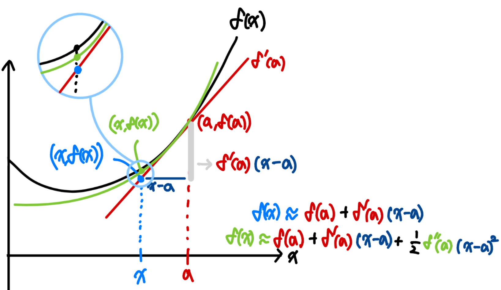

```{r setup, include=FALSE}
knitr::opts_chunk$set(echo = FALSE, warning = FALSE, message = FALSE)
```

class: title-slide
count: false


# Contents
.f-130[
- What was the Kalman Filter?

- Extended Kalman Filter
  - Non-linear system
      - Linearization
]
    


<!-- ---
# Notations
- Scalars, Vectors, Matrices
  - Scalars: $x, y, z$
  - Vectors: $\mathbf{x}, \mathbf{y}, \mathbf{z}$
  - Matrices: $\mathbf{X}, \mathbf{Y}, \mathbf{Z}$ -->


---
# Kalman Filter - Linear System
- Kalman Filter의 대표적인 가정 3가지
  - Gaussian noise assumption: 시스템의 노이즈는 가우시안 분포를 따른다고 가정
    $$p(\mathbf{x}) = \det(2\pi\Sigma)^{-\frac{1}{2}}\exp\left\{-\frac{1}{2}(\mathbf{x}-\boldsymbol{\mu})^\top\Sigma^{-1}(\mathbf{x}-\boldsymbol{\mu})\right\}$$

  - Markov assumption: 시스템의 상태는 바로 **직전 상태**에만 의존한다고 가정
    $$p(\mathbf{x}_t) = p(\mathbf{x}_t | \mathbf{x}_{t-1}, \mathbf{u}_t)$$

  - Linear system이라고 가정 
      $$\mathbf{x}_{t} = \mathbf{A} \mathbf{x}_{t-1} + \mathbf{B} \mathbf{u}_{t} + \epsilon_{t}$$

---
# Kalman Filter - Linear System
- 그림으로 보면 어떻게 되나요?

.pull-left.nl-03[


]
.pull-right.ml-03[

]


---
# Kalman Filter - final state
- 그래서 Kalman Gain이 뭘 의미하는가...
  - 극단적으로, $\mathbf{C}_t$가 1인 경우
  - Distortion, Projection 없이 그대로 측정한 경우라고 '가정'
- 그렇다면, $\mathbf{K}_t$는 $\bar{\Sigma}_{x_t}(\bar{\Sigma}_{x_t} + \mathbf{Q})^{-1}$이 됨
  - 결국 비율문제!
  - 예측한 내 state의 불확실성과 sensor의 불확실성을 모두 고려할 때, 내 불확실성이 차지하는 비중은?
  - 내 불확실성이 크면, K가 커져서 관측값을 더 신뢰하고, 불확실성이 작다면, K가 작아져서 예측값을 더 신뢰하도록!
- 최종적으로, 앞서 구한 Kalman gain을 이용한 최종 state는 아래와 같이 표현 가능
$$\mathbf{x}_t = \bar{\boldsymbol{\mu}}_{x_t} + \mathbf{K}_t (\mathbf{z}_t - \mathbf{C}_t \bar{\mu}_{x_t})$$

---
# Extended Kalman Filter
- 저번주시간의 질문...
    - 어떤것이 Non-Linear 하다는거지요..?

- 결론부터 얘기해보면..
  - System 자체가 Non-Linear!


---
# Extended Kalman Filter
- Linear System이라고 하면, Gaussian distribution이 그대로 유지되었음
  - 선형 변환한 State는 여전히 Gaussian distribution을 따름!
$$\mathbf{x}_{t-1} \sim \mathcal{N}(\boldsymbol{\mu}_{t-1}, \mathbf{0}) \text{,} \quad\mathbf{\bar{\mu}}_{\mathbf{x}_t} = \mathbf{A}_t \boldsymbol{\mu}_{t-1} + \mathbf{B}_t \mathbf{u}_t$$
$$\boldsymbol{\epsilon}_t \sim \mathcal{N}(0, \mathbf{R}) \text{,} \quad \bar{\Sigma}_{\mathbf{x}_t} = \mathbf{A}_t \mathbf{0} \mathbf{A}_t^\top +  \mathbf{R} =  \mathbf{R}$$
$$\mathbf{x}_t = \mathbf{\bar{\mu}}_{\mathbf{x}_t} + \bar{\Sigma}_{\mathbf{x}_t} = \mathbf{A}_t \mathbf{x}_{t-1} + \mathbf{B}_t \mathbf{u}_t + \boldsymbol{\epsilon}_t$$  

- 근데 이 성질이 유지가 되지 않는다는 것...


---
# Extended Kalman Filter
- EKF에서의 Motion model은 아래와 같이 표현 가능
$$\mathbf{x}_t = f(\mathbf{x}_{t-1}, \mathbf{u}_t) + \boldsymbol{\epsilon}_t \text{,} \quad \boldsymbol{\epsilon}_t \sim \mathcal{N}(0, \mathbf{R})$$
- 여기서 다음 state가 Gaussin distribution을 **유지한다는 보장**이 없음
    - Motion/Measurement model이 임의의 함수를 통과 할 때, 그 결과가 Gaussian..?
    - SLAM을 생각해보면.. 보통 추정하고 싶어하는 것은 2D/3D Pose.. 3D points..
- 쉽게 생각하면, 추정하고자 하는 pose부터가 Non-Linear
  - 추정하고자 하는 State의 성분이 Non-Linear한 성분이기에, **System 자체가 Linear하지 않음!**

---
# Extended Kalman Filter
- 선형 시스템에서 비선형 시스템으로의 확장
- 그렇게 어렵지 않다!
- EKF는 시스템 모델과 관측 모델이 비선형 함수로 표현된다고 가정
- 선형화를 위해서, Taylor expansion을 이용하여 시스템 모델과 관측 모델을 선형 근사
   - Taylor series, expansion, appoximation...
$$f(x) \approx f(x_0) + f(x_0)'(x - x_0) + \frac{1}{2}f(x_0)''(x - x_0)^2 + \cdots$$
$$f(\mathbf{x}) \approx f(\mathbf{x}_0) + \nabla f(\mathbf{x}_0)(\mathbf{x} - \mathbf{x}_0)$$


---
# Extended Kalman Filter - Taylor expansion
- 그림으로 보면 이렇게 볼 수 있지요

.pull-left[
- 1st order approximation : 
  임의의 함수를 선형으로 근사해서, 궁금한 지점에서의 함수값의 **근사치**를 구하는 방법
$$f(x) \approx f(a) + f'(a)(x - a)$$
- Gradient descent, Newton's method 등에서 활용
]

.pull-right[
  
]

---
# Extended Kalman Filter - Taylor expansion
.pull-left[
- 2nd order approximation : 임의의 함수를 2차식으로 근사해서, 궁금한 지점에서의 함수값의 **근사치**를 구하는 방법
$$f(x) \approx f(a) + f'(a)(x - a)\\ + \frac{1}{2}f''(a)(x - a)^2$$
- 기울기 뿐만 아니라, 기존 함수의 곡률도 고려해서 근사하겠다
  - 곡률까지 고려한만큼, 훨씬 더 정확한 근사치 제공
]


.pull-right[

]

---
# Extended Kalman Filter - 1st order approximation

.pull-left[
- Gradient: 스칼라 함수의 벡터 입력에 대한 편미분
$$\nabla f(\mathbf{x}) = \begin{pmatrix}
  \frac{\partial f}{\partial x_1} \\
  \frac{\partial f}{\partial x_2} \\
  \vdots \\
  \frac{\partial f}{\partial x_n}
\end{pmatrix}$$
]

.pull-right[ 
- Jacobian: 벡터 함수의 벡터 입력에 대한 편미분
$$\mathbf{J}(\mathbf{x}) = \begin{pmatrix}
  \frac{\partial f_1}{\partial x_1} & \frac{\partial f_1}{\partial x_2} & \cdots & \frac{\partial f_1}{\partial x_n} \\
  \frac{\partial f_2}{\partial x_1} & \frac{\partial f_2}{\partial x_2} & \cdots & \frac{\partial f_2}{\partial x_n} \\
  \vdots & \vdots & \ddots & \vdots \\
  \frac{\partial f_m}{\partial x_1} & \frac{\partial f_m}{\partial x_2} & \cdots & \frac{\partial f_m}{\partial x_n}
\end{pmatrix}$$
]

---
# Extended Kalman Filter 
- 우리가 알고있는 KF의 motion model을, Non-linear system으로 표현해보면
$$\mathbf{x}_t = f(\mathbf{x}_{t-1}, \mathbf{u}_t) + \mathbf{w}_t = \boldsymbol{\mu}_t + \mathbf{w}_t \text{,} \quad \mathbf{w}_t \sim \mathcal{N}(0, \mathbf{R}_t)$$

- EKF에서는, 비선형 시스템 모델이 이전 state의 평균을 기준으로 선형화된다고 가정
$$f(\mathbf{x}_{t-1}, \mathbf{u}_t) \approx f(\boldsymbol{\mu}_{t-1}, \mathbf{u}_t) + \mathbf{J}_t (\mathbf{x}_{t-1}-\boldsymbol{\mu}_{t-1})$$
$$\mathbf{x}_t = f(\mathbf{x}_{t-1}, \mathbf{u}_t) + \mathbf{w}_t = f(\boldsymbol{\mu}_{t-1}, \mathbf{u}_t) + \mathbf{J}_t (\mathbf{x}_{t-1}-\boldsymbol{\mu}_{t-1}) + \mathbf{w}_t$$
$$\mathbf{J}_t = \frac{\partial f(\mathbf{x}_{t-1}, \mathbf{u}_t)}{\partial \mathbf{x}_{t-1}} \bigg|_{\mathbf{x}_{t-1}=\boldsymbol{\mu}_{t-1}}$$

---
# Extended Kalman Filter 
- $f(\boldsymbol{\mu}_{t-1}, \mathbf{u}_t)$만 다시 보면,
$$f(\mathbf{x}_{t-1} \text{, } \mathbf{u}_t) \approx f(\boldsymbol{\mu}_{t-1}, \mathbf{u}_t) + \mathbf{J}_t (\mathbf{x}_{t-1}-\boldsymbol{\mu}_{t-1})$$

$$f(x) \approx f(x_0) + f'(x_0)(x - x_0) \\
\text{Taylor series랑 똑같쥬?}$$

- 그럼, motion model에서의 mean, covariance는?
  - 이전 state는 정확히 알고있다!(KF에서의 가정)
$$\mathbf{x}_{t-1} = \mathcal{N}(\boldsymbol{\mu}_{t-1}, \mathbf{\Sigma}_{t-1}) = \mathcal{N}(0, 0)$$


---
# Extended Kalman Filter 
- 편차들의 합은 결국 0, 즉 선형화된 1st order 항은 삭제
  - noise도 평균은 0!
$$\mathbf{x}_t \approx f(\boldsymbol{\mu}_{t-1}, \mathbf{u}_t) + \mathbf{J}_t (\mathbf{x}_{t-1}-\boldsymbol{\mu}_{t-1}) + \boldsymbol{\epsilon}_t \\
\rightarrow \boldsymbol{\bar{\mu}}_t = f(\boldsymbol{\mu}_{t-1}, \mathbf{u}_t)$$
- 그렇다면, Covariance는?
$$\mathbf{x}_t \approx \boldsymbol{\bar{\mu}}_t + \mathbf{J}_t (\mathbf{x}_{t-1}-\boldsymbol{\mu}_{t-1}) + \boldsymbol{\epsilon}_t$$
$$\mathbf{x}_t - \boldsymbol{\bar{\mu}}_t \approx \mathbf{J}_t (\mathbf{x}_{t-1}-\boldsymbol{\mu}_{t-1}) + \boldsymbol{\epsilon}_t$$
$$\mathbf{\bar{\Sigma}}_t \approx \mathbf{J}_t \mathbf{\Sigma}_{t-1} \mathbf{J}_t^\top + \mathbf{R}_t$$

---
# Extended Kalman Filter 
- Measurement model
$$\mathbf{z}_t = h(\mathbf{x}_t) + \boldsymbol{\mathbf{v}}_t \text{,} \quad \boldsymbol{\mathbf{v}}_t \sim \mathcal{N}(0, \mathbf{Q}_t)$$
- 함수 $h(\mathbf{x}_t)$도 예측된 state에서 선형화
$$h(\mathbf{x}_t) \approx h(\boldsymbol{\bar{\mu}}_t) + \mathbf{H}_t (\mathbf{x}_t - \boldsymbol{\bar{\mu}}_t) \text{,} \quad \mathbf{H}_t = \frac{\partial h(\mathbf{x}_t)}{\partial \mathbf{x}_t} \bigg|_{\mathbf{x}_t=\boldsymbol{\bar{\mu}}_t}$$
$$\therefore \mathbf{z}_t \approx h(\boldsymbol{\bar{\mu}}_t) + \mathbf{H}_t (\mathbf{x}_t - \boldsymbol{\bar{\mu}}_t) + \mathbf{v}_t$$


---
# Extended Kalman Filter 
- 이후는 motion model과 크게 다르지 않음
  - prediction 기준으로의 오차들의 평균은 0이므로, 1st order 항은 삭제

$$\mathbf{z}_t \approx h(\boldsymbol{\bar{\mu}}_t) + \mathbf{H}_t (\mathbf{x}_t - \boldsymbol{\bar{\mu}}_t) + \mathbf{v}_t$$
$$\rightarrow \boldsymbol{\bar{z}}_t = h(\boldsymbol{\bar{\mu}}_t)$$

- Covariance를 구하면, 
$$\mathbf{\bar{\Sigma}}_{z_t} \approx \mathbf{H}_t \mathbf{\bar{\Sigma}}_{t-1} \mathbf{H}_t^\top + \mathbf{Q}_t$$


---
# Extended Kalman Filter 
- Kalman Gain과 업데이트도 크게 다르지 않음
  - Linear system에서의 Kalman gain
$$\mathbf{K}_t = \bar{\Sigma}_{x_t}\mathbf{C}_t^\top (\mathbf{Q} + \mathbf{C}_t\bar{\Sigma}_{x_t}\mathbf{C}_t^\top)^{-1}$$
  - Non-Linear system에서의 Kalman gain
$$\mathbf{K}_t = \mathbf{\bar{\Sigma}}_{z_t} \mathbf{H}_t^\top (\mathbf{H}_t \mathbf{\bar{\Sigma}}_{t-1} \mathbf{H}_t^\top + \mathbf{Q}_t)^{-1}$$

- 최종 update state
$$\boldsymbol{\mu}_t = \boldsymbol{\bar{\mu}}_t + \mathbf{K}_t (\mathbf{z}_t - h(\boldsymbol{\bar{\mu}}_t))$$
$$\mathbf{\bar{\Sigma}}_t \approx (\mathbf{I} - \mathbf{K}_t \mathbf{H}_t) \mathbf{\bar{\Sigma}}_{t-1}$$


  
<!-- xaringan::inf_mr('My_research/Extended Kalman Filter/ekf.Rmd') -->
<!-- pagedown::chrome_print('My_sresearch/Extended Kalman Filter/ekf.html') -->