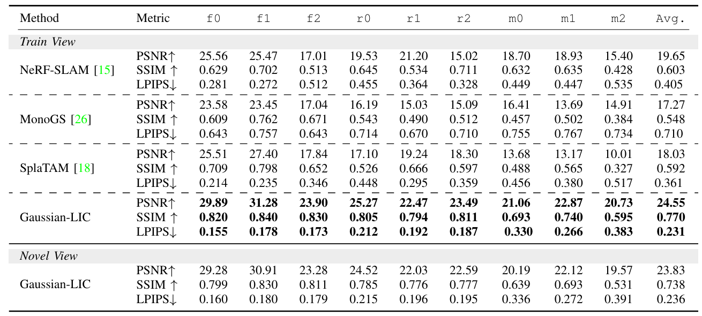
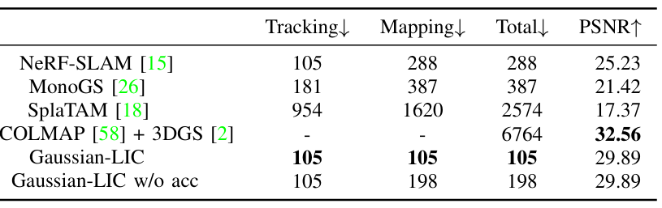

```{r setup, include=FALSE}
knitr::opts_chunk$set(echo = FALSE, warning = FALSE, message = FALSE)
```

class: title-slide
count: false


# Contents

1. Gaussian LIC2
2. GS-LIVM

---
# Gaussian LIC2
- Coco-LIC에 기반한 Gaussian Splatting 논문
  - Continuous Time SLAM에 대해서도 공부해야 하기에 이 부분은 blackbox로 놓고 감
  - Gaussian LIC도 Coco-LIC의 pose를 그대로 사용한다고 언급
-  그럼에도 불구하고 pipeline을 보자면, 
  - 0.1초마다 구간을 분할하는데, 여기서 Non-uniform B-spline을 사용하여, control point의 개수를 motion intensity에 따라 조절
  - Trajectory를 생성하고, point-to-plane residual로 pose optimization을 수행(LiDAR)
  - 이미지에서 feature마다 KLT로 tracking 수행하고, 3D point를 projection하여 residual을 계산하고, pose optimization 수행(Image)
  - Pose를 미분하면 IMU의 angular velocity와 linear acceleration을 얻을 수 있고, 이를 IMU값과 비교(IMU)
- 즉, Coco-LIC에서 나온Pose를 Gaussian LIC에서 그대로 사용

---
# Gaussian LIC2
- 이렇게 얻은 pose는, Camera timestamp 기준으로 가장 마지막 image frame을 기준으로 함
  - 따라서, 0.1초마다 구간을 분할하여 얻은 pose를, 마지막 image frame 기준으로 interpolation하여, 각 image frame에 대한 pose를 얻음
      - Coco-LIC는 Blackbox.
.center[

]

---
# Gaussian LIC2
.center.nt-02[

]

---
# Gaussian LIC2
- 이 다음은, 각 포인트에 zero-degree SH 
 - LiDAR point color는 해당 image projection으로 어은 color
      - Visual SfM point에 대한 color 할당은 설명이 없음;;;
 - Opacity는 0.1로, rotation은 identity 
 - scale은 isotropic하게 depth를 focal lenght로 나누어 설정
 $$s = \begin{bmatrix} \frac{d}{f} & \frac{d}{f} & \frac{d}{f} \end{bmatrix}$$
- Background 표현 위한 Gaussian도 따로 배치(기존 3DGS와 같음)
  - Unbonded outdoor scene이라면, point가 sparse한데, background가 없다면 rendering 시에 빈 공간이 발생할 수 있음.

---
# Gaussian LIC2
- Gaussian을 initialization하고, 매 5번째 frame을 keyframe으로 설정
  - Keyframe마다 opacity map $M$을 랜더링해서, opacity가 적은 녀석들만 initialiation에 사용
$$ M = O < \tau $$
- 이후 최적화 단계
  - Keyframe들 중 랜덤하게 뽑아 re-rendering loss로 optimization 수행
$$\mathcal{L} = (1 - \lambda)\left\|\mathbf{E}[\mathbf{C}] - 
\bar{\mathbf{C}}\right\|_1 + \lambda \mathcal{L}_{D\text{-}SSIM}$$

---
# Gaussian LIC2

.pull-left[

]


.pull-right[

]

---
# GS-LIVM
- 


<!-- xaringan::inf_mr('My_research/For_TVCG/Related_works.Rmd') -->
<!-- pagedown::chrome_print('My_research/For_TVCG/Related_works.html') -->