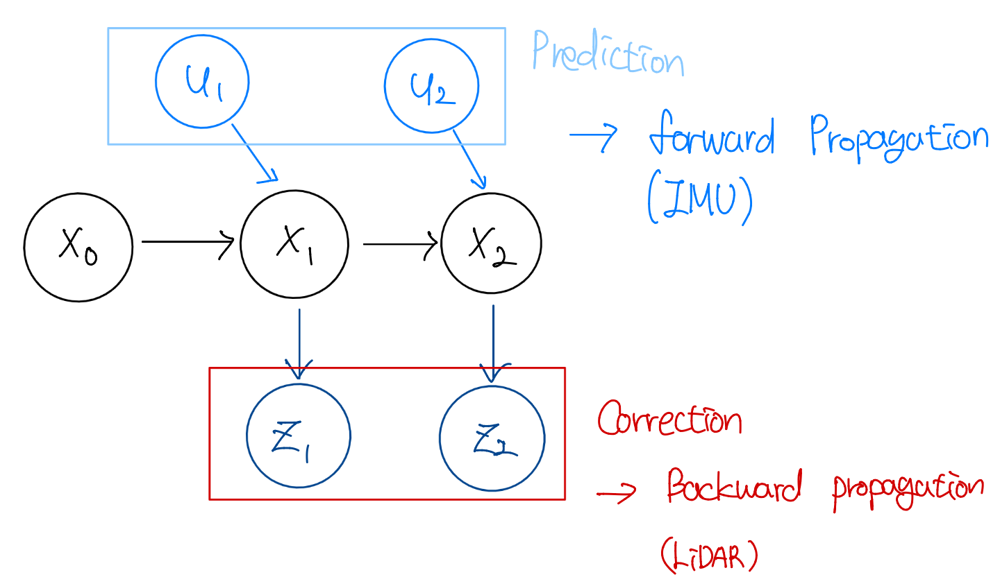
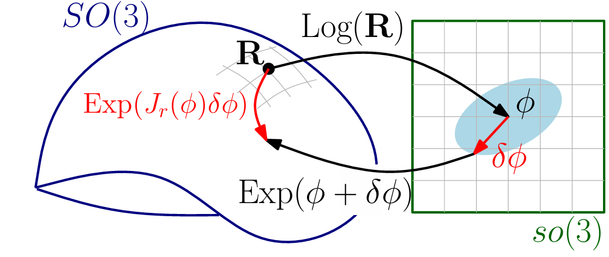
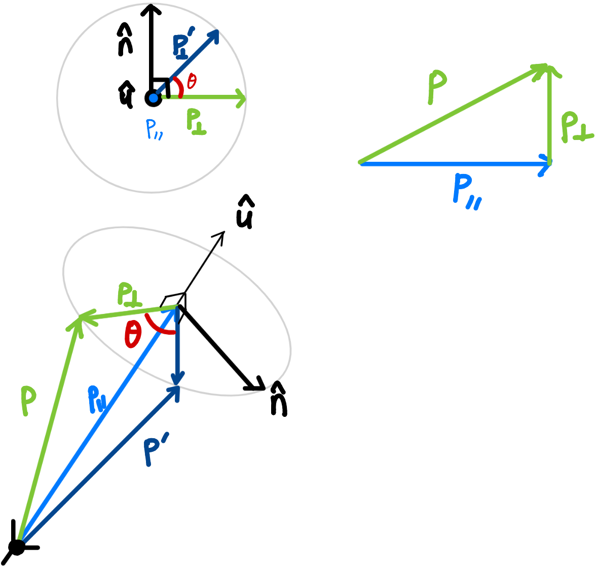

```{r setup, include=FALSE}
knitr::opts_chunk$set(echo = FALSE, warning = FALSE, message = FALSE)
```

class: title-slide
count: false


# Contents
.f-13s0[
- Introduction
- Kalman Filter
  - Linear system
  - Non-linear system
  - IKF(IESKF)
    - Lie group, algebra
]
    


<!-- ---
# Notations
- Scalars, Vectors, Matrices
  - Scalars: $x, y, z$
  - Vectors: $\mathbf{x}, \mathbf{y}, \mathbf{z}$
  - Matrices: $\mathbf{X}, \mathbf{Y}, \mathbf{Z}$ -->


---
# Introduction 
- 어쩌다... Kalman Filter를...
  - Robotics에서 안쓰이는 곳이 드물 정도..
  - State Estimation을 한다 하면 기본이 되는 이론
  - SLAM에서 꼭 필요한 방식이기 때문에 준비해봤습니다😁
     - 이전의 R3LIVE의 FAST-LIO2를 알기 위해서는 Kalman Filter가 그 시작점..!
- SLAM 분야에서는, Filter based method가 한때 유행했었음
  - Probabilistic Robotics 책에서 소개하는 EKF-SLAM이 대표적
  - 그러다, Why Filter? 라는 논문의 등장으로 Keyframe-based optimization이 SLAM 분야의 주류가 됨
      - 개인적으로 이 방식의 정점을 찍은 논문이 GTSAM factor graph를 사용한 LIO-SAM(IROS, 2020)이라고 생각
  - 다시 2021년, FAST-LIO의 등장으로 optimization과 비슷한 IKF를 사용한 filter-based 방식이 재등장
      - 드론에 써야하다보니 속도가 중요함. 정확도는 IKF에서! 

---
# Kalman Filter - Linear System
- Kalman Filter의 대표적인 가정 3가지
  - Gaussian noise assumption: 시스템의 노이즈는 가우시안 분포를 따른다고 가정
    $$p(\mathbf{x}) = \det(2\pi\Sigma)^{-\frac{1}{2}}\exp\left\{-\frac{1}{2}(\mathbf{x}-\boldsymbol{\mu})^\top\Sigma^{-1}(\mathbf{x}-\boldsymbol{\mu})\right\}$$

  - Markov assumption: 시스템의 상태는 바로 **직전 상태**에만 의존한다고 가정
    $$p(\mathbf{x}_t) = p(\mathbf{x}_t | \mathbf{x}_{t-1}, \mathbf{u}_t)$$

  - Linear system이라고 가정 
      $$\mathbf{x}_{t} = \mathbf{A} \mathbf{x}_{t-1} + \mathbf{B} \mathbf{u}_{t} + \epsilon_{t}$$

---
# Kalman Filter - Linear System
- 그림으로 보면 어떻게 되나요?

.pull-left.nl-03[


]
.pull-right.ml-03[

]

---
# Kalman Filter - Linear System
- $\mathbf{x}_t$는 state vector, $\mathbf{u}_t$는 control input, $\epsilon_t \sim \mathcal{N}(0, R)$는 noise
.f-80[
$$\mathbf{x}_t = 
\begin{pmatrix} 
  x_{1,t} \\
  x_{2,t} \\
  \vdots \\
  x_{n,t}
\end{pmatrix}
\quad \text{and} 
\quad \mathbf{u}_t =
\begin{pmatrix} 
  u_{1,t} \\
  u_{2,t} \\
  \vdots \\
  u_{m,t}
\end{pmatrix}$$
]
- 그렇다면, 선형변환일 때의 평균과 공분산이 어떻게 이동하는지 수학으로 알아봅시당😁
---
# Kalman Filter - Linear System
### 도대체 넌 왜 why..

.pull-left[
- 단변수일 때 평균, 편차, 분산😁

$$\mu = \frac{1}{n}\sum_{i=1}^{n}x_i$$
$$\Delta x_i =  x_i - \mu$$
$$V = \frac{1}{n}\sum_{i=1}^{n}\Delta x_i \Delta x_i^\top 
= \frac{1}{n}\sum_{i=1}^{n}(\Delta x_i)^2$$

]

.pull-right[
- 다변수일 때의 평균과 공분산🫡

$$\mathbf{x}_i = 
\begin{pmatrix} 
  x_i \\
  y_i \\
\end{pmatrix},
\quad
\boldsymbol{\mu} = \begin{pmatrix} 
  \mu_x \\
  \mu_y \\
\end{pmatrix}, 
\quad
\Delta \mathbf{x}_i = \mathbf{x}_i - \boldsymbol{\mu}$$

.nl-03[
$$\boldsymbol{\Sigma}
= \frac{1}{n}\sum_{i=1}^{n}\Delta \mathbf{x}_i \Delta \mathbf{x}_i^\top$$
$$\Delta \mathbf{x}_i \Delta \mathbf{x}_i^\top = 
\begin{pmatrix}
  \Delta x_i \\
  \Delta y_i
\end{pmatrix}
\begin{pmatrix}
  \Delta x_i & \Delta y_i
\end{pmatrix}
= \begin{bmatrix}
  \Delta x_i^2 & \Delta x_i \Delta y_i \\
  \Delta x_i \Delta y_i & \Delta y_i^2
\end{bmatrix}$$
]
]

---
# Kalman Filter - Linear System
<!-- - $\mathbf{x} \sim \mathcal{N}(\boldsymbol{\mu}, \boldsymbol{\Sigma})$이고, $\mathbf{y} = \mathbf{A}\mathbf{x} + \mathbf{b}$의 선형변환이 가해진다고 할 때, -->

.pull-left.sub-list[
- 평균 이동
$${\mathbf{y}} = \mathbf{A}\mathbf{x} + \mathbf{b}$$
$$\boldsymbol{\mu}_{\mathbf{y}} = \frac{1}{n}\sum_{i=1}^{n} \mathbf{y}_i 
= \frac{1}{n}\sum_{i=1}^{n} (\mathbf{A}\mathbf{x}_i + \mathbf{b}) \\
\rightarrow \mathbf{A}\left(\frac{1}{n}\sum_{i=1}^{n}\mathbf{x}_i\right) + \mathbf{b} = \mathbf{A}\boldsymbol{\mu}_{\mathbf{x}} + \mathbf{b}$$

$$\therefore \boldsymbol{\mu}_{\mathbf{y}} = \mathbf{A}\boldsymbol{\mu}_{\mathbf{x}} + \mathbf{b}$$
]

.pull-right.sub-list[
- 공분산 이동
.f-60[
$$\boldsymbol{\Sigma}_{\mathbf{y}}
= \frac{1}{n}\sum_{i=1}^{n}(\mathbf{y}_i - \boldsymbol{\mu}_{\mathbf{y}})(\mathbf{y}_i - \boldsymbol{\mu}_{\mathbf{y}})^\top$$

$$\frac{1}{n}\sum_{i=1}^{n}\big[(\mathbf{A}\mathbf{x}_i + \mathbf{b}) - (\mathbf{A}\boldsymbol{\mu}_{\mathbf{x}} + \mathbf{b})\big]
\big[(\mathbf{A}\mathbf{x}_i + \mathbf{b}) - (\mathbf{A}\boldsymbol{\mu}_{\mathbf{x}} + \mathbf{b})\big]^\top$$

$$=\frac{1}{n}\sum_{i=1}^{n} \mathbf{A}(\mathbf{x}_i - \boldsymbol{\mu})(\mathbf{x}_i - \boldsymbol{\mu})^\top \mathbf{A}^\top$$
$$=\mathbf{A}\!\left(\frac{1}{n}\sum_{i=1}^{n}(\mathbf{x}_i - \boldsymbol{\mu})(\mathbf{x}_i - \boldsymbol{\mu})^\top\right)\!\mathbf{A}^\top = \mathbf{A}\,\boldsymbol{\Sigma}\,\mathbf{A}^\top$$

$$\therefore \boldsymbol{\Sigma}_{\mathbf{y}} = \mathbf{A}\,\boldsymbol{\Sigma}\,\mathbf{A}^\top$$
]]

<!-- ---
# Kalman Filter - Linear System
- 다시.. motion model이 control input $u_t$에 의해 $x_{t-1} \rightarrow x_t$로 업데이트 될 때,
.nl-03.f-80[
    $$p(x_t | x_{t-1}, u_t) = \det(2\pi R)^{-\frac{1}{2}}\exp\left\{-\frac{1}{2}(x_t-(A_tx_{t-1}+B_tu_t))^\top R^{-1}(x_t-(A_tx_{t-1}+B_tu_t))\right\}$$
]

- $x_{t-1}$의 상태를 정확히 알고 있다면,  $x_{t-1} \sim \mathcal{N}(0, I)$라고 할 수 있음 -->

---
# Kalman Filter - Prediction step
- 그래서,, previous state와 control input만 가지고 prediction을 해보면
  - 그리고, state에 대해서 **정확히** 알고있다고 가정하면,
$$\mathbf{x}_{t-1} \sim \mathcal{N}(\boldsymbol{\mu}_{t-1}, \mathbf{0})$$
  - 정확한 이전 state를 기준으로 선형변환이 가해진다고 가정하면, 선형변환된 **평균**을 알 수 있음
$$\mathbf{\bar{\mu}}_{\mathbf{x}_t} = \mathbf{A}_t \boldsymbol{\mu}_{t-1} + \mathbf{B}_t \mathbf{u}_t$$
  - 여기에, motion/process noise를 고려하면, 다음과 같이 **공분산** 계산가능
$$\boldsymbol{\epsilon}_t \sim \mathcal{N}(0, \mathbf{R}) \text{,} \quad \bar{\Sigma}_{\mathbf{x}_t} = \mathbf{A}_t \mathbf{0} \mathbf{A}_t^\top +  \mathbf{R} =  \mathbf{R}$$
 - 따라서, 다음 state $\mathbf{x}_t$는 선형변환된 평균과 motion/process noise를 반영하여 표현 가능 
$$\mathbf{x}_t = \mathbf{\bar{\mu}}_{\mathbf{x}_t} + \boldsymbol{\epsilon}_t = \mathbf{A}_t \mathbf{x}_{t-1} + \mathbf{B}_t \mathbf{u}_t + \boldsymbol{\epsilon}_t$$  


---
# Kalman Filter - Prediction step
- 또 다르게 써보면
$$\mathbf{x}_t \sim \mathcal{N}(\mathbf{\bar{\mu}}_{\mathbf{x}_t}, \bar{\Sigma}_{\mathbf{x}_t})$$

- 확률관점에서 정리해보면, 다음 state는 prediction mean 주변에 있을 가능성이 가장 높고, 그 불확실성은 covariance로 표현
.nl-03[
$$p(\mathbf{x}_t | \mathbf{x}_{t-1}, \mathbf{u}_t) = \eta \exp\left\{-\frac{1}{2}(\mathbf{x}_t-(\mathbf{A}_t\mathbf{x}_{t-1}+\mathbf{B}_t\mathbf{u}_t))^\top \mathbf{R}^{-1}(\mathbf{x}_t-(\mathbf{A}_t\mathbf{x}_{t-1}+\mathbf{B}_t\mathbf{u}_t))\right\}$$
$$p(\mathbf{x}_t) \triangleq  p(\mathbf{x}_t | \mathbf{x}_{t-1}, \mathbf{u}_t) = \eta \exp\left\{-\frac{1}{2}(\mathbf{x}_t-\bar{\mu}_{x_t})^\top 
\bar{\Sigma}_{x_t}^{-1}(\mathbf{x}_t-\bar{\mu}_{x_t})\right\}$$

]


---
# Kalman Filter - Correction step
- Prediction step 에서 예측된 state는 단순 motion model(control input)에 의해서만 계산된 state
  - 따지고 보면 눈 감고 1m가라! 한 것과 마찬가지
  - 불확실성이 클 수 밖에 없음
- 따라서, 실제 관측값을 이용해서 **예측된 state를 보정**해주는 과정이 필요함
  - 또는 여러 후보 state중, 가장 정확한 state를 찾아내는 과정 이라고 해도 무방함
- 이 과정을 **Correction step**이라고 하고, 실제 관측값과 예측된 관측값의 차이(residual)를 이용하여 state를 update
- 위 두 과정을 거친 state를 Final state라고 할게요😊

---
# Kalman Filter - Correction step

- Measurement model
$$\mathbf{z}_t = \mathbf{C}_t \mathbf{x}_t + \boldsymbol{\delta}_t \text{,} \quad \boldsymbol{\delta}_t \sim \mathcal{N}(0, \mathbf{Q})$$
- 예측한 state를 기준으로 관측한 값은 아래와 같이 표현
$$\bar{\mathbf{z}}_t = \mathbf{C}_t \mathbf{x}_t$$  
- 따라서, 실제 관측값과 예측된 관측값의 차이인 residual과 센서의 노이즈를 고려하면, 아래와 같이 표현 가능
$$p(\mathbf{z}_t | \mathbf{x}_t) = \eta \exp\left\{-\frac{1}{2}(\mathbf{z}_t-\mathbf{C}_t \mathbf{x}_t)^\top \mathbf{Q}^{-1}(\mathbf{z}_t-\mathbf{C}_t \mathbf{x}_t)\right\}$$


<!-- ---
# Kalman Filter - Correction step
- 그런데, 우리에게 주어진 state는 이전 prediction step에서 구한 state
$$\mathbf{x}_t \sim \mathcal{N}(\hat{\boldsymbol{\mu}}_{x_t}, \hat{\boldsymbol{\Sigma}}_{x_t})$$
- 이 값들을 기준으로 measurement model을 다시 써보면,
$$\mathbf{\boldsymbol{\hat{\mu}}}_{z_t} = \mathbf{C}_t \boldsymbol{\hat{\mu}}_{\mathbf{x}_t} \text{,} \quad \boldsymbol{\hat{\Sigma}}_{z_t} = \mathbf{C}_t \hat{\Sigma}_{x_t} \mathbf{C}_t^\top + \mathbf{Q}$$\ -->

---
# Kalman Filter - Bayes' Rule
- 그렇다면, 이제 Kalman Gain을 구해서 update를 해주면 되는데, 이 때 Bayes rule을 잠깐 사용
  - Bayes' rule: $p(A|B) = \frac{p(B|A)p(A)}{p(B)} = p(A|B) = \frac{\text{likelihood}\times\text{prior}}{\text{evidence}}$

- 이 결과를 이용하여, Bayes rule에 의해 지수부분을 합으로 표현
$$p(\mathbf{x}_t | \mathbf{z}_t) = \eta p(\mathbf{z}_t | \mathbf{x}_t) p(\mathbf{x}_t) \\
\rightarrow \exp(-\frac{1}{2}\text{likelihood}) \times \exp(-\frac{1}{2}\text{prior}) \rightarrow \exp(-\frac{1}{2}(\text{likelihood} + \text{prior}))$$
- exponential term, normalization term 제외하고 보면
$$\mathbf{J}(\mathbf{x}_t) = ((\mathbf{z}_t-\mathbf{C}_t \mathbf{x}_t)^\top \mathbf{Q}^{-1}(\mathbf{z}_t-\mathbf{C}_t  \mathbf{x}_t) + 
(\mathbf{x}_t-\bar{\boldsymbol{\mu}}_{x_t})^\top \bar{\Sigma}_{x_t}^{-1}(\mathbf{x}_t-\bar{\boldsymbol{\mu}}_{x_t}))$$
<!-- $$\exp\left\{-\frac{1}{2}((\mathbf{x}_t-\hat{\mu}_t)^\top \hat{\Sigma}_{x_t}^{-1}(\mathbf{x}_t-\hat{\mu}_t) + (z_t-\hat{z}_t)^\top Q^{-1}(z_t-\hat{z}_t)) \right\}$$ -->
  <!-- - 실제 관측값과, 예측된 관측값의 차이를 이용해서 correction step을 수행
$$p(\mathbf{z}_t | \bar{\mathbf{x}}_t) = \exp\left\{-\frac{1}{2}(\mathbf{z}_t-\bar{\mu}_{z_t})^\top \mathbf{Q}^{-1}(\mathbf{z}_t-\bar{\mu}_{z_t})\right\}$$ -->


---
# Kalman Filter - Maximum A Posteriori (MAP)
- 전개해봅시다
.f-80.nl-05[
$$\mathbf{J}(\mathbf{x}_t)=\Bigg( \mathbf{x}_t^\top \bar{\Sigma}_{x_t}^{-1} \mathbf{x}_t - 2\bar{\boldsymbol{\mu}}_{x_t}^\top \bar{\Sigma}_{x_t}^{-1} 
\mathbf{x}_t + \bar{\boldsymbol{\mu}}_{x_t}^\top \bar{\Sigma}_{x_t}^{-1} \bar{\boldsymbol{\mu}}_{x_t}+ \mathbf{z}_t^\top \mathbf{Q}^{-1} \mathbf{z}_t - 2 \mathbf{z}_t^\top \mathbf{Q}^{-1} 
\mathbf{C}_t \mathbf{x}_t + \mathbf{x}_t^\top \mathbf{C}_t^\top \mathbf{Q}^{-1} \mathbf{C}_t \mathbf{x}_t\Bigg)$$
]

$$= \Bigg(\mathbf{x}_t^\top (\bar{\Sigma}_{x_t}^{-1} + \mathbf{C}_t^\top \mathbf{Q}^{-1} \mathbf{C}_t) 
\mathbf{x}_t - 2\bar{\boldsymbol{\mu}}_{x_t}^\top \bar{\Sigma}_{x_t}^{-1} \mathbf{x}_t - 2 \mathbf{z}_t^\top \mathbf{Q}^{-1} \mathbf{C}_t \mathbf{x}_t+ const \Bigg)$$

- 여기서 제일정확한 $\mathbf{x}_t$는 $\mathbf{J}(\mathbf{x}_t)$가 최대가 되는 지점 $\rightarrow$ MAP! 를 구하면 됨
$$\frac{\partial \mathbf{J}(\mathbf{x}_t)}{\partial \mathbf{x}_t} = \bar{\Sigma}_{x_t}^{-1}(\mathbf{x}_t-\bar{\boldsymbol{\mu}}_{x_t}) - 2\mathbf{C}_t^\top \mathbf{Q}^{-1}(\mathbf{z}_t-\mathbf{C}_t \mathbf{x}_t) = 0$$
$$\frac{\partial \mathbf{x}^\top A \mathbf{x}}{\partial \mathbf{x}} = 2A\mathbf{x} \text{,} \quad \frac{\partial \mathbf{x}^\top b}{\partial \mathbf{x}} = b$$


---
# Kalman Filter - Kalman Gain derivation
- 앞서 본 간단한 미분법칙을 이용하면, 아래와 같이 정리 가능
$$2(\bar{\Sigma}_{x_t}^{-1} + \mathbf{C}_t^\top \mathbf{Q}^{-1} \mathbf{C}_t) \mathbf{x}_t - 2\bar{\mu}_{x_t}^\top \bar{\Sigma}_{x_t}^{-1} - 2 \mathbf{z}_t^\top \mathbf{Q}^{-1} \mathbf{C}_t = 0$$
$$\rightarrow (\bar{\Sigma}_{x_t}^{-1} + \mathbf{C}_t^\top \mathbf{Q}^{-1} \mathbf{C}_t) \mathbf{x}_t - \bar{\mu}_{x_t}^\top \bar{\Sigma}_{x_t}^{-1} - \mathbf{z}_t^\top \mathbf{Q}^{-1} \mathbf{C}_t = 0$$
$$\rightarrow (\bar{\Sigma}_{x_t}^{-1} + \mathbf{C}_t^\top \mathbf{Q}^{-1} \mathbf{C}_t)\mathbf{x}_t \ - \bar{\Sigma}_{x_t}^{-1}\bar{\mu}_{x_t} - \mathbf{Q}^{-1} \mathbf{C}_t\mathbf{z}_t = 0$$
$$\rightarrow \bar{\Sigma}_{x_t}^{-1} \mathbf{x}_t + \mathbf{C}_t^\top \mathbf{Q}^{-1} \mathbf{C}_t\mathbf{x}_t - \bar{\Sigma}_{x_t}^{-1}\bar{\mu}_{x_t} - \mathbf{C}_t^\top \mathbf{Q}^{-1} \mathbf{z}_t = 0$$
$$\rightarrow\bar{\Sigma}_{x_t}^{-1}(\mathbf{x}_t - \bar{\mu}_{x_t}) - \mathbf{C}_t^\top \mathbf{Q}^{-1} ( \mathbf{z}_t - \mathbf{C}_t \mathbf{x}_t) = 0$$
<!-- $$\bar{\Sigma}_{x_t}^{-1} \mathbf{x}_t - \mathbf{C}_t^\top \bar{\Sigma}_{z_t}^{-1} \mathbf{C}_t \mathbf{x}_t = 
\bar{\Sigma}_{x_t}^{-1} \bar{\mu}_{x_t} + \mathbf{C}_t^\top \bar{\Sigma}_{z_t}^{-1} \mathbf{z}_t$$ -->


---
# Kalman Filter - Kalman Gain derivation
- 여기서 correction을 위해서 residual을 predicted mean을 가지고 다시정리해보면,
.f-80.nl-05[
$$\mathbf{z}_t-\mathbf{C}_t \mathbf{x}_t = 
\mathbf{z}_t - \mathbf{C}_t \bar{\mu}_{x_t} + \mathbf{C}_t\bar{\mu}_{x_t} - \mathbf{C}_t\mathbf{x}_t =
\mathbf{z}_t - \mathbf{C}_t \bar{\mu}_{x_t} + \mathbf{C}_t (\bar{\mu}_{x_t} - \mathbf{x}_t) = 
(\mathbf{z}_t - \mathbf{C}_t \bar{\mu}_{x_t}) - \mathbf{C}_t(\mathbf{x}_t - \bar{\mu}_{x_t})$$
]

- 이를 기존 식에 대입해보면
$$\bar{\Sigma}_{x_t}^{-1}(\mathbf{x}_t - \bar{\mu}_{x_t}) - \mathbf{C}_t^\top \mathbf{Q}^{-1} ( (\mathbf{z}_t - \mathbf{C}_t \bar{\mu}_{x_t}) - \mathbf{C}_t(\mathbf{x}_t - \bar{\mu}_{x_t})) = 0$$
$$\rightarrow \bar{\Sigma}_{x_t}^{-1}(\mathbf{x}_t - \bar{\mu}_{x_t}) + \mathbf{C}_t^\top \mathbf{Q}^{-1} \mathbf{C}_t(\mathbf{x}_t - \bar{\mu}_{x_t}) = \mathbf{C}_t^\top \mathbf{Q}^{-1} (\mathbf{z}_t - \mathbf{C}_t \bar{\mu}_{x_t})$$
$$\rightarrow (\bar{\Sigma}_{x_t}^{-1} + \mathbf{C}_t^\top \mathbf{Q}^{-1} \mathbf{C}_t)(\mathbf{x}_t - \bar{\mu}_{x_t}) = \mathbf{C}_t^\top \mathbf{Q}^{-1} (\mathbf{z}_t - \mathbf{C}_t \bar{\mu}_{x_t})$$
$$\rightarrow (\mathbf{x}_t - \bar{\mu}_{x_t}) = (\bar{\Sigma}_{x_t}^{-1} + \mathbf{C}_t^\top \mathbf{Q}^{-1} \mathbf{C}_t)^{-1}\mathbf{C}_t^\top \mathbf{Q}^{-1} (\mathbf{z}_t - \mathbf{C}_t \bar{\mu}_{x_t})$$

---
# Kalman Filter - Kalman Gain derivation

- 즉, 우리가 원하는 최종 state는 아래와 같이 표현 가능
$$\mathbf{x}_t = \bar{\mu}_{x_t} + \underbrace{(\bar{\Sigma}_{x_t}^{-1} + \mathbf{C}_t^\top \mathbf{Q}^{-1} \mathbf{C}_t)^{-1}\mathbf{C}_t^\top \mathbf{Q}^{-1}}_{\mathbf{K}_t \text{(Kalman Gain!)}} (\mathbf{z}_t - \mathbf{C}_t \bar{\mu}_{x_t})$$
- 근데 Kalman Gain은 ..?
$$\mathbf{K}_t = \bar{\Sigma}_{x_t}\,\mathbf{C}_t^\top\left(\mathbf{C}_t\bar{\Sigma}_{x_t}\mathbf{C}_t^\top + \mathbf{Q}\right)^{-1}$$
- 근데 저희가 아는 Kalman gain이랑 모양이 조금 다른데요...
- 그리고 Correction state라면서 왜 mean만 가지고 계산해요...?
  - 일단은 하나하나 봐보아요..

---
# Kalman Filter - Kalman Gain derivation
- 그러니까... 일단 Kalman Gain부터 보면, '아래 두 식이 결국 같은거다' 라는 이야기입니다.
  - Woodbury identity를 이용해서 증명 가능
$$\left(\bar{\Sigma}_{x_t}^{-1} + \mathbf{C}_t^\top \mathbf{Q}^{-1}\mathbf{C}_t\right)^{-1}\mathbf{C}_t^\top\mathbf{Q}^{-1}
\overset{?}{=}
\bar{\Sigma}_{x_t}\mathbf{C}_t^\top\left(\mathbf{C}_t\bar{\Sigma}_{x_t}\mathbf{C}_t^\top + \mathbf{Q}\right)^{-1}$$
- Woodbury identity로 증명 가능하지만, Kalman Gain의 최종적인 형태를 모를때는 어떻게 저 Kalman filter 형태로 어떻게 뽑아내느냐...
  - 역행렬의 성질
$$ \mathbf{A}^{-1}\mathbf{A} = \mathbf{I} \text{,} \quad \mathbf{A}\mathbf{A}^{-1} = \mathbf{I} $$

---
# Kalman Filter - Kalman Gain derivation
- 식을 잠깐 정리하고,
$$(\bar{\Sigma}_{x_t}^{-1} + \mathbf{C}_t^\top \mathbf{Q}^{-1} \mathbf{C}_t)^{-1}\mathbf{C}_t^\top\mathbf{Q}^{-1}$$
$$\rightarrow [\bar{\Sigma}_{x_t}^{-1}(\mathbf{I} + \bar{\Sigma}_{x_t}\mathbf{C}_t^\top \mathbf{Q}^{-1} \mathbf{C}_t)]^{-1}\mathbf{C}_t^\top\mathbf{Q}^{-1}$$
$$\rightarrow (\mathbf{I} + \bar{\Sigma}_{x_t}\mathbf{C}_t^\top \mathbf{Q}^{-1} \mathbf{C}_t)^{-1}\bar{\Sigma}_{x_t}\mathbf{C}_t^\top\mathbf{Q}^{-1}$$
- 다시, 이 식을 $\mathbf{X}, \mathbf{Y}$의 조합으로 치환하면, 
$$\mathbf{X} = \bar{\Sigma}_{x_t}\mathbf{C}_t^\top, \quad \mathbf{Y} = \mathbf{Q}^{-1}\mathbf{C}_t, 
\quad (\mathbf{I} + \mathbf{X}\mathbf{Y})^{-1}\mathbf{X}\mathbf{Q}^{-1}$$

---
# Kalman Filter - Kalman Gain derivation
- $\mathbf{Q}^{-1}$는 맨 마지막에 다시 곱해주면 되니 $\mathbf{X}\mathbf{Y}$만 가지고 해보면,
  - 그 전에, 분배법칙과 역행렬로 앞선 식으로 다시 돌아올것(Kalmain Gain형태를 가져오기 위해서 이런 식으로..)
$$(\mathbf{I} + \mathbf{X}\mathbf{Y})\mathbf{X}= \mathbf{X} + \mathbf{X}\mathbf{Y}\mathbf{X} = \mathbf{X}(\mathbf{I} + \mathbf{Y}\mathbf{X})$$
- 괄호항의 Inverse를 곱하기
$$(\mathbf{I} + \mathbf{X}\mathbf{Y})^{-1}(\mathbf{I} + \mathbf{X}\mathbf{Y})\mathbf{X} = (\mathbf{I} + \mathbf{X}\mathbf{Y})^{-1}\mathbf{X}(\mathbf{I} + \mathbf{Y}\mathbf{X})$$
$$\mathbf{X} = (\mathbf{I} + \mathbf{X}\mathbf{Y})^{-1}\mathbf{X}(\mathbf{I} + \mathbf{Y}\mathbf{X})$$
$$\mathbf{X}(\mathbf{I} + \mathbf{Y}\mathbf{X})^{-1} = (\mathbf{I} + \mathbf{X}\mathbf{Y})^{-1}\mathbf{X}$$
$$\therefore (\mathbf{I} + \mathbf{X}\mathbf{Y})^{-1}\mathbf{X}\mathbf{Q}^{-1} = \mathbf{X}(\mathbf{I} + \mathbf{Y}\mathbf{X})^{-1}\mathbf{Q}^{-1}$$

---
# Kalman Filter - Kalman Gain derivation
- 다시 원상복구를 해보면
$$\bar{\Sigma}_{x_t}\mathbf{C}_t^\top (\mathbf{I} + \mathbf{Q}^{-1}\mathbf{C}_t\bar{\Sigma}_{x_t}\mathbf{C}_t^\top)^{-1}\mathbf{Q}^{-1}$$
$$\therefore \mathbf{K}_t = \bar{\Sigma}_{x_t}\mathbf{C}_t^\top (\mathbf{Q} + \mathbf{C}_t\bar{\Sigma}_{x_t}\mathbf{C}_t^\top)^{-1}$$
- 아까 이게 같다던 그 식
$$\left(\bar{\Sigma}_{x_t}^{-1} + \mathbf{C}_t^\top \mathbf{Q}^{-1}\mathbf{C}_t\right)^{-1}\mathbf{C}_t^\top\mathbf{Q}^{-1}
\overset{?}{=}
\bar{\Sigma}_{x_t}\mathbf{C}_t^\top\left(\mathbf{C}_t\bar{\Sigma}_{x_t}\mathbf{C}_t^\top + \mathbf{Q}\right)^{-1}$$
- 따라서, Kalman Gain 증명 끝!

---
# Kalman Filter - final state
- 그래서 Kalman Gain이 뭘 의미하는가...
  - 극단적으로, $\mathbf{C}_t$가 1인 경우
  - Distortion, Projection 없이 그대로 측정한 경우라고 '가정'
- 그렇다면, $\mathbf{K}_t$는 $\bar{\Sigma}_{x_t}(\bar{\Sigma}_{x_t} + \mathbf{Q})^{-1}$이 됨
  - 결국 비율문제!
  - 예측한 내 state의 불확실성과 sensor의 불확실성을 모두 고려할 때, 내 불확실성이 차지하는 비중은?
  - 내 불확실성이 크면, K가 커져서 관측값을 더 신뢰하고, 불확실성이 작다면, K가 작아져서 예측값을 더 신뢰하도록!
- 최종적으로, 앞서 구한 Kalman gain을 이용한 최종 state는 아래와 같이 표현 가능
$$\mathbf{x}_t = \bar{\boldsymbol{\mu}}_{x_t} + \mathbf{K}_t (\mathbf{z}_t - \mathbf{C}_t \bar{\mu}_{x_t})$$

---
# Kalman Filter - final state
- 해서, 두 번째 이상한 부분 - 왜 mean만 가지고 $\mathbf{x}_t$라고 했어?
  - 사실, 이 녀석은 최종적으로 estimation된 mean입니다.
$$\boldsymbol{\mu}_t = \bar{\boldsymbol{\mu}}_{x_t} + \mathbf{K}_t (\mathbf{z}_t - \mathbf{C}_t \bar{\mu}_{x_t})$$
- 즉, final state의 mean일거라는 것이지요.
$$\mathbf{x}_t \sim \mathcal{N}(\boldsymbol{\mu}_t, \mathbf{\Sigma}_t)$$
- 그러면 $\mathbf{\Sigma}_t$는 어떻게 구하나요?
  - 아까 전개해두었던 수식의 2차항!
$$\Bigg(\mathbf{x}_t^\top (\bar{\Sigma}_{x_t}^{-1} + \mathbf{C}_t^\top \mathbf{Q}^{-1} \mathbf{C}_t) 
\mathbf{x}_t - 
\color{gray}{2\bar{\boldsymbol{\mu}}_{x_t}^\top \bar{\Sigma}_{x_t}^{-1} \mathbf{x}_t - 2 \mathbf{z}_t^\top \mathbf{Q}^{-1} \mathbf{C}_t \mathbf{x}_t+ const \Bigg)}$$

---
# Kalman Filter - final state
- 왜 2차항만 보나?
  - 1차항 부분들은, 결국 mean에 대한 shift만 할 뿐, covariance에는 영향을 주지 않음
  - 즉, 2차항이 곧 correction 된 covariance!
$$\mathbf{\Sigma}_t = (\bar{\Sigma}_{x_t}^{-1} + \mathbf{C}_t^\top \mathbf{Q}^{-1} \mathbf{C}_t)^{-1}$$
- Kalman Gain을 이용해서 표현해보면,
  - Woodbury identity를 이용해서 유도하면
$$(\mathbf{A} + \mathbf{U}\mathbf{B}\mathbf{V})^{-1} = \mathbf{A}^{-1} - \mathbf{A}^{-1}\mathbf{U}(\mathbf{B} + \mathbf{V}\mathbf{A}^{-1}\mathbf{U})^{-1}\mathbf{V}\mathbf{A}^{-1}$$
$$\rightarrow \mathbf{\Sigma}_t = \bar{\Sigma}_{x_t} - \bar{\Sigma}_{x_t}\mathbf{C}_t^\top (\mathbf{Q} + \mathbf{C}_t\bar{\Sigma}_{x_t}\mathbf{C}_t^\top)^{-1} \mathbf{C}_t \bar{\Sigma}_{x_t}$$
$$\therefore \mathbf{\Sigma}_t = \bar{\Sigma}_{x_t} - \mathbf{K}_t\mathbf{C}_t\bar{\mathbf{\Sigma}}_{x_t} = (\mathbf{I} - \mathbf{K}_t \mathbf{C}_t)\bar{\Sigma}_{x_t}$$

---
# Kalman Filter - final state
- 따라서, Kalman Filter의 최종적인 state는 아래와 같이 표현 가능, 끝!
$$\mathbf{x}_t \sim \mathcal{N}(\boldsymbol{\mu}_t, \mathbf{\Sigma}_t)$$

- 다음은, 선형을 비선형으로 바꾼, Extended Kalman Filter(EKF)로
  - 쉬울거에요, Taylor expansion만 하면 되니까요?

---
# Extended Kalman Filter
- 선형 시스템에서 비선형 시스템으로의 확장
- 그렇게 어렵지 않다!
- EKF는 시스템 모델과 관측 모델이 비선형 함수로 표현된다고 가정
- 선형화를 위해서, Taylor expansion을 이용하여 시스템 모델과 관측 모델을 선형 근사
   - Taylor series, expansion, appoximation...
$$f(x) \approx f(x_0) + f(x_0)'(x - x_0) + \frac{1}{2}f(x_0)''(x - x_0)^2 + \cdots$$
$$f(\mathbf{x}) \approx f(\mathbf{x}_0) + \nabla f(\mathbf{x}_0)(\mathbf{x} - \mathbf{x}_0)$$


---
# Extended Kalman Filter - Taylor expansion
- 그림으로 보면 이렇게 볼 수 있지요

.pull-left[
- 1st order approximation : 
  임의의 함수를 선형으로 근사해서, 궁금한 지점에서의 함수값의 **근사치**를 구하는 방법
$$f(x) \approx f(a) + f'(a)(x - a)$$
- Gradient descent, Newton's method 등에서 활용
]

.pull-right[
  
]

---
# Extended Kalman Filter - Taylor expansion
.pull-left[
- 2nd order approximation : 임의의 함수를 2차식으로 근사해서, 궁금한 지점에서의 함수값의 **근사치**를 구하는 방법
$$f(x) \approx f(a) + f'(a)(x - a)\\ + \frac{1}{2}f''(a)(x - a)^2$$
- 기울기 뿐만 아니라, 기존 함수의 곡률도 고려해서 근사하겠다
  - 곡률까지 고려한만큼, 훨씬 더 정확한 근사치 제공
]


.pull-right[

]

---
# Extended Kalman Filter - 1st order approximation
- Taylor expansion을 이용해서, KF를 EKF로! 
- EKF에서는 1st-order approximation을 이용해서 시스템 모델과 관측 모델을 선형화
- 이 때, 선형화 과정에서 벡터를 벡터로 미분한 Jacobian 사용
- Gradient 가 아니라 대부분 Jacobian을 씀 왜?
  - state는 단순한 하나의 변수가 아님; 다변수임(pose, velocity, bias 등등)


---
# Extended Kalman Filter - 1st order approximation

.pull-left[
- Gradient: 스칼라 함수의 벡터 입력에 대한 편미분
$$\nabla f(\mathbf{x}) = \begin{pmatrix}
  \frac{\partial f}{\partial x_1} \\
  \frac{\partial f}{\partial x_2} \\
  \vdots \\
  \frac{\partial f}{\partial x_n}
\end{pmatrix}$$
]

.pull-right[ 
- Jacobian: 벡터 함수의 벡터 입력에 대한 편미분
$$\mathbf{J}(\mathbf{x}) = \begin{pmatrix}
  \frac{\partial f_1}{\partial x_1} & \frac{\partial f_1}{\partial x_2} & \cdots & \frac{\partial f_1}{\partial x_n} \\
  \frac{\partial f_2}{\partial x_1} & \frac{\partial f_2}{\partial x_2} & \cdots & \frac{\partial f_2}{\partial x_n} \\
  \vdots & \vdots & \ddots & \vdots \\
  \frac{\partial f_m}{\partial x_1} & \frac{\partial f_m}{\partial x_2} & \cdots & \frac{\partial f_m}{\partial x_n}
\end{pmatrix}$$
]

---
# Extended Kalman Filter - 1st order approximation
- Hessian: 스칼라 함수의 벡터 입력에 대한 이차 편미분
$$\mathbf{H}(\mathbf{x}) = \begin{pmatrix}
  \frac{\partial^2 f}{\partial x_1^2} & \frac{\partial^2 f}{\partial x_1 \partial x_2} & \cdots & \frac{\partial^2 f}{\partial x_1 \partial x_n} \\
  \frac{\partial^2 f}{\partial x_2 \partial x_1} & \frac{\partial^2 f}{\partial x_2^2} & \cdots & \frac{\partial^2 f}{\partial x_2 \partial x_n} \\
  \vdots & \vdots & \ddots & \vdots \\
  \frac{\partial^2 f}{\partial x_n \partial x_1} & \frac{\partial^2 f}{\partial x_n \partial x_2} & \cdots & \frac{\partial^2 f}{\partial x_n^2}
\end{pmatrix}$$
- 최적화 기법 중 Gauss-Newtion method에서는 Jacobian을 이용해서 Hessian을 근사
$$\mathbf{H} \approx \mathbf{J}^\top \mathbf{J}$$

<!-- ---
# Extended Kalman Filter - 1st order approximation
- 수식으로 보면 아래와 같이 쓸 수 있음
  - Gradient
$$f(\mathbf{x}) \approx f(\mathbf{x}_0) + \nabla f(\mathbf{x}_0)(\mathbf{x} - \mathbf{x}_0)$$
  - Jacobian
$$\mathbf{f}(\mathbf{x}) \approx \mathbf{f}(\mathbf{x}_0) + \mathbf{J}(\mathbf{x}_0)(\mathbf{x} - \mathbf{x}_0)$$ -->


---
# Extended Kalman Filter 
- 우리가 알고있는 KF의 motion model을, Non-linear system으로 표현해보면
$$\mathbf{x}_t = f(\mathbf{x}_{t-1}, \mathbf{u}_t) + \mathbf{w}_t = \boldsymbol{\mu}_t + \mathbf{w}_t \text{,} \quad \mathbf{w}_t \sim \mathcal{N}(0, \mathbf{R}_t)$$

- EKF에서는, 비선형 시스템 모델이 이전 state의 평균을 기준으로 선형화된다고 가정
$$f(\mathbf{x}_{t-1}, \mathbf{u}_t) \approx f(\boldsymbol{\mu}_{t-1}, \mathbf{u}_t) + \mathbf{J}_t (\mathbf{x}_{t-1}-\boldsymbol{\mu}_{t-1})$$
$$\mathbf{x}_t = f(\mathbf{x}_{t-1}, \mathbf{u}_t) + \mathbf{w}_t = f(\boldsymbol{\mu}_{t-1}, \mathbf{u}_t) + \mathbf{J}_t (\mathbf{x}_{t-1}-\boldsymbol{\mu}_{t-1}) + \mathbf{w}_t$$
$$\mathbf{J}_t = \frac{\partial f(\mathbf{x}_{t-1}, \mathbf{u}_t)}{\partial \mathbf{x}_{t-1}} \bigg|_{\mathbf{x}_{t-1}=\boldsymbol{\mu}_{t-1}}$$

---
# Extended Kalman Filter 
- $f(\boldsymbol{\mu}_{t-1}, \mathbf{u}_t)$만 다시 보면,
$$f(\mathbf{x}_{t-1}, \mathbf{u}_t) \approx f(\boldsymbol{\mu}_{t-1}, \mathbf{u}_t) + \mathbf{J}_t (\mathbf{x}_{t-1}-\boldsymbol{\mu}_{t-1})
\text{,} \quad $$

$$f(x) \approx f(x_0) + f'(x_0)(x - x_0) \\
\text{Taylor series랑 똑같쥬?}$$

- 그럼, motion model에서의 mean, covariance는?
  - 이전 state는 정확히 알고있다!(KF에서의 가정)
$$\mathbf{x}_{t-1} = \mathcal{N}(\boldsymbol{\mu}_{t-1}, \mathbf{\Sigma}_{t-1}) = \mathcal{N}(0, 0)$$

---
# Extended Kalman Filter 
- 편차들의 합은 결국 0, 즉 선형화된 1st order 항은 삭제
  - noise도 평균은 0!
$$\mathbf{x}_t \approx f(\boldsymbol{\mu}_{t-1}, \mathbf{u}_t) + \mathbf{J}_t (\mathbf{x}_{t-1}-\boldsymbol{\mu}_{t-1}) + \boldsymbol{\epsilon}_t \\
\rightarrow \boldsymbol{\bar{\mu}}_t = f(\boldsymbol{\mu}_{t-1}, \mathbf{u}_t)$$
- 그렇다면, Covariance는?
$$\mathbf{x}_t \approx \boldsymbol{\bar{\mu}}_t + \mathbf{J}_t (\mathbf{x}_{t-1}-\boldsymbol{\mu}_{t-1}) + \boldsymbol{\epsilon}_t$$
$$\mathbf{x}_t - \boldsymbol{\bar{\mu}}_t \approx \mathbf{J}_t (\mathbf{x}_{t-1}-\boldsymbol{\mu}_{t-1}) + \boldsymbol{\epsilon}_t$$
$$\mathbf{\bar{\Sigma}}_t \approx \mathbf{J}_t \mathbf{\Sigma}_{t-1} \mathbf{J}_t^\top + \mathbf{R}_t$$

---
# Extended Kalman Filter 
- Measurement model
$$\mathbf{z}_t = h(\mathbf{x}_t) + \boldsymbol{\mathbf{v}}_t \text{,} \quad \boldsymbol{\mathbf{v}}_t \sim \mathcal{N}(0, \mathbf{Q}_t)$$
- 함수 $h(\mathbf{x}_t)$도 예측된 state에서 선형화
$$h(\mathbf{x}_t) \approx h(\boldsymbol{\bar{\mu}}_t) + \mathbf{H}_t (\mathbf{x}_t - \boldsymbol{\bar{\mu}}_t) \text{,} \quad \mathbf{H}_t = \frac{\partial h(\mathbf{x}_t)}{\partial \mathbf{x}_t} \bigg|_{\mathbf{x}_t=\boldsymbol{\bar{\mu}}_t}$$
$$\therefore \mathbf{z}_t \approx h(\boldsymbol{\bar{\mu}}_t) + \mathbf{H}_t (\mathbf{x}_t - \boldsymbol{\bar{\mu}}_t) + \mathbf{v}_t$$


---
# Extended Kalman Filter 
- 이후는 motion model과 크게 다르지 않음
  - prediction 기준으로의 오차들의 평균은 0이므로, 1st order 항은 삭제

$$\mathbf{z}_t \approx h(\boldsymbol{\bar{\mu}}_t) + \mathbf{H}_t (\mathbf{x}_t - \boldsymbol{\bar{\mu}}_t) + \mathbf{v}_t$$
$$\rightarrow \boldsymbol{\bar{z}}_t = h(\boldsymbol{\bar{\mu}}_t)$$

- Covariance를 구하면, 
$$\mathbf{\bar{\Sigma}}_{z_t} \approx \mathbf{H}_t \mathbf{\bar{\Sigma}}_{t-1} \mathbf{H}_t^\top + \mathbf{Q}_t$$


---
# Extended Kalman Filter 
- Kalman Gain과 업데이트도 크게 다르지 않음
  - Linear system에서의 Kalman gain
$$\mathbf{K}_t = \bar{\Sigma}_{x_t}\mathbf{C}_t^\top (\mathbf{Q} + \mathbf{C}_t\bar{\Sigma}_{x_t}\mathbf{C}_t^\top)^{-1}$$
  - Non-Linear system에서의 Kalman gain
$$\mathbf{K}_t = \mathbf{\bar{\Sigma}}_{z_t} \mathbf{H}_t^\top (\mathbf{H}_t \mathbf{\bar{\Sigma}}_{t-1} \mathbf{H}_t^\top + \mathbf{Q}_t)^{-1}$$

- 최종 update state
$$\boldsymbol{\mu}_t = \boldsymbol{\bar{\mu}}_t + \mathbf{K}_t (\mathbf{z}_t - h(\boldsymbol{\bar{\mu}}_t))$$
$$\mathbf{\bar{\Sigma}}_t \approx (\mathbf{I} - \mathbf{K}_t \mathbf{H}_t) \mathbf{\bar{\Sigma}}_{t-1}$$

---
# Iterated Error State Kalman Filter (IESKF)
- Iterated Kalman filter의 한 종류로 볼 수 있음
  - FAST-LIO에서는 IKF라는 표현을 사용했음
- 기존의 KF, EKF와 다른 점 
  1. State가 추정하고자 하는 $\mathbf{X}$를 직접 update 하지 않고, **error-state**를 추정하고, 이를 state에 더하는 방식
$$\mathbf{X} =  \mathbf{X} + \delta\mathbf{X}$$
  2. Iterative하게 추정값을 계속해서 업데이트 함. residual과 그 Jacobian을 계산해서, EKF의 correction step에서 non-linear optimization을 푸는 듯한 느낌.
      - Optimization 기법 중 **Gauss-Newton**과 매우 흡사하다.

---
# Iterated Error State Kalman Filter (IESKF)
### State vs. Residual

.pull-left[
#### Kalman Filter
- EKF는, State $\mathbf{X}$에 대해, motion, observation 모델을 1차 선형화하여 state를 업데이트 하는 방식
- IKF(IESKF)는, residual $\mathbf{e}$를 줄이는 error-state를 **반복해서** 추정하고, State에 최종 error-state를 더해 다음 State를 업데이트 하는 방식 
]

.pull-right[
#### Non-linear optimization
- Newton method는, 최적화하고자 하는 함수 $\mathbf{f(x)}$에 대해 2차 근사를 통한  최적화
- Gauss-Newton method는, error를 1차항으로 선형화하여 최적화를 수행, 2차항은 $\mathbf{J}^\top\mathbf{J}$로 근사하여 사용
]

---
# Iterated Error State Kalman Filter (IESKF)
- 그렇다면, IESKF에 대해서 하나씩알아보자.
  - 지금부터는 FAST-LIO2의 논문에 나와있는 대로 가 봅시다.
- 먼저, 연산 방식에 대해서 짚고 넘어가도록 하자.
$$\begin{aligned}
\boxplus &: \mathcal{M} \times \mathbb{R}^{n} \rightarrow \mathcal{M};
\qquad
\boxminus : \mathcal{M} \times \mathcal{M} \rightarrow \mathbb{R}^{n}
\\[0.8em]
\mathrm{SO}(3) &: 
\mathbf{R} \boxplus \mathbf{r}
=
\mathbf{R}\mathrm{Exp}(\mathbf{r});
\qquad
\mathbf{R}_{1} \boxminus \mathbf{R}_{2}
=
\mathrm{Log}\left(\mathbf{R}_{2}^{T}\mathbf{R}_{1}\right)
\\[0.8em]
\mathbb{R}^{n} &: 
\mathbf{a} \boxplus \mathbf{b}
=
\mathbf{a}+\mathbf{b};
\qquad
\mathbf{a} \boxminus \mathbf{b}
=
\mathbf{a}-\mathbf{b}
\end{aligned}$$

---
# Iterated Error State Kalman Filter (IESKF)
### Special Orthogonal group
- 먼저, Rotation을 표현하는 여러가지 방법이 있는데, 그 중에서 Rotation matrix의 몇가지 성질을 정리하면 아래와 같다
  - Rotation matrix는 Special Orthogonal group에 속함 
$$\mathbb{R}\in \mathrm{SO}(n)$$
  - Special Orthogonal group의 성질
$$\mathrm{SO}(n) = \{\mathbf{R} \in \mathbb{R}^{n \times n} | \mathbf{R}^\top \mathbf{R} \text{,} \quad \mathrm{det}(\mathbf{R} = 1) \}$$ 
$$\mathbf{R} + \Delta \mathbf{R} \neq \mathrm{SO}(n)$$
- 따라서, tangent space로의 변환으로 linear 한 변환을 추정하고, 다시 복구해야 함


---
# Iterated Error State Kalman Filter (IESKF)
### Exponential & Logarithm map

.pull-left[
- 기존 Rotation matrix는 Transformation matrix $\mathbf{T} \in \mathrm{SE}(3)$ 내부의 $\mathbf{R} \in \mathrm{SO}(3)$
- $\mathrm{SO}(3)$에서의 직접적인 변환은 비선형이기 때문에, tangent space인 $\mathfrak{so}(3)$에서 선형변화를 통해 변환할 수 있음
  - 이 변환을 다시 $SE(3)$로 변환하는 과정이 **Exponential mapping**!  
- 결국, $\delta \phi$를 추정하는 문제로 풀 수 있다
]

.pull-right.mt-03[

]


---
# Iterated Error State Kalman Filter (IESKF)

.pull-left[
- Exponential mapping은 결국 Rodrigus' formula로 정리할 수 있는데, 이를 증명해보자.
$$\color{#7CFC00}{\mathbf{p}} = \color{#7CFC00}{\mathbf{p}_\perp} + \color{blue}{\mathbf{p}_\parallel} \text{,} \quad 
\color{navy}{\mathbf{p'}} = \color{navy}{\mathbf{p'}_\perp} + \color{blue}{\mathbf{p}_\parallel}$$
$$\left\lVert \hat{\mathbf{u}} \times \color{#7CFC00}{\mathbf{p}_{\perp}}\right\rVert = \left\lVert\color{#7CFC00}{\mathbf{p}_{\perp}}\right\rVert = \left\lVert \mathbf{\hat{n}}\right\rVert$$
$$\therefore \color{navy}{\mathbf{p'}_\perp} = \color{#7CFC00}{\mathbf{p}_{\perp}}\cos\theta  + \hat{\mathbf{n}}\sin\theta$$
]

.pull-right[

]


---
# Iterated Error State Kalman Filter (IESKF)
- 왜요? 진짜맞음? 대충보면 틀린거같은데
  - 저도 그런줄 알았습니다. 근데 맞더라구요.
- 일단, 각 성분을 더하려고 하면, projection의 개념이 필요
  - $\color{navy}{\mathbf{p'}_\perp}$ 를  $\color{#7CFC00}{\mathbf{p}_\perp}$ 방향으로 projection 하는 것은
$$\color{navy}{\mathbf{p'}_\perp}^\top\color{#7CFC00}{\mathbf{p}_{\perp}} = \|\color{navy}{\mathbf{p'}_\perp} \| \| \color{#7CFC00}{\mathbf{p}_\perp}\| \cos\theta$$
  - Projection matrix는 외적을 내적으로 나눔으로써 정의할 수 있고, 이를 이용하면
$$\mathrm{Proj}_\color{#7CFC00}{\mathbf{p}_{\perp}} = \frac{\color{#7CFC00}{\mathbf{p}_{\perp}{\color{#7CFC00}{\mathbf{p}_{\perp}^\top}}}}
{{\color{#7CFC00}{\mathbf{p}_{\perp}^\top}}{\color{#7CFC00}{\mathbf{p}_{\perp}}}} \quad 
\therefore \mathrm{Proj}_\color{#7CFC00}{\mathbf{p}_{\perp}}\color{navy}{\mathbf{p'}_\perp} = 
\frac{\color{#7CFC00}{\mathbf{p}_{\perp}{\color{#7CFC00}{\mathbf{p}_{\perp}^\top}}}}
{{\color{#7CFC00}{\mathbf{p}_{\perp}^\top}}{\color{#7CFC00}{\mathbf{p}_{\perp}}}}\color{navy}{\mathbf{p'}_\perp} = 
\frac{\color{navy}{\mathbf{p'}_\perp}^\top\color{#7CFC00}{\mathbf{p}_{\perp}}}
{{\color{#7CFC00}{\mathbf{p}_{\perp}^\top}}{\color{#7CFC00}{\mathbf{p}_{\perp}}}}\color{#7CFC00}{\mathbf{p}_{\perp}} = 
\frac{\|\color{navy}{\mathbf{p'}_\perp} \| \| \color{#7CFC00}{\mathbf{p}_\perp}\| \cos\theta}
{\|\color{#7CFC00}{\mathbf{p}_{\perp}}\|^2}\color{#7CFC00}{\mathbf{p}_{\perp}}$$
- 따라서 $\color{navy}{\mathbf{p'}_\perp}$의 성분 중 하나는 $\color{#7CFC00}{\mathbf{p}_\perp} \cos\theta$ 로 정리할 수 있음!
  - 나머지도 해보면 똑같음. 방향만 $\sin$ 쪽일 뿐!

---
# Iterated Error State Kalman Filter (IESKF)

.pull-left[
- 그래서 이 수식이 증명이 되는것
$$\color{navy}{\mathbf{p'}_\perp} = \color{#7CFC00}{\mathbf{p}_{\perp}}\cos\theta  + \hat{\mathbf{n}}\sin\theta$$
- 다시 써보면,
$$\color{navy}{\mathbf{p'}_\perp} = \color{#7CFC00}{\mathbf{p}_{\perp}}\cos\theta  + (\mathbf{\hat{u}} \times \color{#7CFC00}{\mathbf{p}_{\perp}})\sin\theta$$

]

.pull-right[

]


---
# Iterated Error State Kalman Filter (IESKF)
<!-- - 우리가 원하는 회전된 벡터 $\color{navy}{\mathbf{p}}$ 는
$$\color{navy}{\mathbf{p'}} = \color{blue}{\mathbf{p}_\parallel} + \color{navy}{\mathbf{p'}_\perp} = \color{#7CFC00}{\mathbf{p}_{\perp}}\cos\theta  + (\mathbf{\hat{u}} \times \color{#7CFC00}{\mathbf{p}_{\perp}})\sin\theta$$ -->
- 증명을 위해, Cross product의 성질을 이용하면 아래와 같이 정리 가능
$$\mathbf{\hat{u}} \times \color{#7CFC00}{\mathbf{p}} = \mathbf{\hat{u}} \times (\color{blue}{\mathbf{p}_\parallel} + \color{#7CFC00}{\mathbf{p}_{\perp}})
= (\mathbf{\hat{u}} \times \color{blue}{\mathbf{p}_\parallel}) + (\mathbf{\hat{u}} \times \color{#7CFC00}{\mathbf{p}_{\perp}}) = \mathbf{\hat{u}} \times \color{#7CFC00}{\mathbf{p}_{\perp}} 
\text{, } \quad \color{blue}{\mathbf{p}_\parallel} = \mathbf{\hat{u}}\mathbf{\hat{u}}^\top\color{#7CFC00}{\mathbf{p}}$$
- 따라서, 아래와 같이 다시 쓸 수 있게 됨
$$\color{navy}{\mathbf{p'}_\perp} = \color{#7CFC00}{\mathbf{p}_{\perp}}\cos\theta  + (\mathbf{\hat{u}} \times \color{#7CFC00}{\mathbf{p}_{\perp}})\sin\theta$$
- 회전된 벡터 $\color{navy}{\mathbf{p'}}$ 를 $\color{#7CFC00}{\mathbf{p}}$ 에 대해 정리
$$\color{navy}{\mathbf{p'}} = \color{blue}{\mathbf{p}_\parallel} + \color{navy}{\mathbf{p'}_{\perp}} = 
\mathbf{\hat{u}}\mathbf{\hat{u}}^\top\color{#7CFC00}{\mathbf{p}} + 
\color{#7CFC00}{\mathbf{p}_{\perp}}\cos\theta  + (\mathbf{\hat{u}} \times \color{#7CFC00}{\mathbf{p}_{\perp}})\sin\theta \text{,} \quad 
\color{#7CFC00}{\mathbf{p}_{\perp}} = \color{#7CFC00}{\mathbf{p}} - \color{blue}{\mathbf{p}_\parallel}$$
$$\color{navy}{\mathbf{p'}} = 
\mathbf{\hat{u}}\mathbf{\hat{u}}^\top\color{#7CFC00}{\mathbf{p}} + 
(\color{#7CFC00}{\mathbf{p}} - \mathbf{\hat{u}}\mathbf{\hat{u}}^\top\color{#7CFC00}{\mathbf{p}})\cos\theta  + (\mathbf{\hat{u}} \times \color{#7CFC00}{\mathbf{p}})\sin\theta$$
---
# Iterated Error State Kalman Filter (IESKF)
- 이 식을 다시 전개해보면,
$$\color{navy}{\mathbf{p'}} = 
\mathbf{\hat{u}}\mathbf{\hat{u}}^\top\color{#7CFC00}{\mathbf{p}} + 
(\color{#7CFC00}{\mathbf{p}} - \mathbf{\hat{u}}\mathbf{\hat{u}}^\top\color{#7CFC00}{\mathbf{p}})\cos\theta  + (\mathbf{\hat{u}} \times \color{#7CFC00}{\mathbf{p}})\sin\theta$$
$$
\color{navy}{\mathbf{p'}} =
\mathbf{\hat{u}}\mathbf{\hat{u}}^\top\color{#7CFC00}{\mathbf{p}}
+
\color{#7CFC00}{\mathbf{p}}\cos\theta
-
\mathbf{\hat{u}}\mathbf{\hat{u}}^\top\color{#7CFC00}{\mathbf{p}}\cos\theta
+
(\mathbf{\hat{u}} \times \color{#7CFC00}{\mathbf{p}})\sin\theta
$$
$$
\color{navy}{\mathbf{p'}} =
\color{#7CFC00}{\mathbf{p}}\cos\theta
+
(\mathbf{\hat{u}} \times \color{#7CFC00}{\mathbf{p}})\sin\theta
+
\mathbf{\hat{u}}\mathbf{\hat{u}}^\top\color{#7CFC00}{\mathbf{p}}(1-\cos\theta)
$$
$$
\mathbf{\hat{u}}\mathbf{\hat{u}}^\top\color{#7CFC00}{\mathbf{p}}
=
\mathbf{\hat{u}}
\left(
\mathbf{\hat{u}}^\top\color{#7CFC00}{\mathbf{p}}
\right)
$$
- Rogdirues' Formula!
$$
\boxed{
\color{navy}{\mathbf{p'}} =
\color{#7CFC00}{\mathbf{p}}\cos\theta
+
(\mathbf{\hat{u}} \times \color{#7CFC00}{\mathbf{p}})\sin\theta
+
\mathbf{\hat{u}}
\left(
\mathbf{\hat{u}}^\top\color{#7CFC00}{\mathbf{p}}
\right)
(1-\cos\theta)
}
$$


---
# Iterated Error State Kalman Filter (IESKF)

### Vector form to Matrix form

- 앞서 유도한 Rodrigues rotation formula의 vector form은 다음과 같다.

$$
{\color{navy}{\mathbf{p}^{\prime}}}
=
{\color{#7CFC00}{\mathbf{p}}}\cos\theta
+
\left(
\hat{\mathbf{u}}\times{\color{#7CFC00}{\mathbf{p}}}
\right)\sin\theta
+
\hat{\mathbf{u}}
\left(
\hat{\mathbf{u}}^{T}{\color{#7CFC00}{\mathbf{p}}}
\right)
(1-\cos\theta)
$$
- Cross product와 projection term을 matrix form으로 바꾸면,

$$\hat{\mathbf{u}}\times{\color{#7CFC00}{\mathbf{p}}} = [\hat{\mathbf{u}}]_{\times}{\color{#7CFC00}{\mathbf{p}}},
\qquad \hat{\mathbf{u}} \left( \hat{\mathbf{u}}^{T}{\color{#7CFC00}{\mathbf{p}}} \right) = \hat{\mathbf{u}}\hat{\mathbf{u}}^{T} {\color{#7CFC00}{\mathbf{p}}}$$

$${\color{navy}{\mathbf{p'}}} = \mathbf{I}{\color{#7CFC00}{\mathbf{p}}}\cos\theta + [\hat{\mathbf{u}}]_{\times}{\color{#7CFC00}{\mathbf{p}}}\sin\theta + \hat{\mathbf{u}}\hat{\mathbf{u}}^{T} {\color{#7CFC00}{\mathbf{p}}} (1-\cos\theta)= \left[ \mathbf{I}\cos\theta + [\hat{\mathbf{u}}]_{\times}\sin\theta
+\hat{\mathbf{u}}\hat{\mathbf{u}}^{T}(1-\cos\theta) \right] {\color{#7CFC00}{\mathbf{p}}}$$
$$
\therefore
\quad
{\color{navy}{\mathbf{p}^{\prime}}}
=
\mathbf{R}
{\color{#7CFC00}{\mathbf{p}}}
$$

$$
\boxed{
\mathbf{R}
=
\mathbf{I}\cos\theta
+
[\hat{\mathbf{u}}]_{\times}\sin\theta
+
\hat{\mathbf{u}}\hat{\mathbf{u}}^{T}(1-\cos\theta)
}
$$

---
# Iterated Error State Kalman Filter (IESKF)

### Rodrigues formula and Exponential map

- 앞서 matrix form으로 바꾼 수식을 조금 더 정리하고자, cross product의 성질을 이용해서 정리해보면,

$$[\hat{\mathbf{u}}]_{\times}^{2}=\hat{\mathbf{u}}\hat{\mathbf{u}}^{T}-\mathbf{I}
\text{,} \quad
\hat{\mathbf{u}}\hat{\mathbf{u}}^{T}
= [\hat{\mathbf{u}}]_{\times}^{2} + \mathbf{I}$$

- 이를 Rodrigues rotation matrix에 대입하면,

$$\mathbf{R}=\mathbf{I}\cos\theta + [\hat{\mathbf{u}}]_{\times}\sin\theta + (1-\cos\theta) \left([\hat{\mathbf{u}}]_{\times}^{2}+\mathbf{I}\right)$$
$$\mathbf{R}=\mathbf{I}+[\hat{\mathbf{u}}]_{\times}\sin\theta+[\hat{\mathbf{u}}]_{\times}^{2}(1-\cos\theta)$$

---
# Iterated Error State Kalman Filter (IESKF)

- 앞에 정리해둔것들 전부 다 가져다 써서 FAST-LIO로 들고 와보면, 
- $\color{#7CFC00}{\mathbf{p}}$ 를 $\color{navy}{\mathbf{p'}}$ 로 회전시킨 것은 중심축 $\hat{\mathbf{u}}$과 각도 $\theta$
  - Axis-Angle representation! $\phi = \theta\hat{\mathbf{u}}$
$$\color{navy}{\mathbf{p'}} = \mathbf{R}\color{#7CFC00}{\mathbf{p}} \text{,} \quad \mathbf{R} = \mathrm{Exp}(\phi) = \mathrm{Exp}(\theta\hat{\mathbf{u}}) \text{,} \quad
\mathrm{exp}(\phi^{\wedge}) = \mathrm{exp}(\theta[\hat{\mathbf{u}}]_{\times})$$
$$\mathbf{R}=\mathbf{I}+[\hat{\mathbf{u}}]_{\times}\sin\theta+[\hat{\mathbf{u}}]_{\times}^{2}(1-\cos\theta)
\rightarrow \mathbf{R} = \mathbf{I} + \frac{\sin\theta}{\theta}\boldsymbol{\phi}^{\wedge} + 
\frac{1-\cos\theta}{\theta^{2}} \left(\boldsymbol{\phi}^{\wedge}\right)^{2}$$
- FAST LIO의 수식과 일치함
   - 논문 수식이 살짝...abuse...
$$
\operatorname{Exp}(\mathbf{r})
=
\mathbf{I}
+
\frac{\mathbf{r}}{\lVert \mathbf{r} \rVert}
\sin\left(\lVert \mathbf{r} \rVert\right)
+
\frac{\mathbf{r}^{2}}{\lVert \mathbf{r} \rVert^{2}}
\left(
1-\cos\left(\lVert \mathbf{r} \rVert\right)
\right)
$$

---
# Iterated Error State Kalman Filter (IESKF)
- Therefore, Rotation의 update는 아래와 같이 $\boxplus$ 로 정의
$$\mathbf{R} \boxplus \mathbf{r} = \mathbf{R}\mathrm{Exp}(\mathbf{r})$$ 

.pull-left[
- Left perturbation  
$$\mathrm{Exp}({}^{w}\delta\phi) {}^{b}\mathbf{p}{}^{w}\mathbf{R}_b$$
- 먼저 world frame으로의 변환을 본 뒤에, world frame에서의 변화 확인!
$${}^{w}\mathbf{p} = \mathrm{Exp}({}^{w}\delta\phi){}^{w}\mathbf{R}_b {}^{b}\mathbf{p}$$
]

.pull-right[
- Right perturbation
$${}^{w}\mathbf{R}_b\mathrm{Exp}({}^{b}\delta\phi) {}^{b}\mathbf{p}$$
- body frame에서의 변화를 확인한 뒤에, world frame으로의 변환!
$${}^{w}\mathbf{p} = {}^{w}\mathbf{R}_b\mathrm{Exp}({}^{b}\delta\phi) {}^{b}\mathbf{p}$$
]

---
# Iterated Error State Kalman Filter (IESKF)
- 앞서 설명한 내용은, Tangent space에서의 결과를 exponential map을 통해 $\mathfrak{so}(3) \rightarrow \mathrm{SO}(3)$ 로 
- Tangent space에서 iterative하게 error를 추정해서 최종 error state를 얻었다고 하면, 그 명확한 **error-state**는 다음과 같이 생각할 수 있음
$$\mathbf{R}_{\mathrm{new}}=\mathbf{R}_{\mathrm{old}}\mathrm{Exp}(\mathbf{r})$$
$$\mathbf{R}_{\mathrm{old}}^{T}\mathbf{R}_{\mathrm{new}}=\mathrm{Exp}(\mathbf{r})$$
$$\therefore\quad\mathbf{r}=\mathbf{R}_{\mathrm{new}}\boxminus\mathbf{R}_{\mathrm{old}}=\mathrm{Log}
\left(\mathbf{R}_{\mathrm{old}}^{T}\mathbf{R}_{\mathrm{new}}\right)$$


---
# Iterated Error State Kalman Filter (IESKF)
$$\mathcal{M} = SO(3) \times \mathbb{R}^{15}, \qquad
\dim(\mathcal{M}) = 18$$

$$\mathbf{x} \doteq
\begin{bmatrix}
{}^{G}\mathbf{R}_{I}^{T} &
{}^{G}\mathbf{p}_{I}^{T} &
{}^{G}\mathbf{v}_{I}^{T} &
\mathbf{b}_{\omega}^{T} &
\mathbf{b}_{a}^{T} &
{}^{G}\mathbf{g}^{T}
\end{bmatrix}^{T}
\in \mathcal{M}$$

$$\mathbf{u} \doteq
\begin{bmatrix}
\omega_{m}^{T} &
\mathbf{a}_{m}^{T}
\end{bmatrix}^{T},
\qquad
\mathbf{w} \doteq
\begin{bmatrix}
\mathbf{n}_{\omega}^{T} &
\mathbf{n}_{a}^{T} &
\mathbf{n}_{b\omega}^{T} &
\mathbf{n}_{ba}^{T}
\end{bmatrix}^{T}$$

$$\mathbf{f}(\mathbf{x}_{i}, \mathbf{u}_{i}, \mathbf{w}_{i})=
\begin{bmatrix}
\omega_{m_i} - \mathbf{b}_{\omega_i} - \mathbf{n}_{\omega_i} \\\\
{}^{G}\mathbf{v}_{I_i} \\\\
{}^{G}\mathbf{R}_{I_i}
\left(
\mathbf{a}_{m_i} - \mathbf{b}_{a_i} - \mathbf{n}_{a_i}
\right)
+
{}^{G}\mathbf{g}_{i} \\
\mathbf{n}_{b\omega_i} \\
\mathbf{n}_{ba_i} \\
\mathbf{0}_{3 \times 1}
\end{bmatrix}$$


---
# Iterated Error State Kalman Filter (IESKF)

$$\widetilde{\mathbf{x}}_{k-1}
\doteq
\mathbf{x}_{k-1} \boxminus \bar{\mathbf{x}}_{k-1}
=
\begin{bmatrix}
\delta\boldsymbol{\theta}^{T} &
{}^{G}\widetilde{\mathbf{p}}_{I}^{T} &
{}^{G}\widetilde{\mathbf{v}}_{I}^{T} &
\widetilde{\mathbf{b}}_{\omega}^{T} &
\widetilde{\mathbf{b}}_{a}^{T} &
{}^{G}\widetilde{\mathbf{g}}^{T}
\end{bmatrix}^{T}$$


---
# Iterated Error State Kalman Filter (IESKF)
- 근데 이 taylor series를 정리를 해보면, 
.f-90[
$$\exp(\mathbf{A})=\mathbf{I}+\mathbf{A}+\frac{\mathbf{A}^2}{2!}+\frac{\mathbf{A}^3}{3!}+\frac{\mathbf{A}^4}{4!}+\frac{\mathbf{A}^5}{5!}\cdots$$
$$\exp(\mathbf A)=\mathbf{I} +  \left(\frac{\mathbf{A}}{1!}+\frac{\mathbf A^3}{3!}+\frac{\mathbf A^5}{5!}\right) + \left(\frac{\mathbf A^2}{2!}+\frac{\mathbf A^4}{4!}+\cdots\right)+\cdots$$
- cos, sin 함수를 정리해보면..?
$$
\cos\theta
=
1-\frac{\theta^2}{2!}
+\frac{\theta^4}{4!}
-\frac{\theta^6}{6!}
+\cdots
$$
$$
\sin\theta
=
\theta
-\frac{\theta^3}{3!}
+\frac{\theta^5}{5!}
-\frac{\theta^7}{7!}
+\cdots
$$
]

---
# Iterated Error State Kalman Filter (IESKF)


<!-- ---
# Iterated Error State Kalman Filter (IESKF)


---
# Iterated Error State Kalman Filter (IESKF)

- Gauss newton과 뭐가 흡사한지 보자
- 그러고 난 뒤에, IKF의 프로세스를 정리해보자
- 여기서부터 FAST LIO2를 입혀서, forward passing과 backward에서 lidar undistortion을 묶어서 설명하고, R3LIVE를 정리하자. 그렇게 끝내자. -->

  
<!-- xaringan::inf_mr('My_research/Road-to-R3LIVE/Road-to-R3LIVE.Rmd') -->
<!-- pagedown::chrome_print('My_sresearch/Road-to-R3LIVE/Road-to-R3LIVE.html') -->