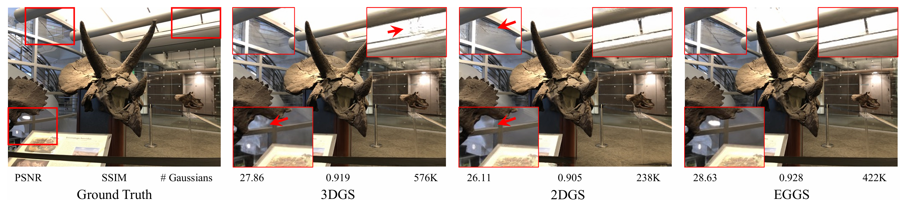

---
# xaringan::inf_mr('Paper_review/2025 (arXiv) EGGS/EGGS_presentation.Rmd')
title: "EGGS: Exchangeable 2D/3D Gaussian Splatting for Geometry-Appearance Balanced Novel View Synthesis"
subtitle: "arXiv 2025"
author: "Minsu Kim"
date: "`r format(Sys.Date(), '%Y.%m.%d')`"
output:
  xaringan::moon_reader:
    lib_dir: libs
    nature:
      highlightStyle: github
      highlightLines: true
      countIncrementalSlides: false
      ratio: '16:9'
---

```{r setup, include=FALSE}
knitr::opts_chunk$set(echo = FALSE, warning = FALSE, message = FALSE)
```

```{css, echo=FALSE}
.title-slide .remark-slide-number {
  display: none;
}

.contents-list {
  font-size: 30px;
  font-family: 'Trebuchet MS', sans-serif;
  line-height: 1.5;
}

.main-text {
  font-size: 30px;
  font-family: 'Trebuchet MS', sans-serif;
  line-height: 1.5;
}

.remark-slide-content ul {
  font-size: 20px;
}

.remark-slide-content ul ul {
  font-size: 18px;
}

.remark-slide-content ul ul ul {
  font-size: 15px;
}

.remark-slide-number {
  font-size: 16px;
  bottom: 40px;
  right: 10px;
}

.remark-slide-content:not(.title-slide)::before {
  content: "";
  position: absolute;
  bottom: 8px;
  right: 10px;
  width: 80px;
  height: 30px;
  background: url('fig/lab_logo.jpg') no-repeat center;
  background-size: contain;
}

.bottom-center-img {
  position: absolute;
  bottom: 60px;
  left: 50%;
  transform: translateX(-50%);
  max-width: 80%;
}
```

<!-- class: title-slide
count: false -->
# Contents

.contents-list[
1. Introduction
2. Method
3. Experiments
4. Conclusion
]

---

# Introduction

- Photo-realistic한 NVS(Novel View Synthesis)를 위해 NeRF, 3DGS 등 다양한 방법들이 제안
- NeRF는 느렸고, 3DGS는 빨랐으나, 정밀한 3D geometry 표현하는 데 어려움
    - 3D Gaussian은 anisotropic한데, 이는 view에 따라 모양이 달라져서 정확한 기하학적 표현이 어려움
- 그래서 Surfel을 사용하는 2DGS가 제안되었으나, 디테일 표현이 부족
    - 2D surfel의 특성을 이용해 ray-splat-intersection으로 view가 달라져도 정확한 geometry를 표현하였지만, high-freqeucny한 디테일 표현이 부족
- 따라서, 본 논문에서는 2D/3D Gaussian Splatting을 균형있게 활용하는 EGGS 제안

---

# Method

- (모델/알고리즘 핵심 아이디어 정리)


---

# Experiments

- (데이터셋, 세팅, 정량/정성 결과)

---

# Conclusion

- (핵심 기여, 한계, 향후 연구)
