---

# pagedown::chrome_print('Paper_review/2026 (ECCV) VolSplat/VolSplat_presentation.html')
# Paper: https://eccv.ecva.net/virtual/2026/poster/3169
# Title and authors: https://lhmd.top/volsplat/ and https://arxiv.org/abs/2509.19297
title: "VolSplat: Rethinking Feed-Forward 3D Gaussian Splatting with Voxel-Aligned Prediction"
subtitle: "2026 (ECCV)"
author: |
  <span style="font-size: 70%;">
  Weijie Wang, Yeqing Chen, Zeyu Zhang, Hengyu Liu,<br>
  Haoxiao Wang, Zhiyuan Feng, Wenkang Qin, Feng Chen,<br>
  Jia-Wang Bian, Zheng Zhu, Donny Y. Chen, and Bohan Zhuang
  <br><br>
  <span style="font-size: 88%; color: #7A7A7A;">Computer Vision and Robotics Lab</span>
  <br><br>
  <span style="font-size: 100%; color: #8A8A8A;"><b style="color: white;">Minsu Kim</b></span><br>
  </span>
date: 2026.10.08

output:
  xaringan::moon_reader:
    lib_dir: libs
    # Render the title explicitly from the metadata below.
    seal: false
    css:
      - default
      - default-fonts
      - swan/swan.css
      - swan/tachyons_ext.css
      - logo-bottom-right.css
    includes:
      after_body: logo-bottom-right.html
    nature:
      highlightStyle: github
      highlightLines: true
      countIncrementalSlides: false
      ratio: '16:9'
  pdf_document:
    latex_engine: xelatex
---

```{r setup, include=FALSE}
knitr::opts_chunk$set(echo = FALSE, warning = FALSE, message = FALSE)
xaringanExtra::use_tachyons()
```

class: center, middle, inverse, title-slide

.title[
# `r rmarkdown::metadata$title`
]
.subtitle[
## `r rmarkdown::metadata$subtitle`
]
.author[
### `r gsub("\n", " ", rmarkdown::metadata$author, fixed = TRUE)`
]
.date[
### `r rmarkdown::metadata$date`
]

---

# Contents

.contents-list[
1. Introduction
2. Method
3. Experiments
4. Conclusion
]

---
# Introduction

- **3D reconstruction**은 로봇의 환경 지각·지도화·이해를 위한 기반
  - Navigation, object manipulation, world model 등에 활용
- **Optimization-based 방식**인 NeRF와 3DGS는 iterative optimization으로 높은 rendering quality을 얻음
  - .light-red[**장면마다 반복 최적화**가 필요하여 재구성 시간과 계산량의 부담이 큼]
- **Feed-forward 방식**은 장면별 최적화를 **사전에 학습한 모델의 추론**으로 대체
  - 입력 영상에서 **한 번의 forward pass**로 scene geometry/3D representation 예측
- 기존 feed-forward 3DGS는 주로 **pixel-aligned prediction**을 사용
  - 여러 뷰의 정보를 **2D feature 공간에서 융합**하고, 픽셀별 feature를 역투영
  - **입력 픽셀마다 Gaussian을 할당**하는 구조


---
# Introduction


- **Pixel-aligned 방식의 두 가지 한계**
  - .light-red[**Alignment**: 카메라 보정·픽셀 이산화 오차와 시점별 sampling 차이로 예측이 어긋남]
  - .light-red[**Assignment**: 장면 복잡도와 무관한 픽셀별 배분으로 단순 영역에는 중복, 세밀한 구조에는 부족]
- **VolSplat**은 Gaussian 예측의 기준을 **2D pixel에서 공유된 3D voxel로 전환**
  - **Multi-view feature aggregation → 3D U-Net으로 refinement → voxel별 Gaussian prediction**
- **Contribution**: 
  - .red[**voxel-aligned**] framework, alignment error analysis, benchmark evaluation


---
# Introduction

.center[
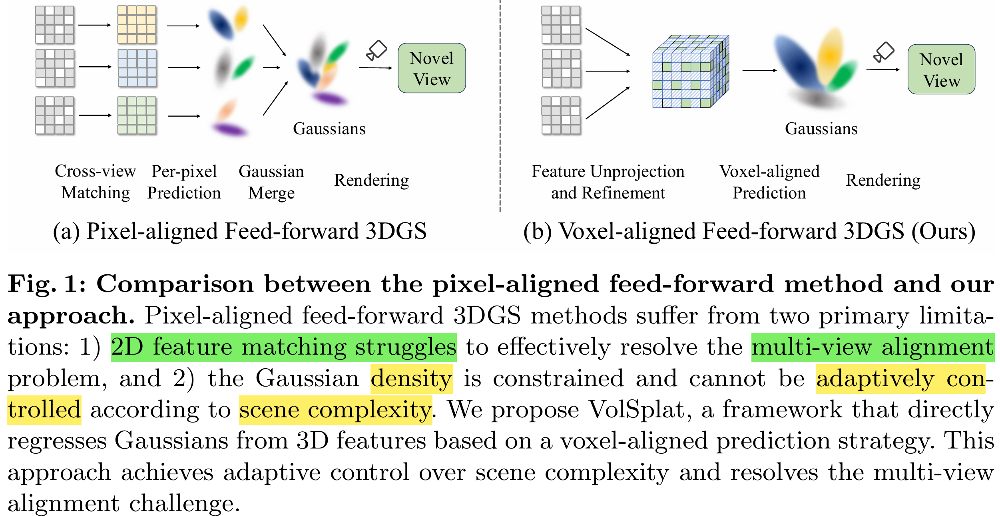
]

<!-- Figure 1 source: https://arxiv.org/html/2509.19297v3/teaser_horizontal.png -->

---
# Method

.center[
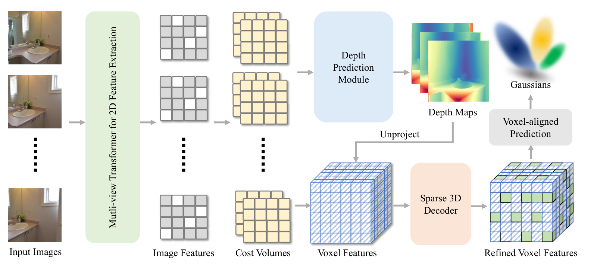
]

<!-- Figure 2 source: https://arxiv.org/html/2509.19297v3/pipeline_.png -->

---
# Method 

#### Multi-view Feature Extraction

- Image input with corresponding camera pose:
    - Camera intrinsic, extrinsic parameters are given
$$\mathcal{I} = {\{\mathbf{I_i}\}^N_{i = 1}}\text{,} \quad \mathbf{I}_i \in \mathbb{R}^{H \times W \times 3}
\text{,} \qquad \mathcal{P} = {\{\mathbf{P_i}\}^N_{i = 1}}\text{,} \quad \mathbf{P}_i \in \mathbb{R}^{4 \times 4}$$

- The output feature from the Transformer
$$\mathcal{F} = \{\mathbf{F}_i\}_{i=1}^{N} = h\bigl(\Phi_{\mathrm{image}}(\mathcal{I}, \mathcal{P})\bigr), \quad \mathbf{F}_i \in \mathbb{R}^{\frac{H}{p} \times \frac{W}{p} \times C}$$

---
# Method 

#### Multi-view Feature Extraction
.center.nt-02[
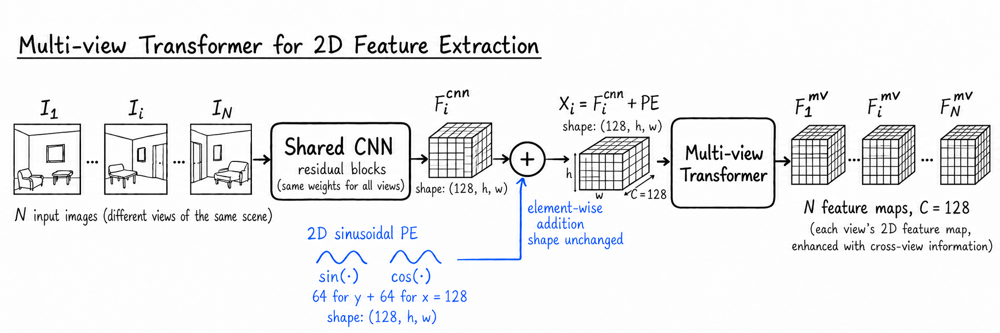
]

<!-- Implementation: https://github.com/ziplab/VolSplat/blob/main/src/model/encoder/unimatch/mv_transformer.py -->
---
# Method

#### Multi-view Feature Extraction
- Transformer를 거친 output $\mathcal{F}$는 feature upsampler를 통해 원래 이미지 해상도로 upsample
$$\mathcal{F}_{\mathrm{full}} = U(\mathcal{F}) \in \mathbb{R}^{N \times H \times W \times C}$$

- Pixel-alignedGaussian initialization
$$\mathcal{G} = \{(\mu_i, \boldsymbol{\Sigma}_i, \alpha_i, \mathbf{c}_i)\}_{i=1}^{H \times W \times N} = \Psi_{\mathrm{pred}}(\mathcal{F}_{\mathrm{full}}, \mathcal{P})$$
    - 위 방식은 depth map의 의존도가 크다. 각 pixel마다 **예측한 depth로 gaussian의 위치**를 정하기 때문
    - 2D grid(pixel)에 고정되어 할당하기 때문에 **장면 복잡도와 무관하게 pixel마다 gaussian을 할당**하는 문제
        


---
# Method
#### 3D Feature Construction
- VolSplat은 Gaussian prediction의 기준을 **2D pixel grid에서 3D voxel**로 옮기고, Gaussian 생성 전에 3D 공간에서 feature interaction과 refinement를 수행
  - 먼저, feature extraction
$$\mathcal{F} = \{F_i\}_{i=1}^{N} \text{,} \quad F_i \in \mathbb{R}^{\frac{H}{p} \times \frac{W}{p} \times C}$$
  
  - 여기서 달라지는 것, **per view cost volume** 생성
$$\mathcal{C} = \{C_i\}_{i=1}^{N} \text{,} \quad C_i \in \mathbb{R}^{\frac{H}{p} \times \frac{W}{p} \times D}$$


---
# Method
#### 3D Feature Construction

.center[
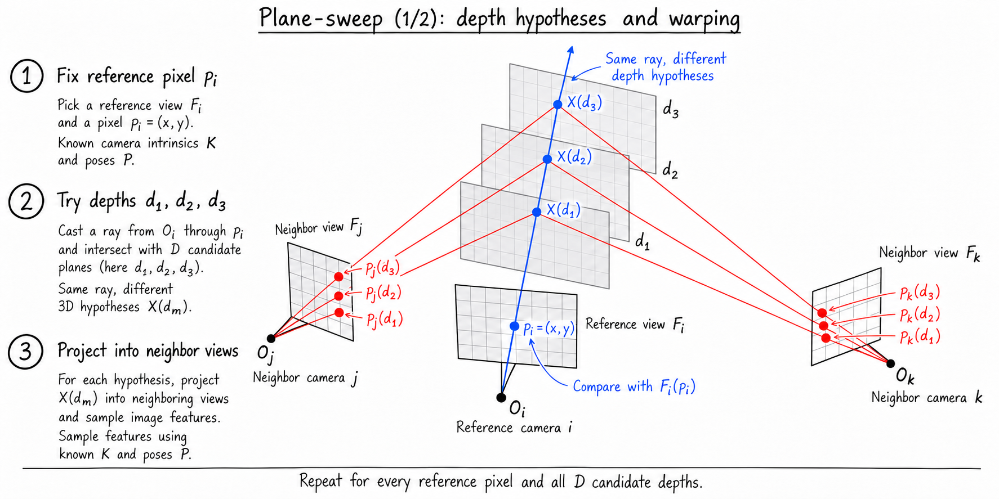
]

<!-- Geometry reference: plane_sweep.png; method: https://arxiv.org/html/2509.19297v3#S3.SS2 -->


---
# Method
#### 3D Feature Construction — Depth Prediction
<div style="position: absolute; top: 190px; right: 40px; bottom: 50px; left: 40px; display: flex; align-items: center; justify-content: center;">
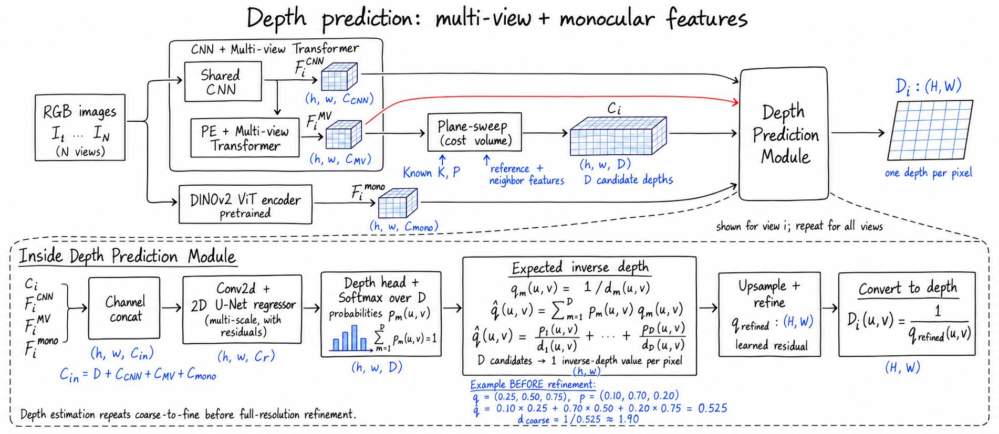
</div>


---
# Method
#### 3D Feature Construction
##### Lifting to 3D feature

- Depth를 얻고 난 뒤, Camera 기준에서 본 점을 World 좌표계 기준으로 변환
$$P_{\mathrm{world}} = R_i P_{\mathrm{cam}} + T_i = R_i \left(D_i(u,v)\,K^{-1}\begin{bmatrix}u\\v\\1\end{bmatrix}\right) + T_i$$

- Voxelization; unstructed point를 voxel index로 ($v_s = 0.001 = 1\,\mathrm{mm}$)
$$i = \operatorname{rnd}\left(\frac{x_p}{v_s}\right), \quad j = \operatorname{rnd}\left(\frac{y_p}{v_s}\right), \quad k = \operatorname{rnd}\left(\frac{z_p}{v_s}\right)$$

<!-- Code-based overview: https://github.com/ziplab/VolSplat/blob/main/src/model/encoder/unimatch/mv_unimatch.py -->
---
class: voxel-feature-aggregation

# Method
#### 3D Feature Construction
##### Lifting to 3D feature
- 해당 voxel 내에 여러개의 point(feature)가 존재할 수 있음
- 따라서 voxel 내의 feature들을 평균하여 voxel feature로 정의
$$V_{i,j,k} = \frac{1}{\lvert S_{i,j,k}\rvert} \sum_{p \in S_{i,j,k}} f_p \text{,} \quad V_{i,j,k} \in \mathbb{R}^C$$ 

<style>
.voxel-feature-aggregation h1 { margin-bottom: 10px; }
.voxel-feature-aggregation h4, .voxel-feature-aggregation h5 { margin: 8px 0; }
.voxel-feature-aggregation ul { margin: 10px 0; font-size: 26px; line-height: 1.3; }
.voxel-feature-aggregation li { font-size: 100%; }
.voxel-feature-aggregation .MathJax_Display { margin: 0.5em 0; }
</style>

<div style="position: absolute; top: 385px; right: 40px; bottom: 45px; left: 40px; display: flex; align-items: center; justify-content: center;">
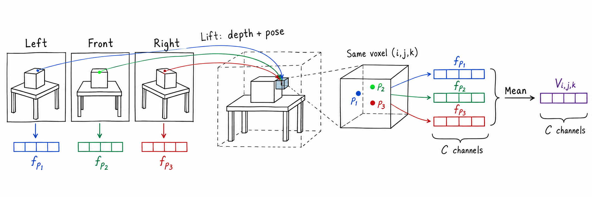
</div>

---
# Method
<div style="position: absolute; top: 40px; right: 15px; width: 50%; line-height: 0;">
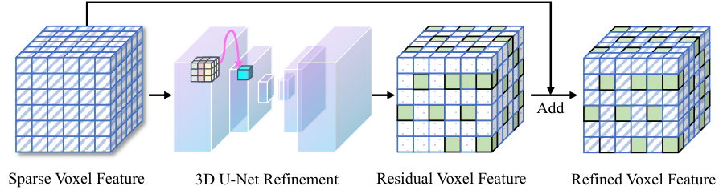
</div>

<!-- Figure 3 source: https://arxiv.org/html/2509.19297v3/refinement.png -->

#### Feature refinement and 3D Gaussians prediction
##### Feature refinement
- voxel들 중에서도, feature가 있는 occupied voxel 만 3D U-Net에 입력
$$R = \mathcal{R}(V) \text{,} \quad R_i \in \mathbb{R}^{\mathcal{V} \times C}$$

- 3D U-Net은 **locality와 geometrical context**를 활용하여 feature refinement 수행
  -  이 결과를 기존 voxel feature에 residual connection으로 더해 최종 refined feature를 얻음
$$V' = V + R \text{,} \quad V' \in \mathbb{R}^{\mathcal{V} \times C}$$


---
# Method
#### Feature refinement and 3D Gaussians prediction
##### 3D Gaussians prediction
- 마지막으로, refined voxel feature를 이용하여 voxel-aligned Gaussian prediction 수행
$$\mathcal{G} = [\{(\bar{\mu}_i, \bar{\alpha}_i, \boldsymbol{\Sigma}_i, \mathbf{c}_i)\}_{i=1}^{\mathcal{V}}\in \mathbb{R}^{38}] = \Psi_{\mathrm{pred}}(V')$$

- Mean은 Voxel center를 기준으로 추가 보정 수행. covariance와 color는 voxel feature를 이용하여 예측
$$\begin{aligned}\mu_j &= r\cdot\bigl(\sigma(\bar{\mu}_j)-0.5\bigr)+\mathrm{Center}_j, \qquad r=3v_s \\ \alpha_j &= \sigma(\bar{\alpha}_j)\end{aligned}$$

---
# Method
#### Training objective
- Loss function은 MSE와 LPIPS를 사용
$$\mathcal{L} = \sum_{m=1}^{M} \left(\mathcal{L}_{\mathrm{MSE}}\bigl(I_{\mathrm{render}}^{(m)}, I_{\mathrm{gt}}^{(m)}\bigr) + \lambda\mathcal{L}_{\mathrm{LPIPS}}\bigl(I_{\mathrm{render}}^{(m)}, I_{\mathrm{gt}}^{(m)}\bigr)\right)$$

---
class: experiment-result

<style>
.experiment-result { padding: 24px 40px; }
.experiment-result h1 { font-size: 36px; line-height: 1.15; margin: 0 0 12px; }
.experiment-result h4 { font-size: 23px; line-height: 1.25; margin: 0; }
.experiment-result .experiment-asset {
  position: absolute; top: 110px; right: 40px; bottom: 50px; left: 40px;
  display: flex; align-items: center; justify-content: center;
}
.experiment-result .experiment-asset img {
  display: block; max-width: 100%; max-height: 100%; width: auto; height: auto;
  object-fit: contain;
}
</style>

# Experiments
#### Fig. 4 — RealEstate10K: Qualitative comparison

<div class="experiment-asset">
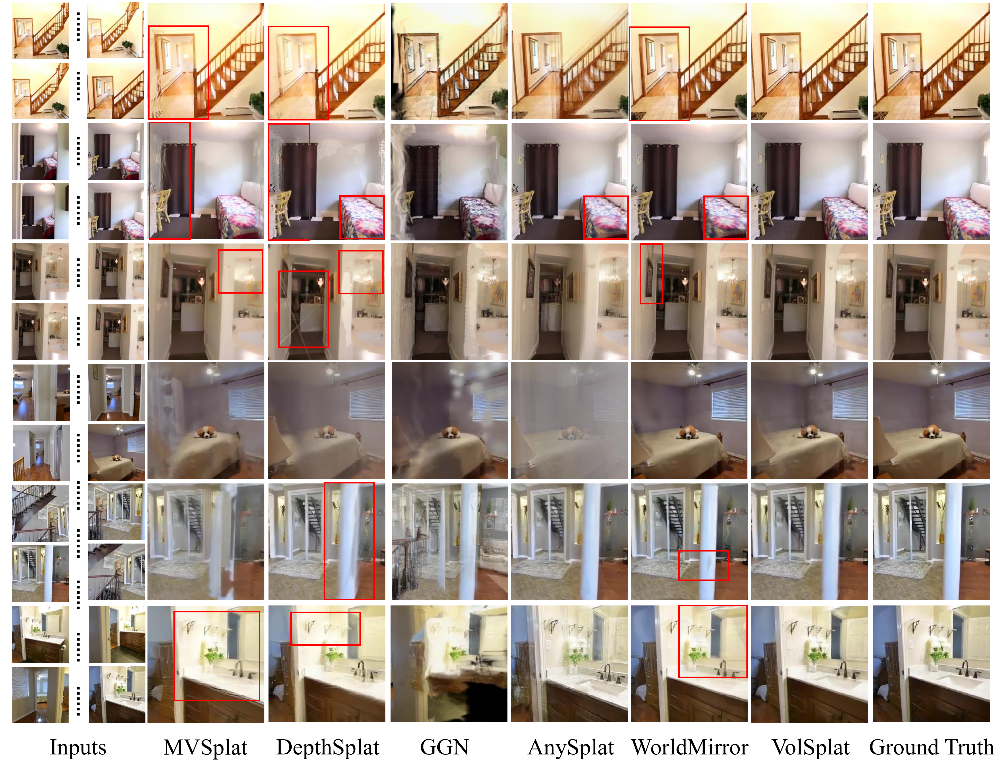
</div>

<!-- High-resolution PDF crops: fig/experiments_sources.json; Figure 4: https://arxiv.org/pdf/2509.19297v3#page=8 -->

---
class: experiment-result

# Experiments
#### Table 1 — RealEstate10K: Quantitative comparison (6 / 12 / 24 views)

<div class="experiment-asset">
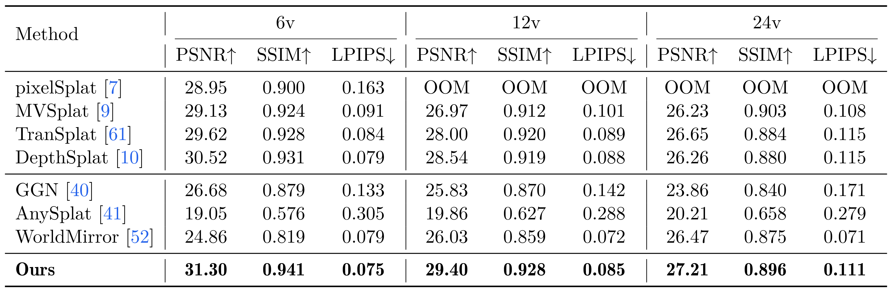
</div>

<!-- Table 1: https://arxiv.org/pdf/2509.19297v3#page=7 -->

---
class: experiment-result

# Experiments
#### Fig. 5 — ScanNet: Qualitative comparison

<div class="experiment-asset">
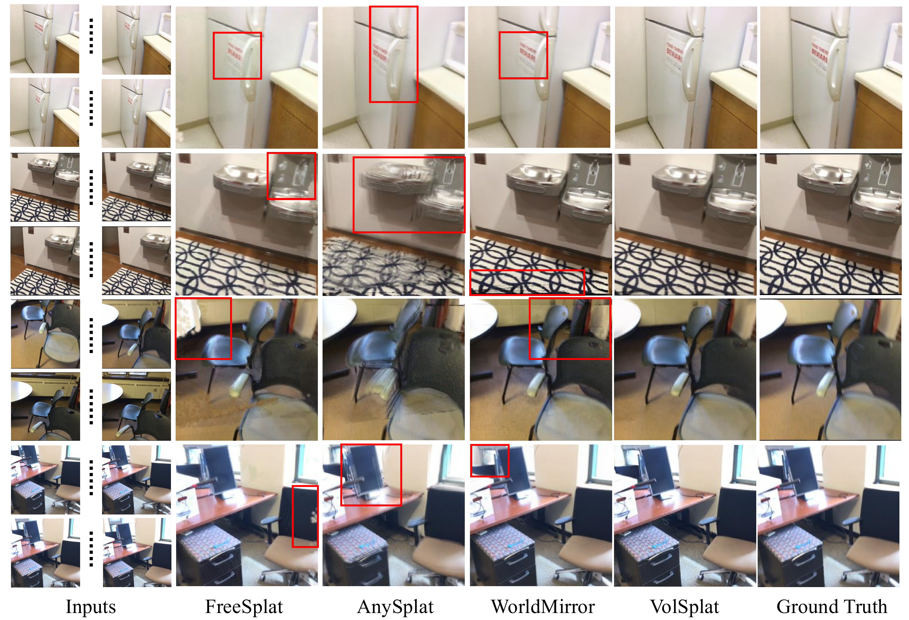
</div>

<!-- Figure 5: https://arxiv.org/pdf/2509.19297v3#page=9 -->

---
class: experiment-result

# Experiments
#### Table 2 — ScanNet: Quantitative comparison (6 views)

<div class="experiment-asset">
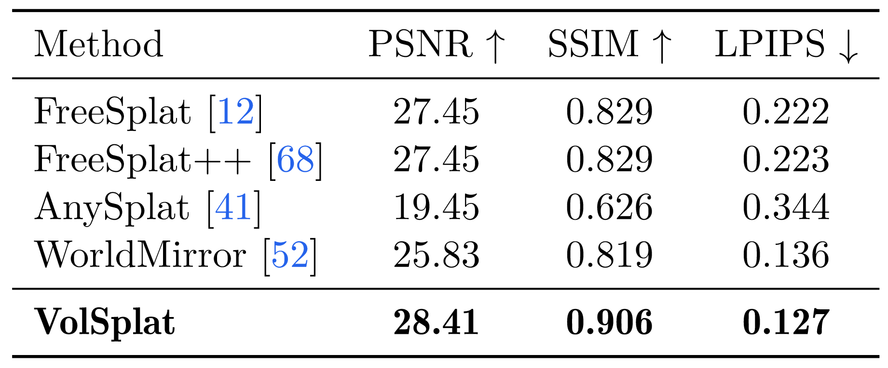
</div>

<!-- Table 2: https://arxiv.org/pdf/2509.19297v3#page=10 -->

---
class: experiment-result

# Experiments
#### Fig. 6 — ACID: Qualitative comparison

<div class="experiment-asset">
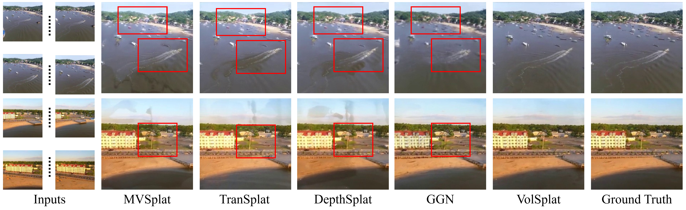
</div>

<!-- Figure 6: https://arxiv.org/pdf/2509.19297v3#page=9 -->

---
class: experiment-result

# Experiments
#### Table 3 — ACID: Cross-dataset generalization (6 views)

<div class="experiment-asset">
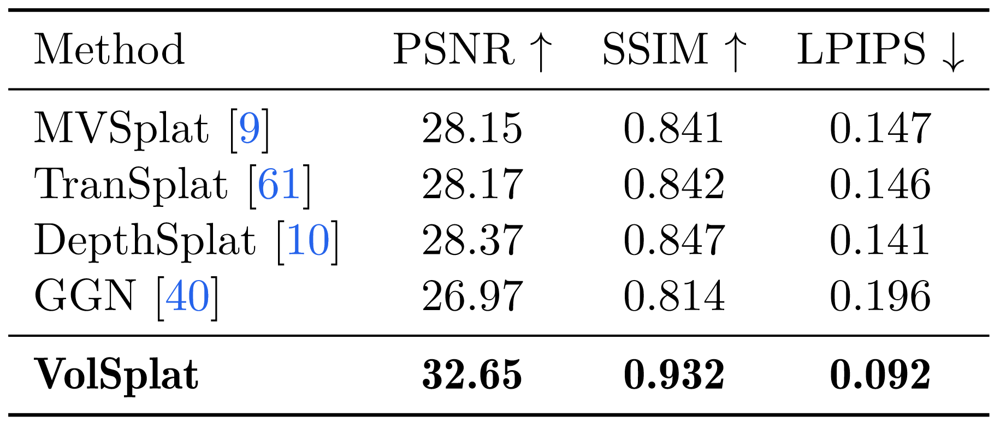
</div>

<!-- Table 3: https://arxiv.org/pdf/2509.19297v3#page=10 -->

---
class: experiment-result

# Experiments
#### Fig. 7 — Gaussians and density maps

<div class="experiment-asset">
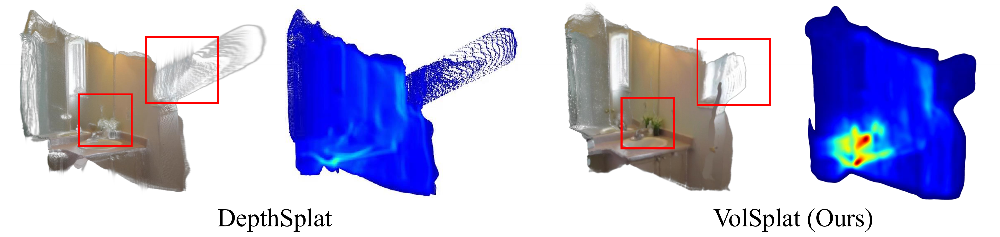
</div>

<!-- Figure 7: https://arxiv.org/pdf/2509.19297v3#page=10 -->

---
class: experiment-result

# Experiments
#### Table 4 — Ablation: Voxel size

<div class="experiment-asset">
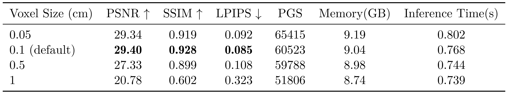
</div>

<!-- Table 4: https://arxiv.org/pdf/2509.19297v3#page=11 -->

---
class: experiment-result

# Experiments
#### Table 5 — Ablation: Sparse 3D decoder

<div class="experiment-asset">
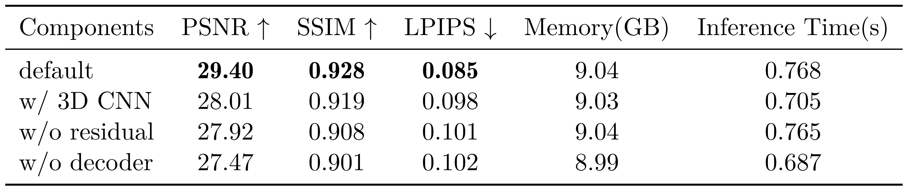
</div>

<!-- Table 5: https://arxiv.org/pdf/2509.19297v3#page=11 -->

---
# Conclusion
- **VolSplat**은 feed-forward 3D Gaussian Splatting의 한계를 극복하기 위해 **voxel-aligned prediction**을 제안
  - Multi-view feature aggregation → 3D U-Net refinement → voxel-aligned Gaussian prediction
- 2D로부터 바로 3D를 만들어내는 방식의 새로운 유형
  - 엄청 느릴 것 같음... 처리하기 위해 필요로 하는 network이 너무 많음
  - Camera pose도 given임...
      - 아니라면 SLAM 문제로 풀게 될 것
- Feed-Forward 3DGS의 새로운 방식을 제시👍
      

<!-- 
xaringan::inf_mr('Paper_review/2026 (ECCV) VolSplat/VolSplat_presentation.Rmd')
# rmarkdown::render('Paper_review/2026 (ECCV) VolSplat/VolSplat_presentation.Rmd', output_format = 'xaringan::moon_reader') -->
