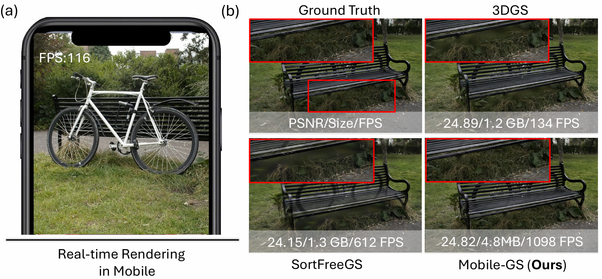
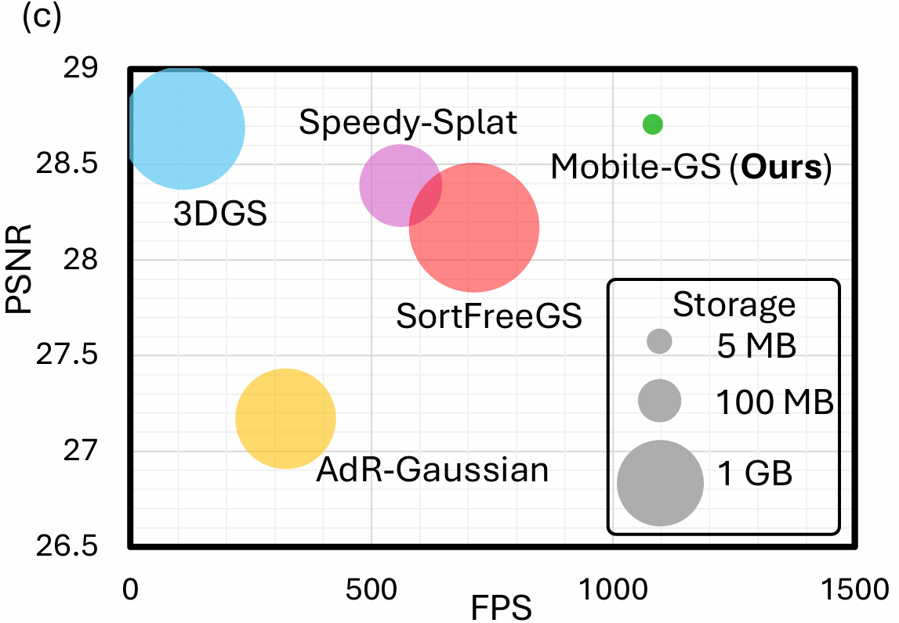
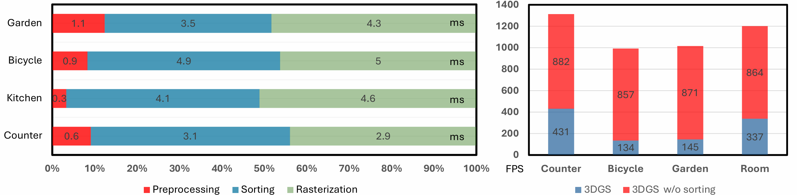
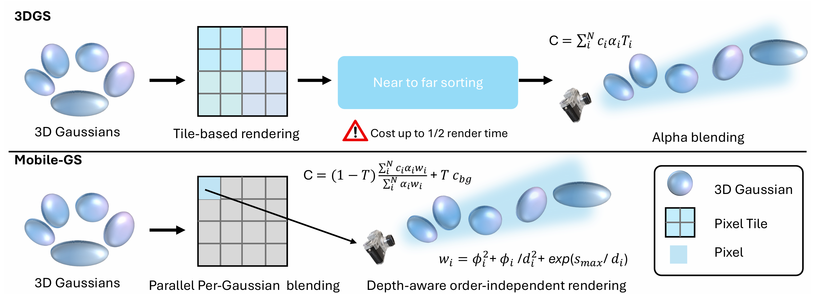
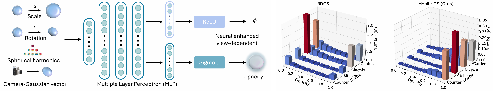
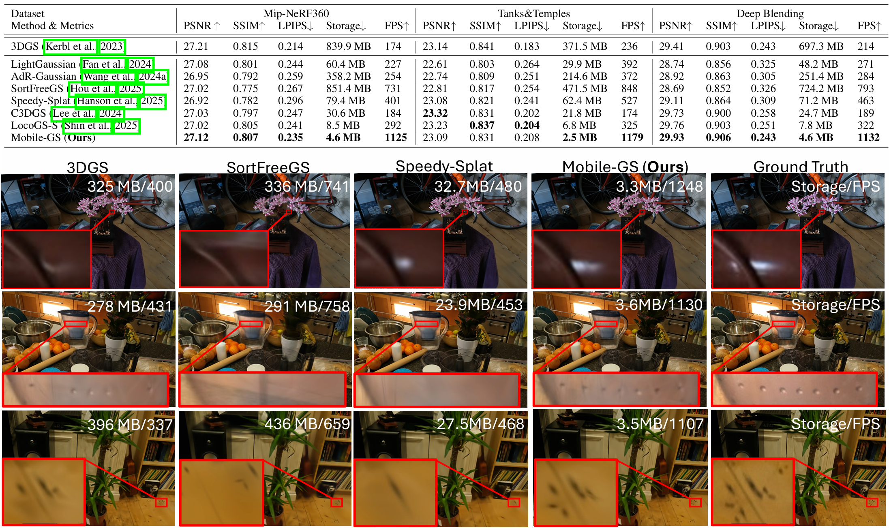
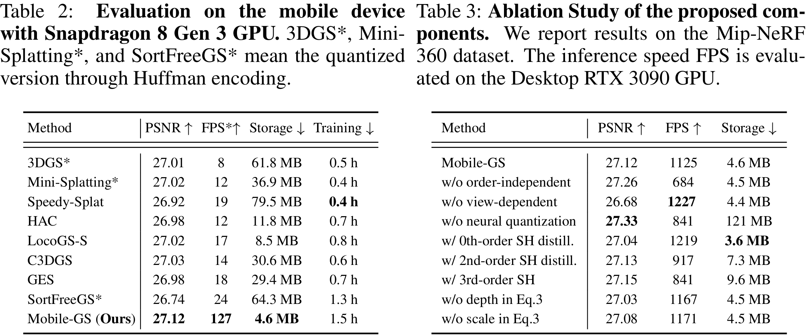
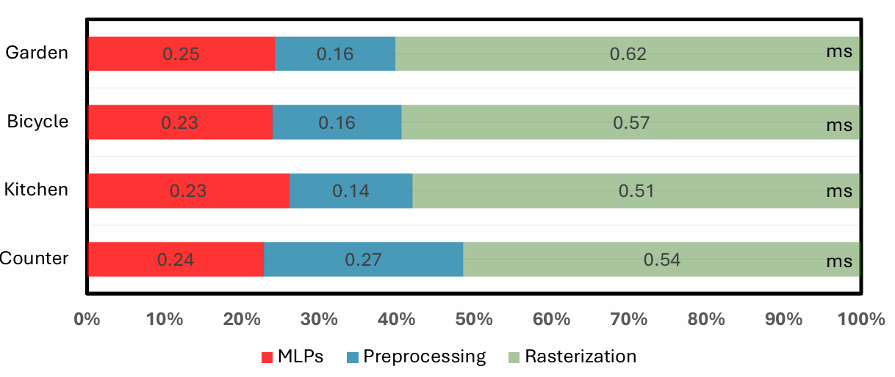
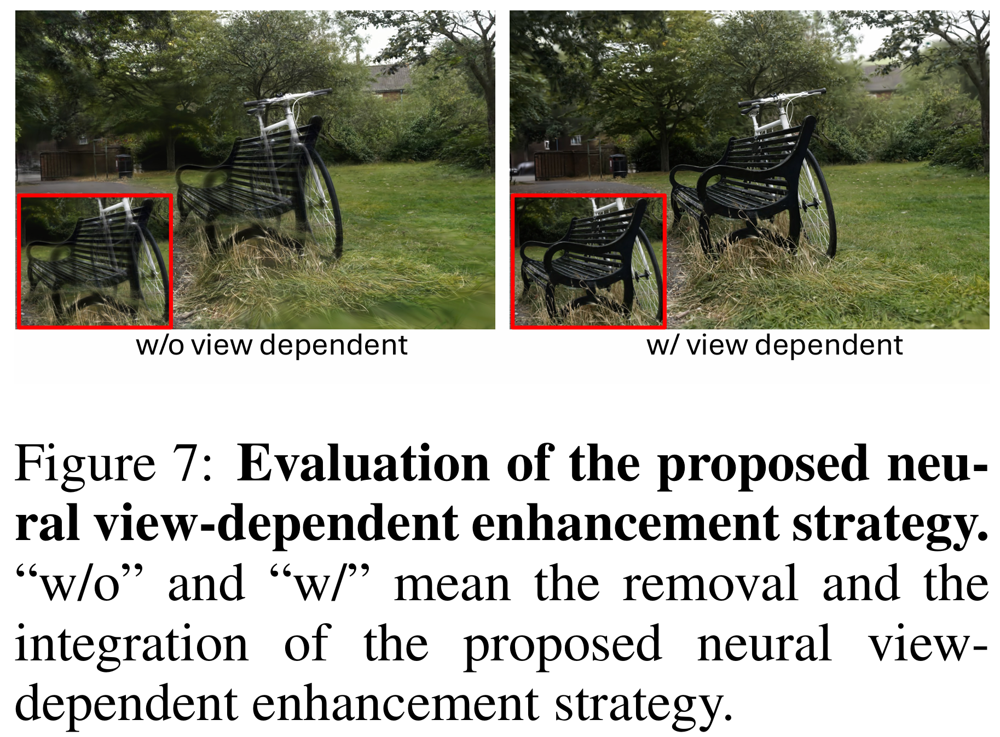
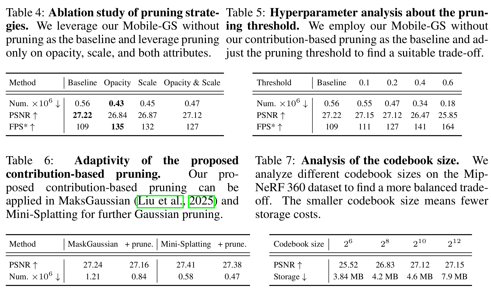

---
# xaringan::inf_mr('Paper_review/2026 (ICLR) Mobile-GS/Mobile-GS_presentation.Rmd')
# pagedown::chrome_print('Paper_review/2026 (ICLR) Mobile-GS/Mobile-GS_presentation.html')
title: "Mobile-GS: Real-Time Gaussian Splatting For Mobile Devices"
subtitle: "2026 ICLR"
author: |
  <span class="author-line">Xiaobiao Du<sup>1,3</sup>, Yida Wang<sup>3</sup>, KunZhan<sup>3</sup>, XinYu<sup>2∗</sup>
  <span class="affiliation"><sup>1</sup>University of Technology Sydney, <sup>2</sup>Adelaide University, <sup>3</sup>Li Auto Inc</span>
date: 2026.03.19

output:
  xaringan::moon_reader:
    lib_dir: libs
    css:
      - default
      - default-fonts
      - ../../swan/swan.css
      - ../../swan/tachyons_ext.css
      - logo-bottom-right.css
    includes:
      after_body: logo-bottom-right.html
    nature:
      highlightStyle: github  
      highlightLines: true
      countIncrementalSlides: false
      ratio: '16:9'
---

```{r setup, include=FALSE}
knitr::opts_chunk$set(echo = FALSE, warning = FALSE, message = FALSE)
```

<!-- class: title-slide
count: false -->
# Contents

.contents-list[
1. Introduction
2. Related Work
3. Method
4. Experiments
5. Conclusion
]

---

# Introduction
.pull-left[
- Gaussian Splatting은 빠르지만, 전체 pipeline에서의 병목 존재
- 3DGS의 지속적인 병목: **Sorting**
  - 3DGS는 alpha blending을 통해 픽셀의 색상을 결정하는데, 이 때, near-to-far depth sorting이 필요함
  - 따라서, 3DGS의 병목은 Sorting이며, 이는 모바일에서 실시간 렌더링을 어렵게 하는 주요 원인임
  - 즉, sorting이 비싼연산임
  ]

.pull-right[
<div class="pull-up-20">


</div>
]

---

# Introduction
- 본 논문은 병목을 줄이고 추가 최적화를 통해 모바일 실시간 렌더링을 달성하는 것이 목표
- Mobile-GS는 다음과 같은 세 가지 핵심 아이디어로 구성
  - Order-free rendering : Sorting 제거 (Depth-aware order-independent rendering)
  - Quantization : 메모리 절약을 (Neural vector quantization + SH distillation)
  - Fewer Gaussian points : 퀄리티 유지하면서 Gaussian point 수 줄이기 (Contribution-based pruning)
.left-10[
.top-56[

]
]

---
# Related Work
### 3D Gaussian Splatting 

.font80[  
- 3DGS (Kerbl et al., 2023) : 장면을 anisotropic 3D Gaussian으로 표현하고, tile-based differentiable rasterizer를 사용해 novel view를 렌더링함.
- Scaffold-GS (Lu et al., 2024) : hierarchical scaffold structure를 도입하여, 시각적 품질을 유지하면서 Gaussian 수를 줄이는 방식으로 고품질 렌더링을 달성함.
- Mini-Splatting (Fang & Wang, 2024) : pruning + densification 전략을 통해, 매우 compact한 Gaussian 구조를 생성하는 데 초점을 맞춤.
- 후속 compression 계열 연구들 (Chen et al., 2024b; 2025; Wang et al., 2024b; Liu et al., 2024) : 더 lightweight한 representation을 만들기 위해 compression ratio를 높이는 방향으로 접근함.
- MVGS (Du et al., 2026) : 최적화 단계에서 multi-view learning을 도입하여, 3DGS의 multi-view constraint를 강화하고 전체 렌더링 성능을 향상시킴.

]
---
### Order Independent Transparency (OIT)/Sort-Free 3DGS

.font80[
- Traditional OIT methods
  - A-buffer, K-buffer, Depth Peeling, Stochastic Transparency
  $\rightarrow$sorting 없이 transparency를 처리하기 위한 전통적 접근

- Recent sort-free 3DGS works
  - approximated compositing 또는 order-independent accumulation을 통해 sorting 제거

- Representative work: SortFreeGS(Hou et al., 2025) 
  - Weighted sum 기반 compositing으로 order-independent rendering 수행

$$C = \frac{c_{bg} w_{bg} + \sum_{i=1}^{N} c_i \alpha_i w(d_i)}{w_{bg} + \sum_{i=1}^{N} \alpha_i w(d_i)}, \quad w(d_i)=\exp\left(-\sigma_i d_i^{\beta_i}\right)$$

- 그럼에도 불구하고 용량이 너무크고, inference time 측면에서 여전히 delay가 존재
  - 이와 관련해서 압축과 경량화에 집중한 후속 연구들이 수행됨
]


---
# Related Work
### Gaussian Compression and Pruning.

.font80[
- Compression methods
  - vector quantization / entropy encoding을 통해 Gaussian representation 압축
  - locality-aware strategy로 Gaussian attributes를 compact local representation으로 압축

- LODGE / MaskGaussian / GaussianSpa
  - importance, contribution, sparsity constraint 기반 pruning으로 Gaussian 수 감소

- Redundancy(중복) 감소에는 효과적이지만, 렌더링 품질 저하와 여전한 storage overhead 문제가 존재
- 따라서, Mobile-GS는 **3가지 contribution**(order free, quantization, pruning) 모두를 활용하여, **모바일에서 실시간 렌더링**이 가능한 compact한 Gaussian Splatting을 목표로 함
]

---
# Method

### Overview of Mobile-GS


---
# Method

### I. Depth-aware Order-Independent Rendering

.font80[
- 앞서 언급한 alpha-blending, 기존의 sort-free 3DGS 방식들과 다르게, 본 논문은 아래의 수식으로 order-independent rendering을 수행
  - Alpha blending이긴 함
  - 다만, 여기서는 foreground와 background의 비율을 조정할 수 있는 Global transmittance인 $T$를 도입하여 사용
$$C=(1-T)\frac{\sum_{i=1}^{N} c_i\alpha_i w_i}{\sum_{i=1}^{N} \alpha_i w_i}+T\,c_{bg}, \quad T=\prod_{j=1}^{N}(1-\alpha_j)$$

- 여기서 opacity와 weight로 normalize해줌으로써 결국 color는 weighted average로 계산
]
---
# Method

.font80[

- Weighted average, 즉 덧셈으로 pixel의 색상을 계산하기 위해서, alpha와 weight를 다음과 같이 정의
$$\alpha_i=o_i\exp\left(-\frac{1}{2}\,\Delta x_i^{\top}\Sigma_i^{-1}\Delta x_i\right), \quad w_i=\phi_i^2+\frac{\phi_i}{d_i^2}+\exp\left(\frac{s_{\max}}{d_i}\right)$$
- feature를 통해 $\phi_i$와 $o_i$를 MLP로 예측(Neural View-dependent Enhancement):
$$F=\mathrm{MLP}_f(\mathbf{p}_i,s_i,r_i,Y_i),\quad \phi_i=\mathrm{ReLU}(\mathrm{MLP}_{\phi}(F)),\quad o_i=\sigma(\mathrm{MLP}_{o}(F)), \quad \mathbf{p}_i=\frac{\mu_i-\mathbf{t}_v}{\left\|\mu_i-\mathbf{t}_v\right\|}$$

]


.top-63[
.left-10[

] 
]

---
# Method
### II. Distillation and Quantization

.font90[
- First-order Spherical Harmonics Distillation
  - SH coefficient 마저도 압축하여 경량화에 신경을 더 쓰겠다
  - 기존 3DGS에서는 3차까지 쓰고, LightGS에서는 2차만 썼는데, 1차까지 3개 총 4개로 줄여 표현
  - Teacher-student distillation
    - 여기서 teachear는 Mini-Splatting 모델로, student는 Mobile-GS 모델
      $$\mathcal{L}_{\mathrm{distill}}=\frac{1}{|P|}\sum_{p\in P}\left\|C_p^{\mathrm{tea}}-C_p\right\|$$
    - Geometry 안정화를 위해 depth distillation loss도 추가
      $$\mathcal{L}_{\mathrm{depth}}(\mathbf{D},\mathbf{D}^{\mathrm{tea}})=\frac{1}{|P|}\sum_{p\in P}\left(\log(\hat{D}_p)-\log(\hat{D}_p^{\mathrm{tea}})\right)^2-\frac{1}{|P|^2}\left(\sum_{p\in P}\left(\log(\hat{D}_p)-\log(\hat{D}_p^{\mathrm{tea}})\right)\right)^2$$
    
      

]
---
# Method
.font90[
-  Neural Vector Quantization
  - 기존의 방식들보다도 많은 경량화를 이뤘지만, mobile device에서 랜더링하기 위해서는 좀 더..
  - Gaussian attributes를 Neural vector quantization을 통해 압축
      - Gaussian 하나의 attributes들을 K개의 sub-vector로 분할
        $$z = \left[z_1, z_2, \cdots, z_K\right], \quad z \in \mathbb{R}^{K \times L}$$

      - 각 sub-vector는 codebook에서 가장 가까운 벡터로 양자화
        $$ C^K \in \mathbb{R}^{B \times L} $$
      - ...?
]

---
# Method

- For example...

.pull-left[
  .font80[
  - Gaussian 하나의 atrribute를 12차원이라고 해보자.
  $$z \in \mathbb{R}^{12}$$

  - 이걸 subvector로 나누는데, $K = 3$ subvectors로 나눈다고 해보자.
  $$z = \left[z_1, z_2, z_3\right], \quad z_k \in \mathbb{R}^{4}$$

  - 수십, 수백만개의 Gaussian들이 있을텐데, K-means clustering을 통해서, 각 subvector에 대해서 codebook을 생성 $\left(k = B\right)$
  $$C^k \in \mathbb{R}^{B \times L}$$
  ]
]
.pull-right[
  .font80[
- 그런데, $z$ 내부에는 다차원의 SH계수를 0차원 색상인 $h_d \in \mathbb{R}^1$와 view dependent color인 $h_v \in \mathbb{R}^3$로 압축한걸 들고있다
- 랜더링할 때에는 이를 MLP로 다시 예측해서 사용
  $$f_d = \mathrm{MLP}_d(h_d, h_v), \quad f_v = \mathrm{MLP}_v(h_d, h_v)$$
- 이때 복원된 색상정보가 앞서 보았던 MLP에 다시 들어가 $\phi_i$와 $o_i$를 예측하는데 사용됨

  ]
]


---
# Method
### III. Contribution-based Pruning
.font90[
- 너무 투명하거나, scale이 너무 작은 gaussian은 랜더링에 거의 기여하지 않음
  - 다른말로 해석해보면, 오히려 scene 정확도를 해치는 floating point 관리
      - $Q$ 함수를 사용하는 이유는, 항상 하위 몇%를 유지할 수 있도록 함
  $$\mathcal{C}_{\mathrm{opacity}}^{(t)} = \{g \in \mathcal{G} \mid o_g < Q_{\tau}(o)\}, \quad \mathcal{C}_{\mathrm{scale}}^{(t)} = \{g \in \mathcal{G} \mid s_{\max}(g) < Q_{\tau}(s_{\max})\}$$
  $$\mathcal{C}_{\mathrm{prune}}^{(t)} = \mathcal{C}_{\mathrm{opacity}}^{(t)} \cap \mathcal{C}_{\mathrm{scale}}^{(t)}$$
  

- 다만, $\mathcal{C}_{\mathrm{prune}}^{(t)}$ 에 해당하는 녀석들을 바로 pruning하지 않고, 투표를 함
  - $I_{prune} = 100$은 pruning interval, $v = 60$는 pruning vote threshold, 즉 100번 중 60번 이상 prune해야되면 지움
  $$V_g^{(t+1)} = V_g^{(t)} + \mathbf{1}[g \in \mathcal{C}_{\mathrm{prune}}^{(t)}],\quad \mathcal{G}_{\mathrm{new}} = \mathcal{G} \setminus \{g \in \mathcal{G} \mid \mathbf{1}[V_g^{(t)} > I_{\mathrm{prune}} \cdot v]\}$$
]
---
# Method
### IV. Implementation

.font90[
- Trainig loss
  $$\mathcal{L}_{\mathrm{rgb}} = \lambda \mathcal{L}_1(\mathbf{C}, \mathbf{C}_{\mathrm{gt}}) + (1-\lambda)\mathcal{L}_{\mathrm{DSSIM}}(\mathbf{C}, \mathbf{C}_{\mathrm{gt}})$$
  $$\mathcal{L} = \mathcal{L}_{\mathrm{rgb}} + \lambda_{\mathrm{distill}}\mathcal{L}_{\mathrm{distill}} + \lambda_{\mathrm{depth}}\mathcal{L}_{\mathrm{depth}}$$

- Training detials
  - RTX 3090 GPU
  - 60k iterations
  - 35k-th iteration에서 NVQ 시작
  - Mobile devices :  Snapdragon 8 Gen 3 GPU
]

---
# Experiments

.center.nt-02[
  
]

---
# Experiments

.center[
  
]

---
# Experiments

.pull-left[
  
]

.pull-right[
  
]

---
# Experiments

.center.nt-01[
  
]

---
# Conclusion
- Mobile-GS는 3D Gaussian Splatting을 모바일에서 실시간으로 렌더링할 수 있도록 하는 방법론
- Order-independent rendering, distillation과 quantization, contribution-based pruning을 활용하여, 모바일에서 실시간 렌더링이
  - 경량화에 할 수 있는 모든걸 다함
- 빠르다, 퀄리티도 꽤 좋다, 압축 열심히 하고 품질 유지한것도 좋다. 
- 다만 bounded scene이다. 
- incremental하게 확장하는걸 좋아하는 사람은 어떻게 활용할 수 있을까
- 꼭 MLP를 활용해야하나? geometric한 방법으로 더 빠르게 할 수는 없나?
