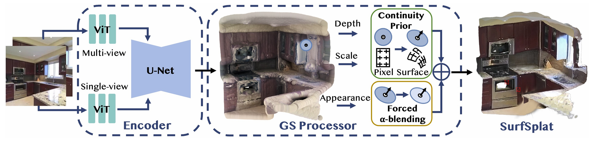
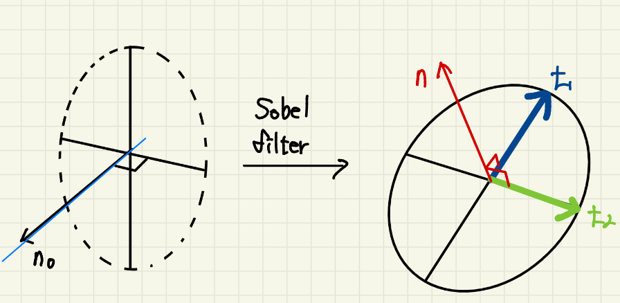
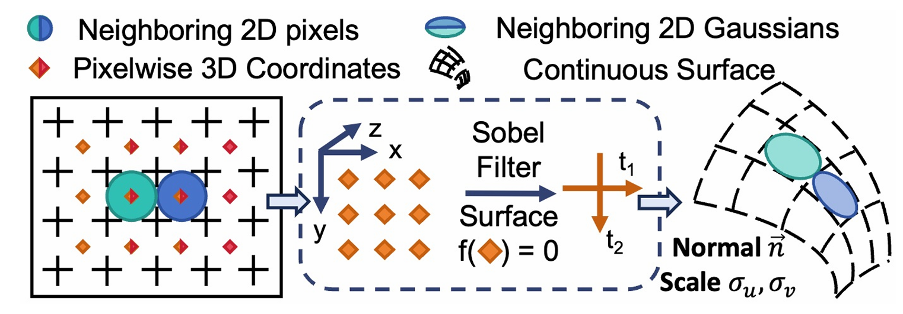
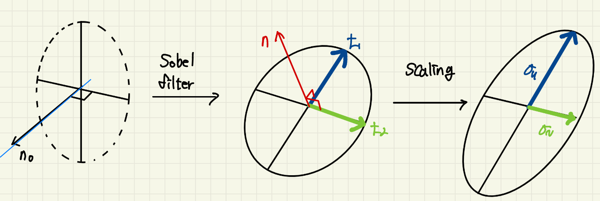
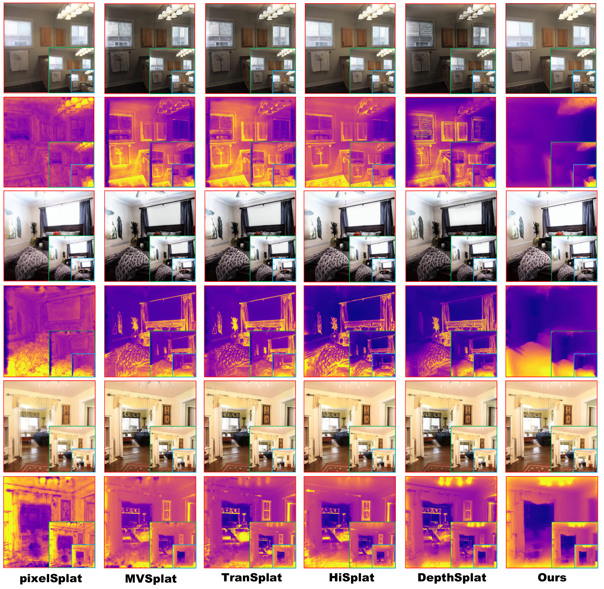
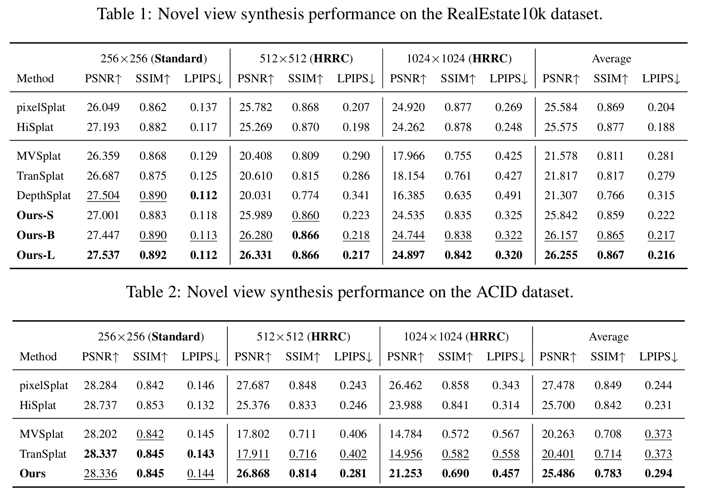
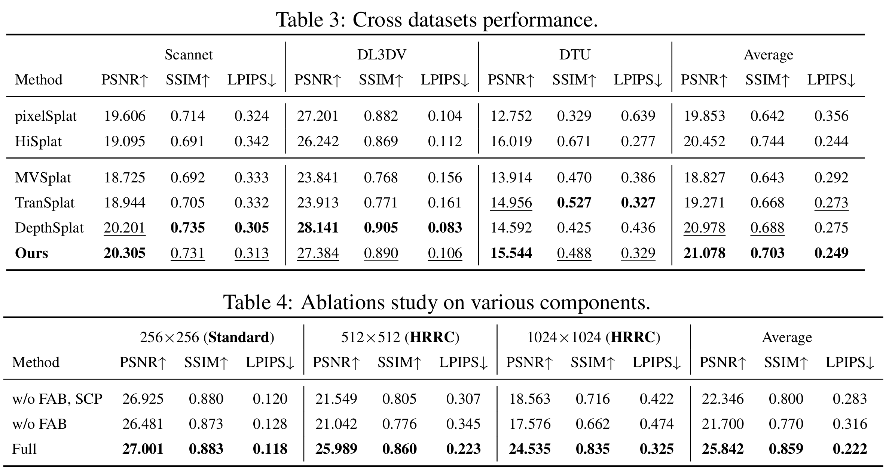
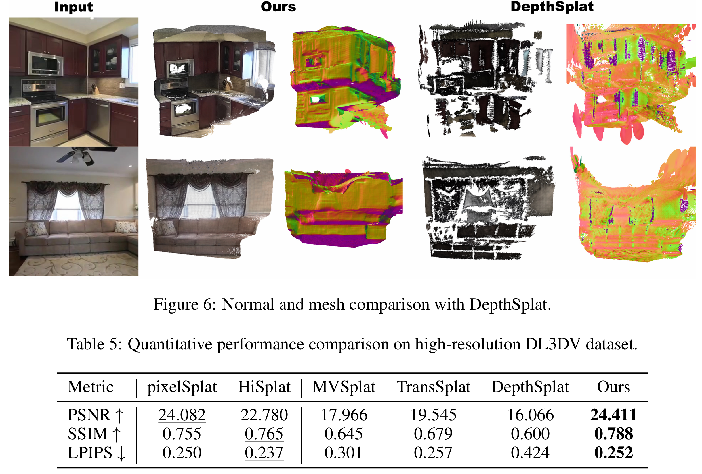
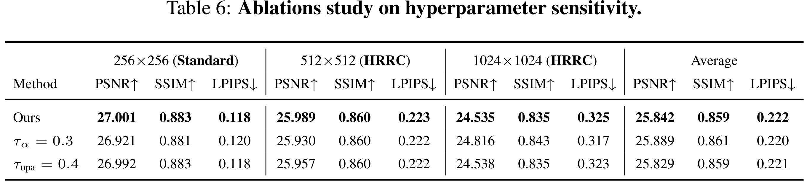

---
# xaringan::inf_mr('Paper_review/2026 (ICLR) SurfSplat/SurfSplat_presentation.Rmd')
# pagedown::chrome_print('Paper_review/2026 (ICLR) SurfSplat/SurfSplat_presentation.html')
title: "SurfSplat: Conquering Feedforward 2D Gaussian Splatting with Surface Continuity Priors"
subtitle: "ICLR 2026"
author: |
  <span class="author-line">Bing He<sup>1</sup>, Jingnan Gao<sup>1</sup>, Yunuo Chen<sup>1</sup>, Gang Chen<sup>2</sup>, Ning Cao<sup>2</sup>,</span><br>
  <span class="author-line">Zhengxue Cheng<sup>1</sup>, Li Song<sup>1</sup>, Wenjun Zhang<sup>1</sup></span><br><br>
  <span class="affiliation"><sup>1</sup>Shanghai Jiao Tong University&emsp;<sup>2</sup>Tianyi Shilian Technology Co., Ltd</span>
date: 2026.02.12

output:
  xaringan::moon_reader:
    mathjax: "default"
    lib_dir: libs
    nature:
      highlightStyle: github  
      highlightLines: true
      countIncrementalSlides: false
      ratio: '16:9'
---

```{r setup, include=FALSE}
knitr::opts_chunk$set(echo = FALSE, warning = FALSE, message = FALSE)
```

```{css, echo=FALSE}
.title-slide .remark-slide-number {
  display: none;
}

.title-slide .author-line {
  font-size: 0.85em;
  letter-spacing: 0.3px;
}

.title-slide .affiliation {
  font-size: 0.65em;
  color: #bbbbbb;
  font-style: italic;
}

.title-slide sup {
  font-size: 0.6em;
  vertical-align: super;
  color: #f0c040;
}

.contents-list {
  font-size: 30px;
  font-family: 'Trebuchet MS', sans-serif;
  line-height: 1.5;
}

.main-text {
  font-size: 30px;
  font-family: 'Trebuchet MS', sans-serif;
  line-height: 1.5;
}

.remark-slide-content ul {
  font-size: 20px;
}

.remark-slide-content ul ul {
  font-size: 18px;
}

.remark-slide-content ul ul ul {
  font-size: 15px;
}

.remark-slide-number {
  font-size: 16px;
  bottom: 40px;
  right: 10px;
}

.remark-slide-content:not(.title-slide)::before {
  content: "";
  position: absolute;
  bottom: 8px;
  right: 10px;
  width: 80px;
  height: 30px;
  background: url('fig/lab_logo.jpg') no-repeat center;
  background-size: contain;
}

.bottom-center-img {
  position: absolute;
  bottom: 60px;
  left: 50%;
  transform: translateX(-50%);
  max-width: 80%;
}

.bottom-right-img {
  position: absolute;
  bottom: 60px;
  right: 20px;
  max-width: 40%;
}

.pull-left, .pull-right {
  width: 48%;
}

.pull-left {
  margin-top: 30px;
}

.pull-left img, .pull-right img {
  display: block;
  width: 100%;
}

.remark-slide-content:not(.title-slide)::before {
  content: "";
  position: absolute;
  bottom: 8px;
  right: 10px;
  width: 80px;
  height: 30px;
  background: url('fig/lab_logo.jpg') no-repeat center;
  background-size: contain;
}
.caption-left {
  position: absolute;
  bottom: 50px;
  left: 25%;
  transform: translateX(-50%);
  font-size: 16px;
  font-style: italic;
}

.caption-right {
  position: absolute;
  bottom: 50px;
  right: 25%;
  transform: translateX(50%);
  font-size: 16px;
  font-style: italic;
}

/* .title-slide::after {
  content: "Computer Vision and Robotics Laboratory, Minsu Kim";
  position: absolute;
  bottom: 30px;
  left: 50%;
  transform: translateX(-50%);
  font-size: 22px;
  color: #ffffff;
  font-weight: bold;
} */
```

<!-- class: title-slide
count: false -->
# Contents

.contents-list[
1. Introduction
2. Method
3. Experiments
4. Conclusion
]

---
# Introduction

- NVS(Novel View Systhesis)의 방식에서도, Gaussian Splatting은 크게 2가지로 나눌 수 있음
    - COLMAP input을 받아 optimization을 통해 scene을 생성하는 방식
    - Feedforward 방식으로, 사전학습 모델을 사용하여 single/multi-view에서 바로 Gaussian을 생성하는 방식


- 다만, 기존의 feedforward 방식들은 빠르긴 하지만, rendering 품질이 떨어질 수 있음
    - 최적화를 통해 gaussian의 속성을 수정하고, scene의 품질을 끓어올렸지만, 이 부분이 사라짐
    - 또한, 3D Gaussian을 만드는 데, 2D image loss에 의존
    - 즉, image가 없는 곳(한번도 본 적이 없던 곳) 은 gaussian이 부정확하게 생성될 수 있음

- 따라서, 본 논문에서는 surface continuity prior를 도입하여, feedforward Gaussian splatting의 품질을 끌어올림
- 또한, forced alpha blending을 통해, occlusion 문제도 해결
- 마지막으로 HRRC(high resolustion redering-based metric)을 도입하여 평가

---
# Method
### Encoder
- Multi-view branch와 Single View branch로 나누어 구성 (Depth Splat과 유사)
- 각 이미지에 ResNet 기반 stride-2 layer 2개를 사용해 1/4 사이즈의 feature map을 추출
    - 이 feature들을 multi-view Swin Transformer에 통과시켜, self, cross attention 수행을 6번 반복한 결과는 아래와 같음
    $$\{F^i \}_{i = 1}^N, F^i \in \mathbb{R}^{\frac{H}{s} \times \frac{W}{s} \times C}$$
    - 이 Multi-view aware output을 plane sweep stereo를 통해 $\{F_{d_m}^{j \rightarrow i}\}$ 마다 score를 뽑아서 평균을 냄(source image가 2개면 score/2, 3개면 score/3)
    - 이후 Softmax 통과시켜 cost volume을 확률밀도값으로 가지고있음 $C_i \in \mathbb{R}^{\frac{H}{S} \times \frac{W}{S} \times D}$ 생성
    
<div style="position:absolute; left:50%; top:480px; transform:translateX(-50%); width:80%; text-align:center;">
  
</div>


---
# Method

- Single-view branch는 DepthAnything V2를 사용하면서, texture가 없거나, correspondence가 부족한 영역에서 일단 gaussian을 생성
    - Depth Anything V2 는 1/14 사이즈의 결과가 나오는데, 1/4로 binlinear upsampling 후 사용
    - 최종 output은 monocular features $F_m^i \in \mathbb{R}^{\frac{H}{s} \times \frac{W}{s} \times C_m}$

- 두 cost volume을 concat해 U-Net에 입력하여 Gaussian attributes 추출
   - texture가 없는곳은 Single view branch의 이점을, depth가 모호한 곳은 multi-view branch의 이점을 취함
$$f_\theta : \{(I^v, \mathbf{k}^v, \mathbf{T}^v)\}_{v=1}^V \mapsto \left\{\bigcup_{j=1}^{H\times W} (\boldsymbol{\mu}_j^v, 
\alpha_j^v, \mathbf{r}_j^v, \mathbf{s}_j^v, \mathbf{c}_j^v)\right\}_{v=1}^V$$
- 여기서 초기 3D Gaussian을 만들어냄!


---
# Method

### Surface Continuity Prior
- 기존의 feedforward 방식들은 2D image loss에만 의존하여, 3D Gaussian을 생성
    - 이미지가 없는 곳에서는 부정확한 Gaussian이 생성될 수 있음; 이걸 **scene이 불연속적이다** 라는 표현을 쓰기도 함
- 본 논문에서는, 대부분의 실제 표면은 locally smooth하고, 이미지에서 이웃한 픽셀은 3D 표면에서도 이웃한 점일 가능성이 높다는 것을 가정
    - 즉, 이미지 상에서 이웃한 pixel들은, 3D 공간에서도 이웃한 Gaussian을 만들어야 한다는 가정
    - 즉, rotation, scale은 이웃한 Gaussian과 유사해야 함
- 3차원 공간에서의 Gaussian은 $\mathbf{p_0} \in \mathbb{R}^3$, normal vector는 COLMAP의 좌표계 기준에 따라 
$\mathbf{n}_0 = (0, 0, 1)^\top$, rotation은 $\mathbf{R}_0 \in SO(3)$
  - 즉, Gaussian은 카메라 view direction과 정면에 위치하도록 설정

- 정밀한 local surface normal을 얻기위해, depth map에 Sobel filter를 수행(x, y 축으로 soble filtering) 후 virtual neighbors 생성($\mathbf{p}_1, \mathbf{p}_2$)
    - 기준점으로부터 빼서 plane의 기저벡터 생성 
    $$\mathbf{t}_1 = \mathbf{p}_1 - \mathbf{p}_0 , \quad \mathbf{t}_2 = \mathbf{p}_2 - \mathbf{p}_0$$

<div style="position:absolute; right:30px; top:30px; width:50%; text-align:right;">
  
</div>

---
# Method
.pull-left[
- 이후, 두 벡터의 외적을 통해 normal vector 계산
    $$\mathbf{n} = \frac{\mathbf{t}_1 \times \mathbf{t}_2}{\|\mathbf{t}_1 \times \mathbf{t}_2\|}$$

- 계산된 normal을 기준으로, 기존의 $\mathbf{n}_0$를 $\mathbf{n}$으로 회전시키는 rotation matrix $\mathbf{R}$ 계산
    $$\mathbf{R} = \mathbf{I} + [\mathbf{v}]_{\times} + \frac{1 - c}{\|\mathbf{v}\|^2} [\mathbf{v}]_{\times}^2$$
    $$\mathbf{R}_{\text{surf}} = \mathbf{R}\mathbf{R}_0 = \mathbf{R}$$

- Scale은 앞서 구한 plane에 주변 point들 을 투영한 후 각 축으로의 분산 계산
$$u = \frac{t_1}{\|t_1\|}, \quad v = \frac{t_2}{\|t_2\|}, \quad w = n \text{ (Normal)}$$
]

.pull-right[
 $$\text{dist}_{u, k} = (p_k - p_0) \cdot u$$
 $$\text{Var}_u = \frac{1}{N} \sum_{k \in \mathcal{N}} \left( (p_k - p_0) \cdot u \right)^2$$
 $$\sigma_u = \sqrt{\text{Var}_u} = \sqrt{\frac{1}{N} \sum_{k \in \mathcal{N}} ((p_k - p_0) \cdot u)^2}$$
  - 2D Gaussian이기에 $S = diag(\sigma_u, \sigma_v, \sigma_w = 0)$
]

<div style="position:absolute; right:30px; bottom:30px; width:50%; text-align:right;">
  
</div>

---
# Method

- Covariance는 앞서 구한 Rotation과 Scale을 사용하여 다음과 같이 계산
$$\Sigma = \mathbf{R}\mathbf{S}\mathbf{S}^T\mathbf{R}^T,$$
$$\Sigma' = \mathbf{J}\mathbf{W}\Sigma\mathbf{W}^T\mathbf{J}^T,$$


- But,, 앞에 설명한 '정석' 대로 Projection Jacobian을 역으로 풀어 3D scale을 구하는 방식은 불안정할 수 있다.
    - Feedforward 방식에서는 inital point도 없고, 매 pixel마다 독립적으로 Gaussian을 생성해야 함
    - 따라서, tangent plane 상에서 이미 괜찮게 구해진 vector들의 크기를 이용해 2D Gaussian의 scale을 이용해 근사(coarse scale estimation)
    - 기존에 구한 $t_1$, $t_2$ 벡터의 각 성분을 활용해 scale 결정 
       - 즉, surface-consistent scale을 먼저 만들고, multiplier로 fine-tuning 한다.
.pull-left[
    $$\bar{\sigma}_u^2 = t_{1x}^2 + t_{1z}^2, \qquad \bar{\sigma}_v^2 = t_{2y}^2 + t_{2z}^2$$
    $$\sigma_u = \bar{\sigma}_u \hat{\sigma}_u, \qquad \sigma_v = \bar{\sigma}_v \hat{\sigma}_v$$
    ]
<div style="position:absolute; right:80px; bottom:35px; width:45%; text-align:right;">
  
</div>


---
# Method
### Forced Alpha Blending
- 기존의 alpha blending은 일정 gaussian의 opacity가 커지면, 뒤의 gaussian이 가려져 해당 pixel에 아예 영향이 없는 경우가 생김
    - 기존 alpha blending 
$$C = \sum_{i \in \mathcal{N}} c_i \alpha_i \prod_{j=1}^{i-1} (1 - \alpha_j), \quad \alpha = \sum_{i \in \mathcal{N}} \alpha_i \prod_{j=1}^{i-1} (1 - \alpha_j).$$
- 위 식대로라면, geometry가 있어서 gaussian이 생성되어야 하는 경우에 training view에서 보이지 않으면 gaussian 이 생성되지 않음
- 따라서, alpha 값을 일정 값 이상 커지지 않도록 강제(force) 하도록 함 ($\alpha < \tau_{opa} < 1$)
- 또한, alpha값에 따라 color contribution도 조절
  - alpha 값이 큰 녀석은 복원해주도록 함 (e.g., $C/\alpha = (0.6, 0, 0)/0.6 = (1, 0, 0)$)
$$C = \begin{cases} C, & \alpha < \tau_\alpha, \\ \frac{C}{\alpha}, & \alpha \geq \tau_\alpha, \end{cases}$$

---
# Method

### Training loss

- 기존의 3DGS와 유사하게, image rendering 기반 loss
$$L_{\text{gs}} = \sum_{m=1}^{M} \left( \text{MSE} \left( I_{\text{render}}^m, I_{\text{gt}}^m \right) + \lambda \cdot \text{LPIPS} \left( I_{\text{render}}^m, I_{\text{gt}}^m \right) \right),$$

### HRRC(High-Resolution Rendering Consistency)
- 새로운 metric을 제안하는데, 기존의 metric은 저해상도 이미지에서 계산
- 따라서, high-resolution rendering을 통해, 더 정밀한 평가를 수행
- 2배, 4배 upsample한 이미지에서 각각 PSNR, SSIM, LPIPS 계산($\color{blue}{\times 1}$, $\color{green}{\times 2}$, $\color{red}{\times 4}$)
$$\text{HRRC}_{\text{metric}} = \text{metric}(\hat{I}^{HR}, \hat{I}^{GT\uparrow}) \quad \text{where metric} \in \{\text{PSNR, SSIM, LPIPS}\}$$

---
# Experiments

### Hyperparameter Summary


**FAB(Forced Alpha Blending)**
- Opacity bound: $\tau_{\text{opa}} = 0.6$
- Alpha threshold: Train 0.1 / Eval 0.001

---
# Experiments

<div style="position:absolute; left:50%; top:100px; transform:translateX(-50%); width:80%; text-align:center;">
  
</div>


---
# Experiments

<div style="position:absolute; left:50%; top:120px; transform:translateX(-50%); width:80%; text-align:center;">
  
</div>

---
# Experiments

<div style="position:absolute; left:50%; top:120px; transform:translateX(-50%); width:80%; text-align:center;">
  
</div>

---
# Experiments
<div style="position:absolute; left:50%; top:120px; transform:translateX(-50%); width:80%; text-align:center;">
  
</div>

---
# Experiments
<div style="position:absolute; left:50%; top:120px; transform:translateX(-50%); width:80%; text-align:center;">
  
</div>

<div style="position:absolute; bottom:20px; left:50%; transform:translateX(-50%); text-align:center;">
<a href="https://hebing-sjtu.github.io/SurfSplat-website/" target="_blank">https://hebing-sjtu.github.io/SurfSplat-website/</a>
</div>

---
# Conclusion 

- Feedforward 방식의 최신 논문
  - 이 분야의 논문은 한번에 잘 만드는 것이 관건
- Surface continuity prior를 도입하여, Gaussian의 rotation, scale을 더 정확하게 추정
- Forced alpha blending을 통해, occlusion 문제 해결
- HRRC metric을 도입하여, 고해상도에서의 rendering 품질 평가
- SLAM에서 비교해보면, frontend라고 생각할 수 있음
  - 최적화는 생각하지 않고, scene을 확장해나가고 odometry 계산에 초점
      - 다만 품질은 떨어질 수 있음
- Transformer 기반의 feedforward, frontend 방식이 괜찮은가?
    - Optimization의 계산비용과 품질 사이의 trade-off
    - Kalman filter?