---
# xaringan::inf_mr('Paper_review/2026 (RA-L) GSO-SLAM_np/GSO_SLAM_np_presentation.Rmd')
# pagedown::chrome_print('Paper_review/2026 (RA-L) GSO-SLAM_np/GSO_SLAM_np_presentation.html')
title: "GSO-SLAM: Bidirectionally Coupled Gaussian Splatting and Direct Visual Odometry"
subtitle: "2026 (RA-L)"
author: |
  Jiung Yeon, Seongbo Ha, Hyeonwoo Yu†
  Sungkyunkwan University
date: 2026.02.27

output:
  xaringan::moon_reader:
    lib_dir: libs
    nature:
      highlightStyle: github  
      highlightLines: true
      countIncrementalSlides: false
      ratio: '16:9'
---

```{r setup, include=FALSE}
knitr::opts_chunk$set(echo = FALSE, warning = FALSE, message = FALSE)
```

```{css, echo=FALSE}
.title-slide .remark-slide-number {
  display: none;
}

.contents-list {
  font-size: 30px;
  font-family: 'Trebuchet MS', sans-serif;
  line-height: 1.5;
}

.main-text {
  font-size: 30px;
  font-family: 'Trebuchet MS', sans-serif;
  line-height: 1.5;
}

.remark-slide-content ul {
  font-size: 20px;
}

.remark-slide-content ul ul {
  font-size: 18px;
}

.remark-slide-content ul ul ul {
  font-size: 15px;
}

.remark-slide-number {
  font-size: 16px;
  bottom: 40px;
  right: 10px;
}

.remark-slide-content:not(.title-slide)::before {
  content: "";
  position: absolute;
  bottom: 8px;
  right: 10px;
  width: 80px;
  height: 30px;
  background: url('fig/lab_logo.jpg') no-repeat center;
  background-size: contain;
}

.bottom-center-img {
  position: absolute;
  bottom: 60px;
  left: 50%;
  transform: translateX(-50%);
  max-width: 80%;
}

.bottom-right-img {
  position: absolute;
  bottom: 60px;
  right: 20px;
  max-width: 40%;
}

.pull-left, .pull-right {
  width: 48%;
}

.pull-left {
  margin-top: 30px;
}

.pull-left img, .pull-right img {
  display: block;
  width: 100%;
}

.caption-left {
  position: absolute;
  bottom: 50px;
  left: 25%;
  transform: translateX(-50%);
  font-size: 16px;
  font-style: italic;
}

.caption-right {
  position: absolute;
  bottom: 50px;
  right: 25%;
  transform: translateX(50%);
  font-size: 16px;
  font-style: italic;
}

/* .title-slide::after {
  content: "Computer Vision and Robotics Laboratory, Minsu Kim";
  position: absolute;
  bottom: 30px;
  left: 50%;
  transform: translateX(-50%);
  font-size: 22px;
  color: #ffffff;
  font-weight: bold;
} */
```

<!-- class: title-slide
count: false -->
# Contents

.contents-list[
1. Introduction
2. Method
3. Experiments
4. Conclusion
]

---

# Introduction
.pull-left[
- SLAM(Simultaneous Localization and Mapping)은 로봇, AR/VR 등에서 필수적인 기술
  - 정확한 pose estimation뿐 아니라, 기하학적으로 정밀한 dense reconstruction에 대한 수요 증가
- INR(Implicit Neural Representation) 기반 SLAM이 등장했으나, 높은 연산 비용으로 실시간 적용에 한계
  - iMAP, NICE-SLAM, Co-SLAM, Point-SLAM 등
- Gaussian Splatting(GS) 기반 SLAM이 대안으로 부상
  - 명시적 Gaussian primitive와 GPU 가속 rasterization 기반 렌더링
  - MonoGS, SplaTAM, GS-SLAM 등 → GS의 dense SLAM에서의 효과성 입증
]
.pull-right[
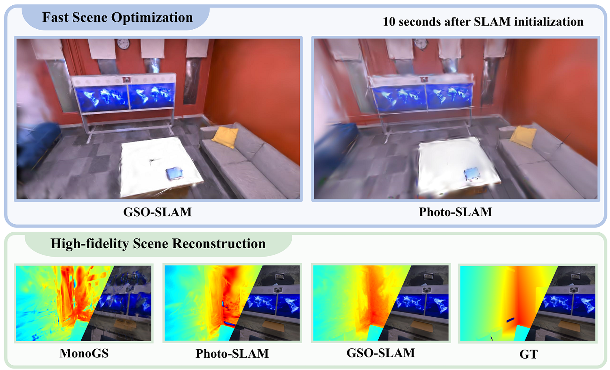
]

---

# Introduction

### Limitations of Existing GS-SLAM Methods

- **Coupled 방식** (MonoGS, SplaTAM, GS-SLAM):
  - 통합된 scene을 tracking과 mapping에 공유하여 re-rendering loss 기반 tracking 수행
  - 하지만 tracking에 반복적인 rendering과 optimization이 필요 → **실시간 처리 어려움**

- **Loosely coupled 방식** (Photo-SLAM, MGSO):
  - ORB-SLAM3, DSO 등 기존 tracking framework와 GS를 독립적으로 통합
  - 속도 문제는 해결하지만, tracking과 mapping이 **독립적으로 동작** → dense scene을 tracking에 활용 불가
  - Scene geometry 정보가 scene optimization에 제한적으로만 반영

---

# Introduction

### GSO-SLAM의 제안

- **Bidirectional Coupling**: Visual Odometry(VO)와 Gaussian Splatting(GS)을 양방향으로 결합
  - DSO(Direct Sparse Odometry)와 2D Gaussian Splatting 기반 mapping의 joint optimization
- **EM(Expectation-Maximization) Framework**:
  - Joint optimization을 EM으로 정식화 → **추가 연산 비용 없이** VO의 semi-dense depth와 GS representation을 동시에 최적화
- **Gaussian Splat Initialization**:
  - DSO의 image gradient, keyframe pose, pixel association을 활용하여 초기 Gaussian 파라미터를 결정
  - Heuristic 초기화 방법 불필요 → 수렴 가속화

.center[
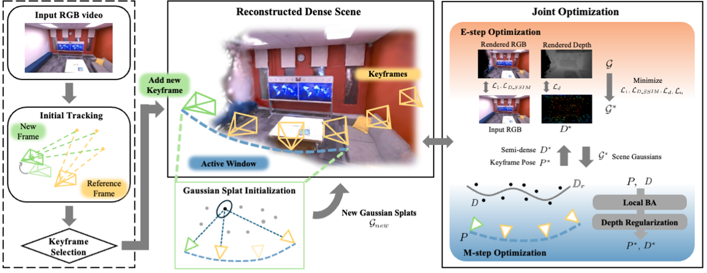
]

---
# Method

### Preliminaries - Direct Sparse Odometry (DSO)
 

- Direct Sparse Odometry (DSO)는, 이미지를 사용해서 loss를 구하는 photometric loss기반이라 'Direct'라 씀
- 하지만, 모든 이미지 픽셀을 사용하는것은 쉽지 않다.(연산량 너무많음)
- 따라서, 그 중 gradient가 큰 픽셀만 선택해서 사용하기에 'Sparse'라고 함
  - 그래서 'Direct Sparse Odometry'라고 불리는 것
- DSO는, 이미지 $I$로부터, 최적의 camera poses $P^*$와 depth maps $D^*$를 추정하는 문제로 정의
  - 관측된 이미지 $I$를 가장 잘 설명하는  $P^*$와 $D^*$를 찾자..!
$$P^*, D^* = \arg\max_{P,D} p(I \mid P, D)$$

- 어떻게..?
  - Phtometric loss를 구해서, 오차를 최소화하는 방식

---
# Method
$$E_{pj} = \sum_{\mathbf{p} \in \mathcal{N}_p}\left\|
\left(I_j[\mathbf{p}'] - b_j\right) - \frac{t_j e^{a_j}}{t_i e^{a_i}}\left(I_i[\mathbf{p}] - b_i\right)\right\|$$
- 여기서 $E_{pj}$는, reference frame $i$의 pixel $\mathbf{p}$와 target frame $j$의 reprojected pixel $\mathbf{p}'$ 간의 photometric error

- Sparse라며,, $\mathbf{p}$는 어떻게 찾는가?
  - 32x32 크기의 block으로 이미지를 나누고, 각 pixel gradient의 절댓값중 중앙값에서 + 7 threshold로 설정
      - 이렇게 하면, 하얀 벽처럼 textureless한 곳에서도 픽셀을 뽑을 수 있음(well-distributed)
  - 선택된 pixel $\mathbf{p}$는, 특정 pattern을 만들어, 이들은 $\mathcal{N}_p$에 속함 
      

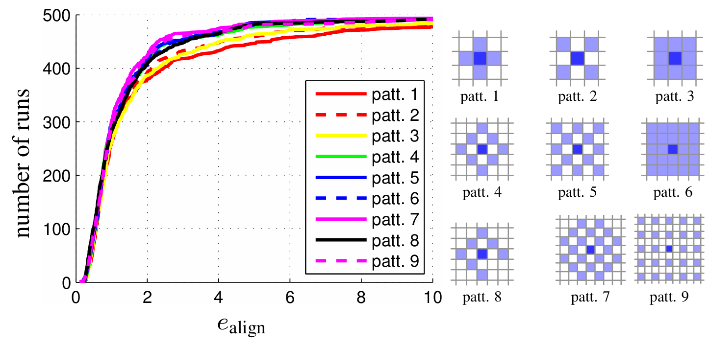
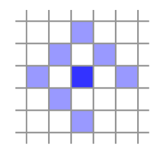
---
# Method
$$E_{pj} = \sum_{\mathbf{p} \in \mathcal{N}_p}\left\|
\left(I_j[\mathbf{p}'] - b_j\right) - \frac{t_j e^{a_j}}{t_i e^{a_i}}\left(I_i[\mathbf{p}] - b_i\right)\right\|$$
- $\mathbf{p}'$은, 아래와 같이 reprojection으로 구할 수 있음

$$\mathbf{p}' = \Pi_c\left(\mathbf{R}\,\Pi_c^{-1}(\mathbf{p}, d_p) + \mathbf{t}\right)$$

- 여기서, $d_p$는 pixel의 inverse depth이고, reference frame에서의 pixel을 unprojection하고, 좌표계 변환을 거친 뒤 re-projection을 통해
current frame에서의 pixel $\mathbf{p}'$를 구할 수 있음
- 여기서, 조도의 변화를 보정하기 위해 bias를 빼고, exposure time을 보정하는 항이 추가됨
- 마지막으로 앞서 구한 photometric error를 모든 keyframe과 선정된 pixel들에 대해 합산하면 photometric loss가 됨


$$E_{\text{photo}} := \sum_{i \in \mathcal{F}} \sum_{\mathbf{p} \in \mathcal{P}_i} \sum_{j \in \text{obs}(\mathbf{p})} E_{\mathbf{p}j}$$

---
# Method

### Preliminaries - 2D Gaussian Splatting (2DGS)

- 3D가 아닌 **2DGS**를 썼다 왜?
- 이미지만으로 dense 3D geometry를 추정하는 것은 정보가 부족(2D로부터 3D)한 까다로운 문제(ill-posed)이므로, 이를 효과적으로 모델링하기 위해 2D Gaussian Splatting 사용
- 각 2D 가우시안은 ($\mu, \Sigma, \alpha, c$)으로 정의되며, 렌더링과 최적화 과정의 연산 부담을 줄이기 위해 복잡한 Spherical Harmonics(SH) 제외(RGB color만 사용?)
- 3D 공간의 교차점을 평가하는 3DGS와 달리, 2DGS는 **ray와 2DGS의 교차(ray-splat intersection)** 방식을 사용하여 기하학적 모호함을 줄임.
- 이러한 2DGS의 고유한 렌더링 방식 덕분에 **다양한 시점에서 봐도 일관된 깊이(multi-view consistent depth)**를 얻을 수 있어, SLAM이나 표면 재구성(surface reconstruction) 작업에서 기하학적 정확도가 훨씬 뛰어남.


---
# Method

### Joint optimization

- 단순히 Bundle Adjustment(BA)를 통해 얻은 pose와 point로 2DGS에게 넘겨줘서 최적화 하는 방식은, photometric loss로 2DGS만 최적화되는데,
pose가 정확하지 않을 때에는 error을 가진채로 열심히 최적화
    - 이상한 곳으로 빠져 열심히 이상한 일을 한다.


- 따라서, 본 논문에서는 **Joint optimization**을 통해 BA와 2DGS가 서로 영향을 주고받으며 최적화 되도록 제안
    - DSO tracking과 dense reconstruction이 상호작용하여, 통합된 프레임워크 내에서 error를 공동으로 수정
    - SLAM에선 Joint optimization, tightly coupled 방식이라고 하기도 하지요..?

---
# Method
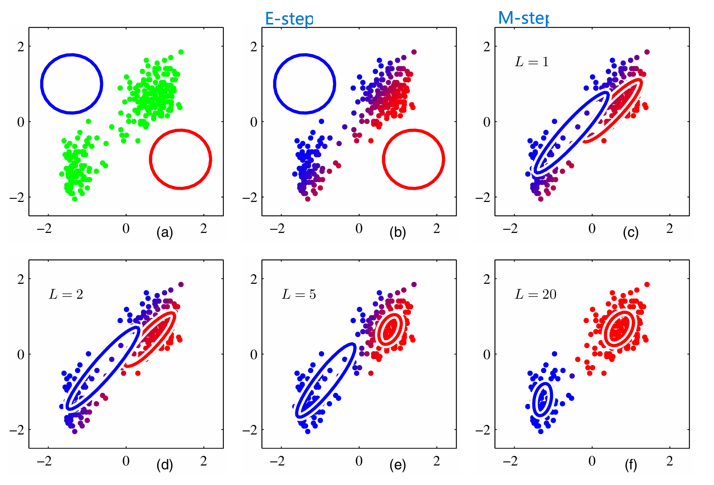

---

# Method

### EM Algorithm의 GSO-SLAM으로의 적용

- PRML의 GMM에서 봤던 EM과 동일한 구조 → GSO-SLAM에 그대로 적용

| PRML (GMM) | GSO-SLAM |
|---|---|
| Observed data $\mathbf{X}$ | 이미지 시퀀스 $I$ |
| Latent variable $\mathbf{Z}$ | 2D Gaussian scene $\mathcal{G}$ |
| Parameters $\boldsymbol{\theta} = (\boldsymbol{\pi}, \boldsymbol{\mu}, \boldsymbol{\Sigma})$ | Camera pose & depth $(P, D)$ |
| E-step: responsibility $\gamma(z_{nk})$ 계산 | E-step: $\mathcal{G}^*$ MAP 추정 (scene 업데이트) |
| M-step: $\boldsymbol{\mu}_k, \boldsymbol{\Sigma}_k, \pi_k$ 업데이트 | M-step: $(P, D)$ 업데이트 (BA + Depth Reg.) |


---

# Method

### Joint Optimization: E-step

- $P$와 $D$를 고정, $\mathcal{G}$를 MAP로 업데이트:

$$\mathcal{L}(q, P, D) = \mathbb{E}_{q(\mathcal{G})}[\log p(I, D, \mathcal{G}|P)] \tag{5}$$

- $q(\mathcal{G}) \approx \delta(\mathcal{G} - \mathcal{G}^*)$ ($\delta$-function 근사) → MAP estimation으로 단순화:

$$\mathcal{G}^* = \underset{\mathcal{G}}{\arg\max}\log p(\mathcal{G}|I,D,P) \propto \underset{\mathcal{G}}{\arg\max}\log p(I|\mathcal{G},D,P)\,p(D|\mathcal{G},P)\,p(\mathcal{G}|P)$$

$$= \underset{\mathcal{G}}{\arg\min}\; \underbrace{-\log p(I|\mathcal{G},D,P)}_{\text{RGB Rendering Loss}} \underbrace{-\log p(D|\mathcal{G},P)}_{\text{Semi-dense Depth Loss}} \underbrace{-\log p(\mathcal{G}|P)}_{\text{Normal Consistency Loss}} \tag{6}$$

- 각 loss를 구체화하면:

$$\mathcal{G}^* = \underset{\mathcal{G}}{\arg\min}\; \underbrace{(1-\lambda)\mathcal{L}_1(I_r, I_{gt}) + \lambda\,\mathcal{L}_{D\text{-SSIM}}(I_r, I_{gt})}_{\text{RGB}} + \underbrace{\lambda_d \mathcal{L}_1(D_r, D)}_{\text{Depth}} + \underbrace{\lambda_n \mathcal{L}_n}_{\text{Normal}} \tag{7}$$

---

# Method

### Joint Optimization: M-step

- E-step에서 얻은 $\mathcal{G}^*$를 고정, $P$와 $D$를 업데이트:

$$P^*, D^* = \underset{P,D}{\arg\max}\log p(I, D, \mathcal{G}^*|P)$$

$$= \underset{P,D}{\arg\min}\; \underbrace{-\log p(I|\mathcal{G}^*,D,P)}_{\text{BA Term}} \underbrace{-\log p(D|\mathcal{G}^*,P)}_{\text{Depth Regularization Term}} - \log p(\mathcal{G}^*|P) \tag{8}$$

- **BA Term**: 기존 DSO의 photometric loss ($E_\text{photo}$) 그대로 사용
  - $\mathcal{G}^*$ 고정 시 $-\log p(\mathcal{G}^*|P)$는 $P$에 대한 영향 미미 → 무시
- **Depth Regularization Term**: E-step의 $\mathcal{G}^*$에서 렌더링한 depth와 DSO depth의 **weighted average**
  - 매 iteration마다 depth re-rendering은 연산 과다 → averaging으로 대체
  - Basin of attraction 내에서 안정적인 초기화 역할 → high-frequency geometric detail 복원 유리

---

# Method

### Joint Optimization: EM에서 Loss 유도 정리

.pull-left[
**PRML EM 일반 형태:**
1. E-step: $q(\mathbf{Z}) = p(\mathbf{Z}|\mathbf{X}, \boldsymbol{\theta}^{\text{old}})$
2. M-step: $\boldsymbol{\theta}^{\text{new}} = \arg\max_{\boldsymbol{\theta}} \mathcal{Q}(\boldsymbol{\theta}, \boldsymbol{\theta}^{\text{old}})$

**$\delta$-function 근사 시:**
1. E-step: $\mathbf{Z}^* = \arg\max_{\mathbf{Z}} \; p(\mathbf{Z}|\mathbf{X}, \boldsymbol{\theta})$
2. M-step: $\boldsymbol{\theta}^* = \arg\max_{\boldsymbol{\theta}} \log p(\mathbf{X}, \mathbf{Z}^*|\boldsymbol{\theta})$
]

.pull-right[
**GSO-SLAM에서:**
1. **E-step** ($P, D$ 고정, $\mathcal{G}$ 최적화):
   - $\mathcal{G}^* = \arg\min_{\mathcal{G}} \; \mathcal{L}_{\text{E-step}}$ (Eq. 7)
   - RGB loss + Depth loss + Normal loss

2. **M-step** ($\mathcal{G}^*$ 고정, $P, D$ 최적화):
   - $(P^*, D^*) = \arg\min_{P,D} \; \mathcal{L}_{\text{M-step}}$ (Eq. 8)
   - BA Term + Depth Regularization
   
3. 반복 → **수렴 보장** (ELBO 단조 증가)
]

---
# Method

.pull-left[
### Gaussian Splat Initialization:
- DSO는 최적화 과정에서 **image gradient를 이미 계산**
- Image gradient를 projected Gaussian Splat distribution의 확률적 추정으로 사용
- 추가 연산 없이 초기 Gaussian 파라미터 결정

- 3단계 프로세스:
  1. Keyframe의 image intensity와 gradient로부터 **2D covariance** 추정
  2. Multiple keyframe의 2D covariance를 결합하여 **3D covariance** 계산
  3. Eigen-decomposition으로 rotation과 scaling 파라미터 추출

]
.pull-right[
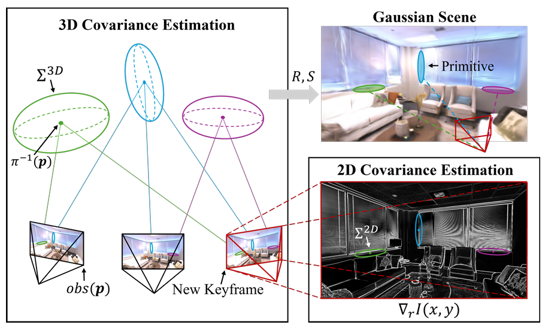

]

---

# Method

### Gaussian Splat Initialization: 2D Covariance 추정

- Image intensity가 Gaussian distribution을 따른다고 가정:

$$I(x, y) = \frac{1}{2\pi |\Sigma_{2D}|^{1/2}} \exp\left( -\frac{1}{2} (\mathbf{r} - \mathbf{p})^\top (\Sigma_{2D})^{-1} (\mathbf{r} - \mathbf{p}) \right) \tag{9}$$

  - $\mathbf{r} = [x, y]^\top$: image 좌표
  - $\mathbf{p} = [p_x, p_y]^\top$: distribution의 center

- Log-probability의 gradient를 계산:

$$\nabla_{\mathbf{r}} \log I(x, y) = -\alpha (\Sigma_{2D})^{-1} (\mathbf{r} - \mathbf{p}) \tag{10}$$

  - $\alpha$: scaling factor

- 다양한 $\mathbf{r}$에 대해 이 식을 세우고, **least-squares**로 $\Sigma_{2D}$를 추정

---

# Method

### Gaussian Splat Initialization: 2D → 3D Covariance

- 동일한 3D point가 여러 keyframe $\text{obs}(\mathbf{p})$에서 관측됨
- 각 keyframe $i$에서의 2D covariance $\Sigma_i^{2D}$는 하나의 3D covariance $\Sigma_{3D}$에 대응

- 2D-3D covariance 관계 (EWA Splatting):

$$\Sigma_i^{2D} = J_i W_i \Sigma_{3D} W_i^\top J_i^\top, \quad i \in \text{obs}(\mathbf{p}) \tag{11}$$

  - $J$: 3D point → image plane의 Jacobian matrix
  - $W$: world → camera 좌표 변환

- 모든 observation의 방정식을 선형화하여 **least-squares**로 $\Sigma_{3D}$ 추정

---

# Method

### Gaussian Splat Initialization: Covariance 보정

- Closed-form 해로 얻은 covariance가 유효한 covariance matrix의 조건을 만족하지 못할 수 있음
  - Covariance matrix는 **symmetric positive semi-definite**이어야 함

- 보정 전략:

$$\tilde{\Sigma}_{3D} = \begin{cases} \Sigma_{3D} + \epsilon \mathbf{I} & \text{(Regularization)} \\ U \tilde{\Lambda} U^\top & \text{(Eigenvalue clipping)} \end{cases} \tag{12}$$

  - $\epsilon > 0$: 작은 상수
  - $U$: $\Sigma_{3D}$의 eigenvector matrix
  - $\tilde{\Lambda} = \text{diag}(\max(\lambda_i, \epsilon))$: 음의 eigenvalue를 clip

- Eigen-decomposition으로 최종 파라미터 추출:
  - Eigenvector matrix → **Rotation matrix** $R$
  - Eigenvalue의 대각 행렬 → **Scaling matrix** $S$ (최소 eigenvalue를 0으로 설정 → 2DGS)
  - $\alpha$: $S$의 최대 원소로 나눈 preset 값으로 정의하여 regularize

---

# Method

### SLAM Framework: Localization & M-step

1. **새 frame 도착 시**: Eq. (2)의 energy function으로 two-frame direct image alignment → pose 추정

2. **Keyframe 선택**: FOV 변화, translation, exposure time 기반
   - 새 keyframe이 선택되면 sliding window에 추가

3. **Local BA (M-step)**:
   - Camera pose, affine brightness parameter, inverse depth, camera intrinsic 최적화
   - 이것이 EM의 **M-step**에 해당

4. **Depth Regularization**:
   - Keyframe의 sparse depth map + 이전 E-step에서 업데이트된 2DGS rendered depth map
   - 두 depth의 **평균**을 초기 depth estimate로 사용
   - Dense reconstruction의 이점을 활용하면서 DSO-derived depth의 신뢰성 보존
   - 이후 Eq. (3)으로 camera pose와 semi-dense depth map을 최적화

---

# Method

### SLAM Framework: E-step Optimization

- Main thread가 tracking과 keyframe 선택을 처리하는 동안, **2DGS scene optimization은 병렬 thread**에서 실행

- 새 keyframe이 선택될 때마다:
  1. **Gaussian Splat Initialization** (Sec. III-C)으로 새 Gaussian splat의 초기 형태 정의
  2. Reconstructed scene에 삽입
  3. 원본 GS의 **densification** 기법도 추가로 적용하여 finer detail 개선

- **Windowed refinement**:
  - 최근 추가된 keyframe을 우선적으로 최적화
  - Active window가 충분히 학습되면, 추가 keyframe을 샘플링하여 다양한 viewpoint 반영

- **Real-time 성능 보장**:
  - E-step이 별도 thread에서 지속적으로 scene Gaussian을 refine
  - Front-end는 real-time으로 유지

---

# Experiments
.pull-left[
  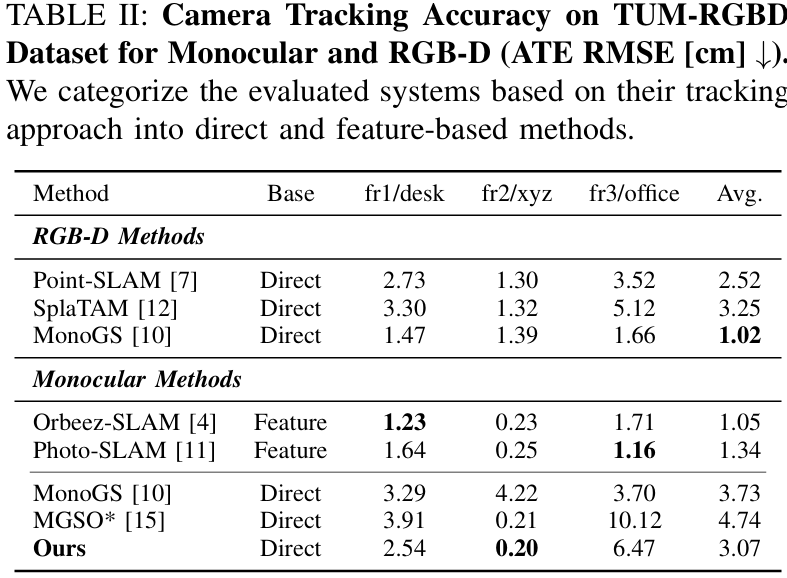
]

.pull-right[
  
]

---

# Experiments

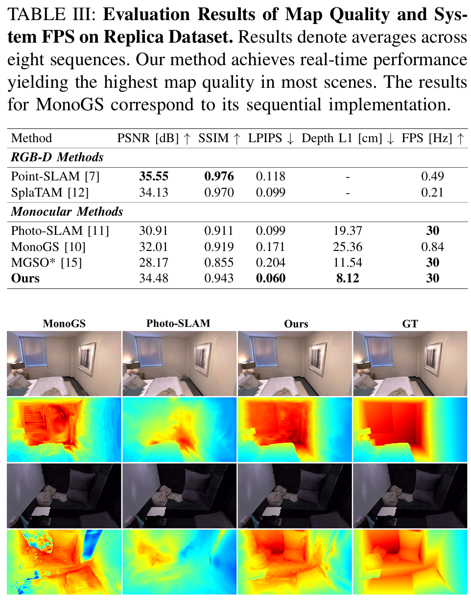
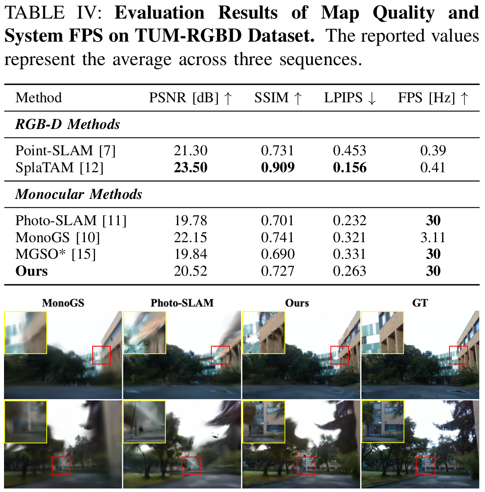

---


# Experiments

### Real-world & Scalability

.pull-left[
**Self-captured Dataset (Quadrupedal Robot)**:
- 상당한 camera motion jitter에도 불구하고 우수한 map reconstruction quality

.center[
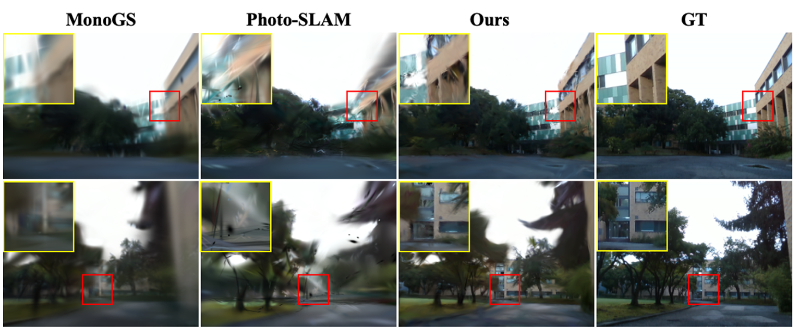
]
]

.pull-right[
**Large-scale INS Dataset**:

.center[
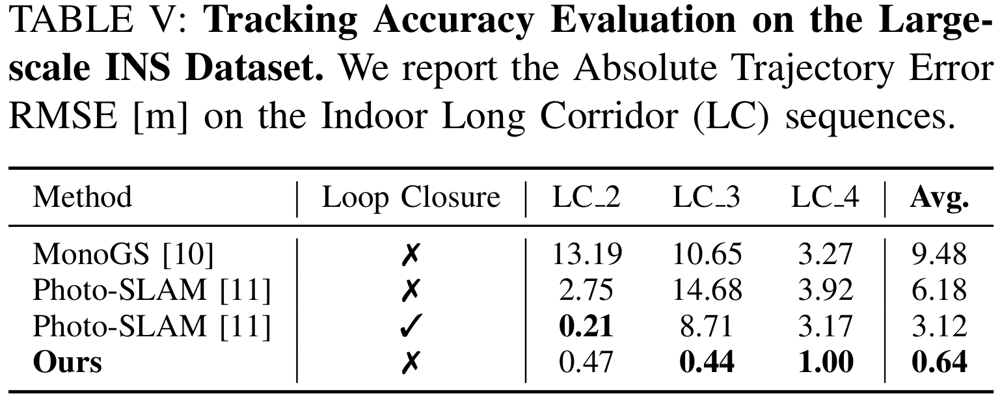
]

- Pure VO로 MonoGS보다 높은 정확도
- Photo-SLAM (Loop Closure 있음)보다 LC_3, LC_4에서 우수
- **Loop Closing 없이도** 누적 drift 최소화
- PSNR: 23.11 dB vs MonoGS 16.76 / Photo-SLAM 17.62
]

---

# Experiments

### Runtime Analysis

.center[
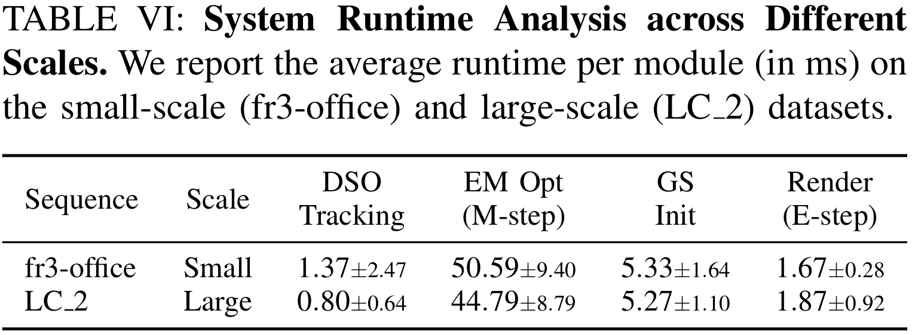
]

- Tracking: 항상 low latency (local keyframe 기반)
- M-step: windowed optimization → scene scale에 무관하게 **일정한 복잡도**
- 카메라 모션이 runtime에 더 큰 영향 (handheld > smooth trajectory)
- GPU memory: Small 2.8GB / Large 5.8GB

---

# Experiments

### Ablation Study: Gaussian Splat Initialization

.center[
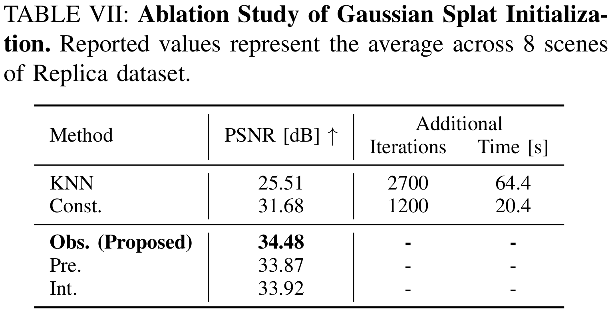
]

- **KNN 기반**: 기존 GS/Photo-SLAM 방식, PSNR 25.51, 추가 2700 iter (64.4s) 필요
- **Constant (Isotropic)**: PSNR 31.68, 추가 1200 iter (20.4s) 필요
- **Obs (제안)**: PSNR **34.48**, 추가 iteration/시간 불필요
- Image structural information을 활용하는 것이 geometric distribution만 사용하는 것보다 효과적

---

# Experiments

### Ablation Study: Joint Optimization

.center[
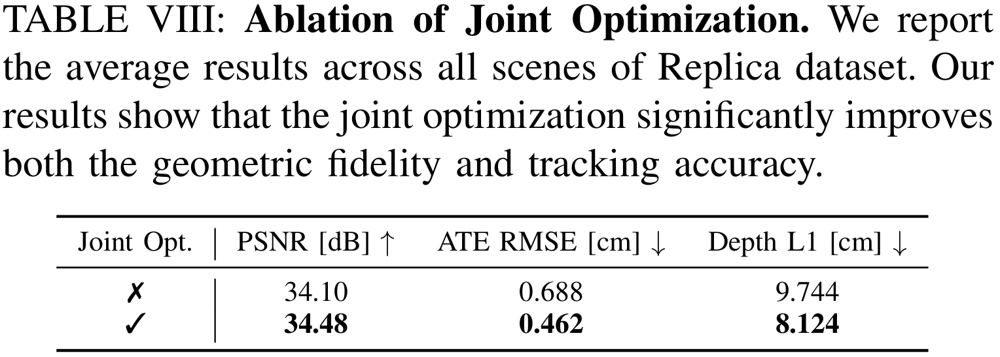
]

- Joint Optimization 없이 (naive coupling): PSNR 34.10, ATE 0.688, Depth L1 9.744
- Joint Optimization 적용: PSNR **34.48**, ATE **0.462**, Depth L1 **8.124**
- Scene geometry가 제대로 공유되면 tracking과 mapping **모두 개선**

---

# Experiments

### Failure Cases

.center[
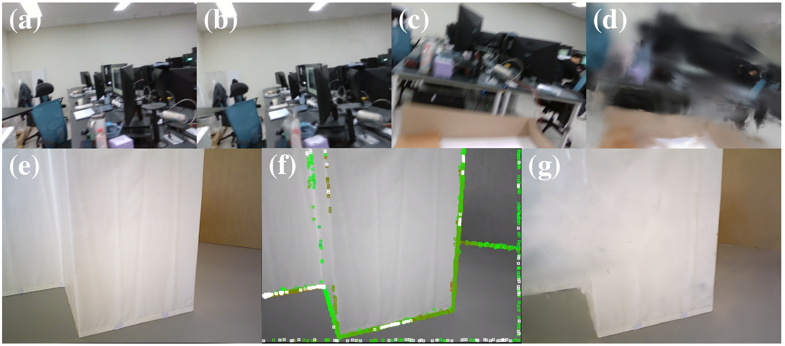
]

- **(a, b)**: 안정적인 motion → robust
- **(c, d)**: 심한 motion blur → photometric consistency 위반 → tracking drift → geometric distortions
- **(e, f, g)**: Textureless region (흰 벽) → image gradient 부족 → sampling 불가 → 불완전한 geometry
  - 그럼에도 제안된 initialization은 PSNR 25.51로 Constant (22.27), KNN (25.23) 대비 우수

---

# Conclusion

1. **Bidirectional Coupling**: VO와 GS를 seamless하게 통합
   - 추가 연산 비용 없이 tracking과 mapping 성능 모두 향상

2. **EM Framework**: Joint optimization을 EM으로 정식화
   - E-step: $\mathcal{G}$를 MAP로 추정 (RGB + Depth + Normal loss)
   - M-step: $(P, D)$를 BA + Depth Regularization으로 최적화

3. **Gaussian Splat Initialization**: DSO의 image gradient 재활용
   - 2D covariance → 3D covariance 추정 → clipping으로 보정
   - 기존방식 초기화 대비 수렴 가속화 및 reconstruction quality 향상

4. **성능**: Real-time (30 FPS)으로 SOTA 수준의 photometric/geometric fidelity 및 tracking accuracy 달성
 