---
# xaringan::inf_mr('Paper_review/2026 (arXiv) RGS-SLAM/RGS_SLAM_presentation.Rmd')
# pagedown::chrome_print('Paper_review/2026 (arXiv) RGS-SLAM/RGS_SLAM_presentation.html')
title: "ㄴ"
subtitle: "2026 (arXiv)"
author: |
  Wei-Tse Cheng, Yen-Jen Chiou, Yuan-Fu Yang∗
  National Yang Ming Chiao Tung University
date: 2026.01.16

output:
  xaringan::moon_reader:
    lib_dir: libs
    nature:
      highlightStyle: github  
      highlightLines: true
      countIncrementalSlides: false
      ratio: '16:9'
---

```{r setup, include=FALSE}
knitr::opts_chunk$set(echo = FALSE, warning = FALSE, message = FALSE)
```

```{css, echo=FALSE}
.title-slide .remark-slide-number {
  display: none;
}

.contents-list {
  font-size: 30px;
  font-family: 'Trebuchet MS', sans-serif;
  line-height: 1.5;
}

.main-text {
  font-size: 30px;
  font-family: 'Trebuchet MS', sans-serif;
  line-height: 1.5;
}

.remark-slide-content ul {
  font-size: 20px;
}

.remark-slide-content ul ul {
  font-size: 18px;
}

.remark-slide-content ul ul ul {
  font-size: 15px;
}

.remark-slide-number {
  font-size: 16px;
  bottom: 40px;
  right: 10px;
}

.remark-slide-content:not(.title-slide)::before {
  content: "";
  position: absolute;
  bottom: 8px;
  right: 10px;
  width: 80px;
  height: 30px;
  background: url('fig/lab_logo.jpg') no-repeat center;
  background-size: contain;
}

.bottom-center-img {
  position: absolute;
  bottom: 60px;
  left: 50%;
  transform: translateX(-50%);
  max-width: 80%;
}

.bottom-right-img {
  position: absolute;
  bottom: 60px;
  right: 20px;
  max-width: 40%;
}

.pull-left, .pull-right {
  width: 48%;
}

.pull-left {
  margin-top: 30px;
}

.pull-left img, .pull-right img {
  display: block;
  width: 100%;
}

.caption-left {
  position: absolute;
  bottom: 50px;
  left: 25%;
  transform: translateX(-50%);
  font-size: 16px;
  font-style: italic;
}

.caption-right {
  position: absolute;
  bottom: 50px;
  right: 25%;
  transform: translateX(50%);
  font-size: 16px;
  font-style: italic;
}

/* .title-slide::after {
  content: "Computer Vision and Robotics Laboratory, Minsu Kim";
  position: absolute;
  bottom: 30px;
  left: 50%;
  transform: translateX(-50%);
  font-size: 22px;
  color: #ffffff;
  font-weight: bold;
} */
```

<!-- class: title-slide
count: false -->
# Contents

.contents-list[
1. Introduction
2. Method
3. Experiments
4. Conclusion
]

---
# Introduction

.pull-left[
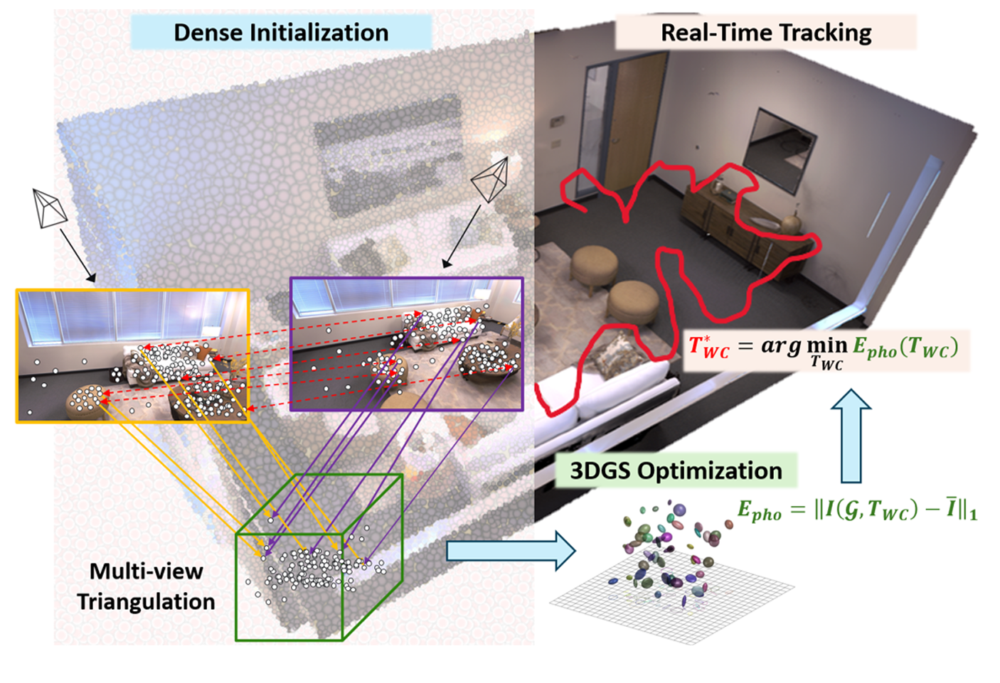
]

.pull-right[
- 3D Gaussian Splatting(3DGS)의 발전으로 고품질 뷰 합성과 실시간 매핑이 가능
  - 하지만 대부분의 파이프라인은 여전히 잔차(residual)에 기반한 밀집화(densification) 에 의존
      - 이는 오차가 감지될 때마다 Gaussian을 반복적으로 생성하거나 병합하는 방식

- 이 방식은 결국 최적화 하고자 하는 scene의 최종목표를 계속 바꾸는 것으로 이해할 수 있음
  - Gaussian이 계속 사라지거나, 추가되거나, 변형됨

- 그러면 처음부터 잘하자!
  - RGS-SLAM: Robust Gaussian Splatting SLAM with One-Shot Dense Initialization
  - 단일 프레임에서 고밀도 Gaussian을 초기화하여 SLAM의 견고성과 효율성을 향상
]


---
# Introduction

- 즉, Keyframe에서 한번에 Gaussian을 생성
- 생성한 Gaussian은 꽤나 정확하다고 생각
    - Gaussian의 개수는 고정 후, 나머지 mean, covariance, color, opacity등은 최적화
    - MCMC....?

- 이 방식을 Monocular camera SLAM에 적용해보니 괜찮더라
    - 초기값이 정확하기 때문에 쓸만한 지도를 생성하는데까지 시간 단축
    - 당연히 pose 추정도 더 안정적
    - 기존 MonoGS 파이프라인에서, densification 단계만 feature matching으로 대체함
---
# Method
### RGS-SLAM pipeline

<div style="position:absolute; left:50%; top:185px; transform:translateX(-50%); width:80%;">
  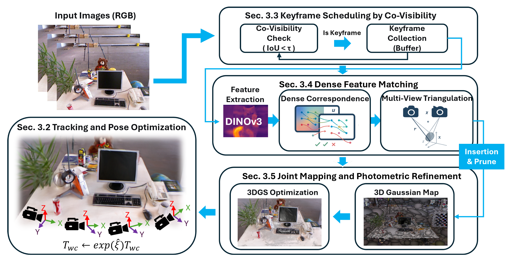
</div>

---
# Method

### 1. Gaussian Splatting representaion
- Anisotropic Gaussian은 mean, covariance, color, opacity, 를 가짐

$$
G = \{G_i\},\quad
G_i = \left(\mathbf{c}_i,\, \alpha_i,\, \boldsymbol{\mu}_i^{W},\, \mathbf{\Sigma}_i^{W}\right),\quad
\mathbf{c}_i \in \mathbb{R}^3,\ \alpha_i \in [0,1],\ \boldsymbol{\mu}_i^{W} \in \mathbb{R}^3,\ \mathbf{\Sigma}_i^{W} \in \mathbb{R}^{3\times 3},\ \mathbf{\Sigma}_i^{W} \succ 0.
$$

- 현재 카메라 pose(world-to-camera)
     $$T_{WC} = [\mathbf{R}\mid \mathbf{t}]$$ 
- 3D Gaussian $\mathcal{N}(\boldsymbol{\mu}_i^{W}, \mathbf{\Sigma}_i^{W})$를 투영하면 이미지 평면의 2D Gaussian을 얻음

$$\boldsymbol{\mu}_i^{I} = \pi\!\left( T_{WC}\, \boldsymbol{\mu}_i^{W} \right),\qquad
\mathbf{\Sigma}_i^{I} = \mathbf{J}_i\, \mathbf{R}\, \mathbf{\Sigma}_i^{W}\, \mathbf{R}^{\mathsf{T}}\, \mathbf{J}_i^{\mathsf{T}}$$

- 픽셀 $p$의 색은 alpha blending으로 계산

$$C_p = \sum_{i\in \mathcal{N}(p)} \mathbf{c}_i\,\alpha_i\, \prod_{j=1}^{i-1}\left(1-\alpha_j\right)$$


---
# Method
### 2. Tracking and Camera Pose Optimization

- Objective per frame update
    - 매 이미지 frame마다 camera pose $T_{WC}$를 추정
    - 랜더링된 이미지가 관측이미지(GT)와 최대한 비슷하도록 $T_{WC}$를 업데이트

- 렌더링 이미지(예측)와 관측 이미지(GT)와의 Photometric error
    $$E_{\mathrm{pho}} = \left\| I(\mathcal{G}, T_{WC}) - \bar{I} \right\|_{1}$$
    - 여기서, 기존의 방식처럼 photometric error를 그대로 쓰면 noise에 대응하기 어려움
    - affine brightness model을 도입하여 조명 변화에 대응
- 보정을 위한 gain과 bias 도입 
      $$\left(g_I, b_I\right) = \arg\min_{g,\,b} \sum_{x \in \Omega_I} \left( I(x) - g\,\hat{I}\left(x; \mathcal{G}, T_{WC}\right) - b \right)^2$$
    
---
# Method
- 매 frame마다 gain과 bias를 도입해서 이미지 보정

  $$\tilde{I}\left(x; \mathcal{G}, T_{WC}\right) = g_I\, \hat{I}\left(x; \mathcal{G}, T_{WC}\right) + b_I$$

- 다만, sequential한 이미지 특성상 rendered image와 observed image의 차이가 클 수 있음
  - 따라서, pixel마다 weight를 계산할 수 있도록 함
    $$w_I(x) = w_{\alpha}(x)\, w_{\nabla}(x)$$
    $$w_{\alpha}(x) = \operatorname{clip}\!\left(\frac{\hat{\alpha}(x)}{\tau_{\alpha}},\, 0,\, 1\right)$$
    $$w_{\nabla}(x) = \operatorname{clip}\!\left(\frac{\left\|\nabla I(x)\right\|_2}{\tau_{\nabla}},\, 0,\, 1\right)$$

- 따라서, 최종 tracking loss는 다음과 같음
  $$\mathcal{L}_{\mathrm{track}}\left(T_{WC}\right) = \sum_{x\in\Omega_I} w_I(x)\,\left\| I(x) - \tilde{I}\left(x; \mathcal{G}, T_{WC}\right) \right\|_{1}$$

---
# Method
- Minimal Pose Jacobians on SE(3) for Pose update

$$T_{WC} \leftarrow \exp\!\left(\hat{\xi}\right)\, T_{WC}$$

- Pose $\xi\in\mathfrak{se}(3)$에 대한 mean/cov Jacobian
  - $[\cdot]_\times$: skew-symmetric matrix

$$\frac{\partial \boldsymbol{\mu}^{C}}{\partial \xi} = \big[\,\mathbf{I}\;\; -[\boldsymbol{\mu}^{C}]_{\times}\,\big]$$

$$\frac{\partial \boldsymbol{\mu}^{I}}{\partial \xi} = \mathbf{J}_{\pi}(\boldsymbol{\mu}^{C})\,\big[\,\mathbf{I}\;\; -[\boldsymbol{\mu}^{C}]_{\times}\,\big]$$

$$\frac{\partial \mathbf{\Sigma}^{I}}{\partial \xi}
= \frac{\partial \mathbf{\Sigma}^{I}}{\partial \mathbf{J}}\,\frac{\partial \mathbf{J}}{\partial \boldsymbol{\mu}^{C}}\,\frac{\partial \boldsymbol{\mu}^{C}}{\partial \xi}
\; +\; \frac{\partial \mathbf{\Sigma}^{I}}{\partial \mathbf{R}}\,\frac{\partial \mathbf{R}}{\partial \xi}$$

- 즉, Pose refinement를 하면서 gaussian도 어떻게 움직이고, 어떻게 변형되어야 하는지 수학적으로 계산
    - analytic하게 구할 수 있기 때문에, 기존 autodiff방식들 overhead가 없음, 빠르다!
---
# Method
### 3. Keyframe Scheduling by Co-Visibility

- 마지막으로 채택된 keyframe $I_{k^\star}$와 현재 frame $I_k$의 **co-visibility**를 비교
- visible Gaussian 집합 $V(I)$를 정의 (screen-space opacity가 임계값을 넘는 Gaussian)

$$\mathrm{IoU}(I_k, I_{k^\star})=
\frac{\left| V(I_k) \cap V(I_{k^\star}) \right|}{\left| V(I_k) \cup V(I_{k^\star}) \right|}$$

- **Keyframe 생성 조건**: $\operatorname{IoU}(I_k, I_{k^\star}) < \tau$ 이고, inter-view parallax가 충분히 클 때
- 채택된 keyframe은 bounded buffer $\mathcal{B}$에 저장 → multi-view initialization에서 이웃(neighbors) 제공

---
# Method

### 4. Dense Feature Matching


- **Dense correspondence**는 DINO v3로 추츨한 feature 사용
  - viewpoint의 변화가 크거나, textureless 환경에서도 robust한 매칭 가능
- 를 위해, 현재 keyframe과 이웃한 K개의 keyframe을 선택
    - K개의 이웃 keyframe 집합 $\mathcal{N}_r$, 전체 Keyframe buffer $\mathcal{B}$
    $$\mathcal{N}_r \subset \mathcal{B}$$

- 기준이 되는 image $I_r$ 에서의 pixel이 이웃한 이미지 $I_n$ 로의 변위벡터 $\mathbf{u}$를 구함
- 즉, 각 픽셀 $p$는 다음과 같은 pair로 표현
$$(p,\, p + \mathbf{u}_{r\rightarrow n}(p))$$ 


---
# Method
- 이 매칭된 포인트가 모두 정확하지는 않으니, epipolar test, blue-noise thinning등의 후처리
    - Epipolar test로 outlier를 제거하고, blue-noise thinning으로 평면과 같이 굳이 dense한 매칭이 필요없는 부분에서의 포인트 수를 줄임

- 또한, 각 매칭된 feature에 대해 confidence score $\kappa_{r \to n}(p)$를 계산
    - 이웃한 image는 $\mathcal{N}_r$ 5장으로 고정, 전체 keyframe buffer $\mathcal{B}$는 최대 12개
    
$$\bar{\kappa}(p) = \frac{1}{\left| \mathcal{N}_r \right|} \sum_{n \in \mathcal{N}_r} \kappa_{r \to n}(p), 
      \kappa_{r \to n}(p) \in [0, 1]$$

- **Multi-view triangulation**은 전통적인 DLT 알고리즘을 사용
    - view가 5개니, 그 중 small parallex, Large reprojection error를 갖는 view는 제외
    - 남은 view 중 reprojection error가 가장 낮은 view를 고르고, 비슷하다면 baseline이 큰 view를 선택
---
# Method

 
**Gaussian Initialization** : Triangulation된 점을 **Surface-aligned Anisotropic Ellipsoid**로 초기화

- **Mean ($\mu_i^W$)**: Multi-view Triangulation으로 구한 3D 좌표 $\hat{X}(p)$
- **Rotation ($U_i$)**: 주변 점들과의 Plane Fitting으로 법선($\mathbf{v}$) 추출 $\rightarrow$ Surface-aligned
    - plane fitting : 일정 반경(radius) 내의 이웃 점들로부터 centroid 구하고, Covariance matrix 구한 뒤 SVD 수행
    - $U_i = [\mathbf{t}_1, \mathbf{t}_2, \mathbf{v}]$ (Tangents + Normal)
- **Scale ($\Sigma_i^W$)**: back-projection된 2D Gaussian의 크기와 형태로부터 결정 (one-pixel image uncertainty)
    - $\Sigma_i^W = U_i \operatorname{diag}(s_{\perp}^2, s_{\perp}^2, s_{\parallel}^2) U_i^\top$, where $s_{\parallel} > s_{\perp}$
    - $\Sigma^W = R \Sigma R^\top$
- **Color ($c_i$)**: 여러 View의 픽셀값 중 **Median** 사용 (Outlier 제거)
- **Opacity ($\alpha_i$)**: 매칭 신뢰도($\bar{\kappa}$)를 기반으로 초기화 $\alpha_i \propto \bar{\kappa}(p)$
---
# Method
### 5.Joint Mapping and Photometric Refinement 
 **Insertion, Lightweight Merging, and Pruning**
 - 일단 initialization된 Gaussian들은 고정된 개수로 유지하는데, 추가는 안해도 삭제는 함
   - 관측 횟수가 너무 적거나($m_i < m_{\min}$), 가시성이 너무 안좋거나(view에 안들어오거나 가려지거나)($v_i < v_{\min}$), 
   - 크기가 너무 커서 화면을 다 가리거나($\operatorname{tr}(\Sigma_i^W) > \sigma_{\max}^2$), 
   너무 투명해서 거의 안보일 때 ($\alpha_i < \alpha_{\min}$)
   - 또는, 너무 겹치거나 비슷한 Gaussian은 merge

**Sliding-Window Photometric Refinement** 
 - Keyframe과 Gaussian 동시에 최적화
 $$\mathcal{L} = \sum_{I \in \mathcal{W}} \lambda_{\text{pho}} \| g_I \mathcal{S}(\mathcal{G}, T_{WC}) + b_I - \bar{I} \|_1 + \mathcal{R}$$

 - Regularizer를 추가; neddle이 되거나, 애매한 opacity 가진것들을 방지하고, 초기화된 위치에서 벗어나지 않도록
 $$\mathcal{R} = \lambda_{\text{iso}} \sum_i \left\| \Sigma_i^W - \frac{\text{tr}(\Sigma_i^W)}{3} I_3 \right\|_F + \lambda_{\alpha} \sum_i \psi(\alpha_i) + \lambda_{\mu} \sum_i \| \mu_i^W - \bar{\mu}_i^W \|_2^2$$
---
# Experiments

**Hardware**
- GPUs: 2 × NVIDIA L40
- CPU: Intel Xeon Platinum 8362 @ 2.80 GHz (32 cores / 64 threads) :contentReference[oaicite:0]{index=0}
- System memory: 128 GB RAM or higher recommended
- Storage: At least 200 GB free disk space for datasets, checkpoints, and rendered results

---
# Experiments

.pull-left[
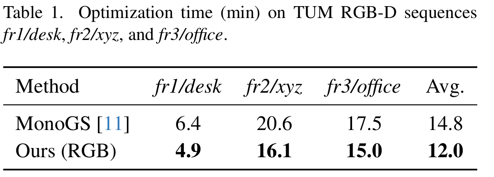
]
<div style="position:absolute; right:20px; top:80px; width:45%;">
  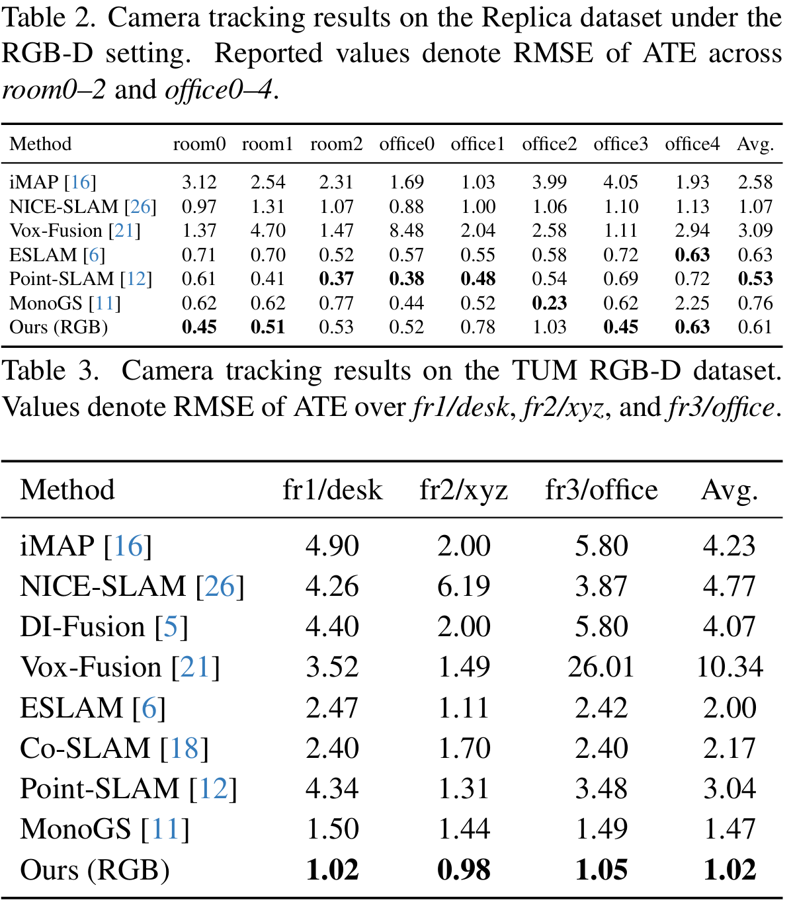
</div>

---
# Experiments

<div style="position:absolute; left:50%; top:140px; transform:translateX(-50%); width:80%; text-align:center;">
  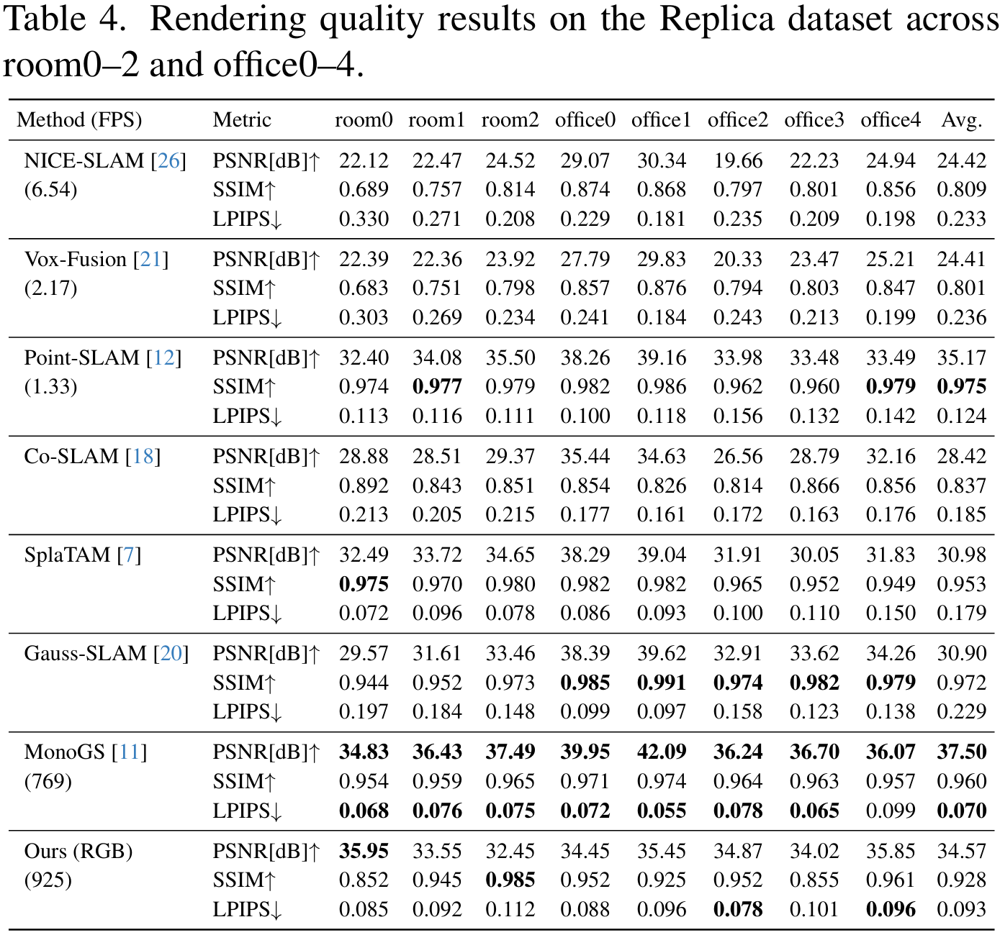
</div>

---
# Experiments

<div style="position:absolute; left:50%; top:140px; transform:translateX(-50%); width:80%; text-align:center;">
  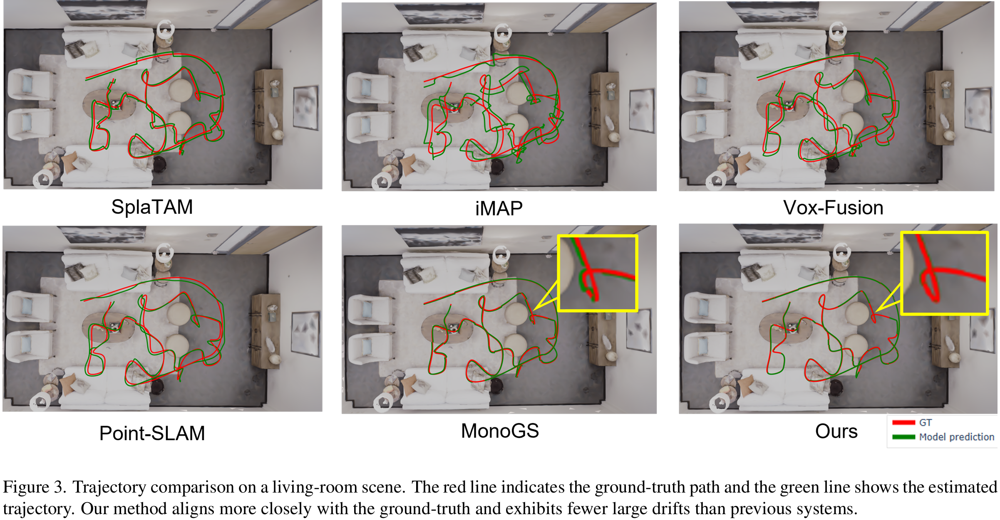
</div>

---
# Experiments

<div style="position:absolute; left:50%; top:140px; transform:translateX(-50%); width:80%; text-align:center;">
  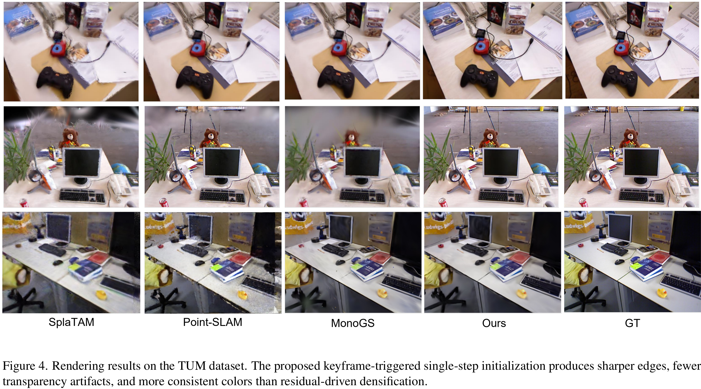
</div>

---
# Experiments

<div style="position:absolute; left:20px; top:130px; width:48%;">
  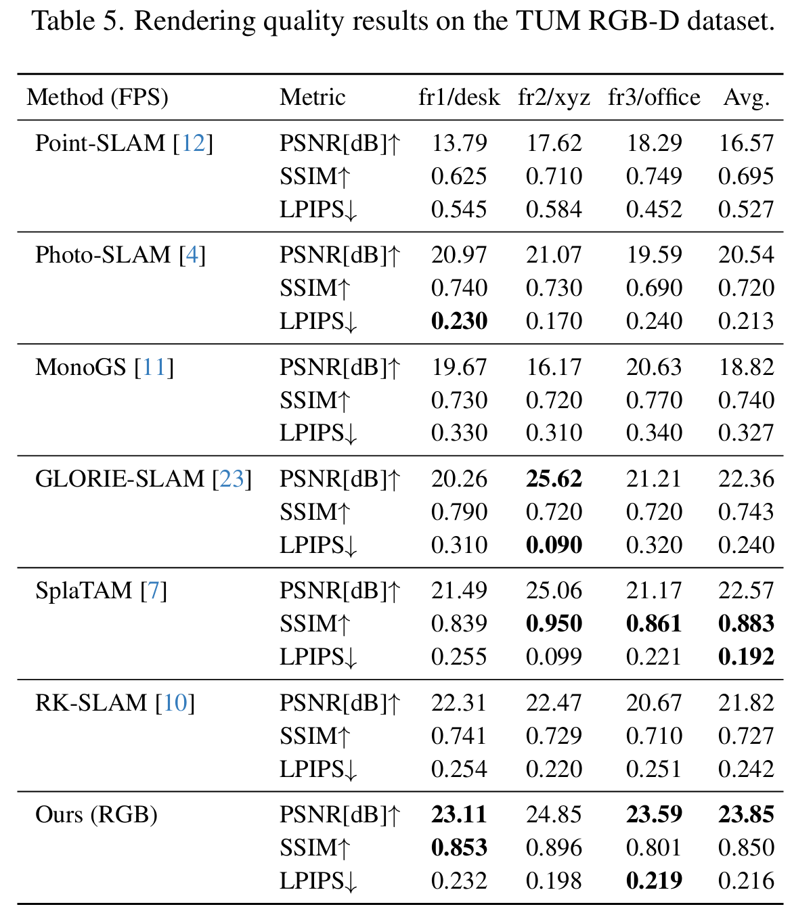
</div>

<div style="position:absolute; right:20px; top:10px; width:45%;">
  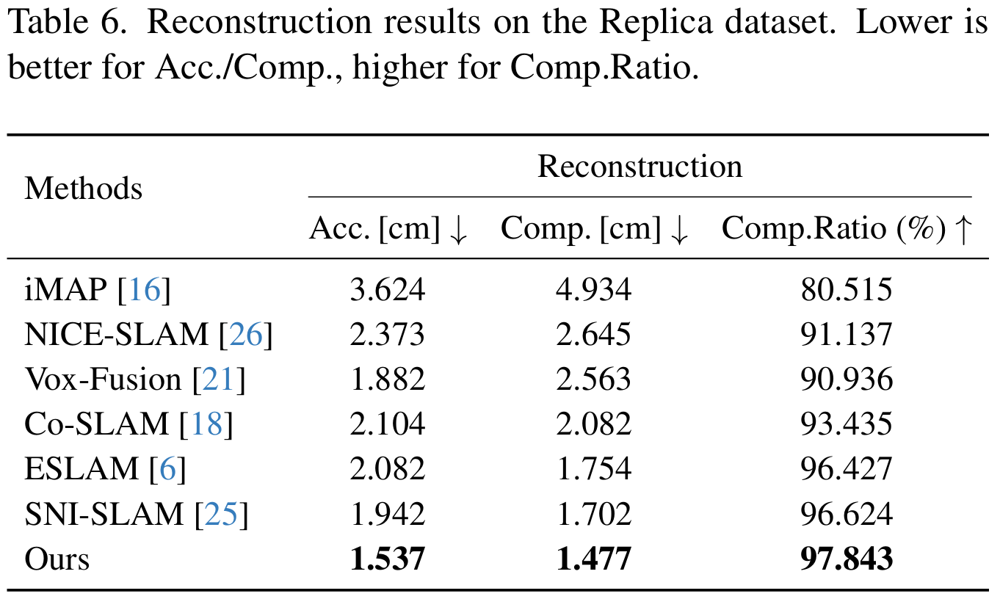
</div>

<div style="position:absolute; right:20px; top:280px; width:45%;">
  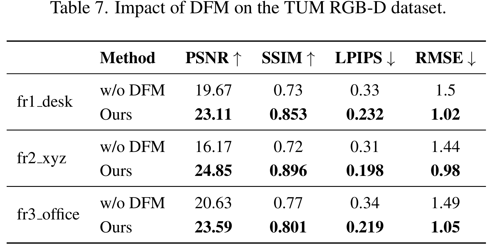
</div>

<div style="position:absolute; right:20px; top:470px; width:45%;">
  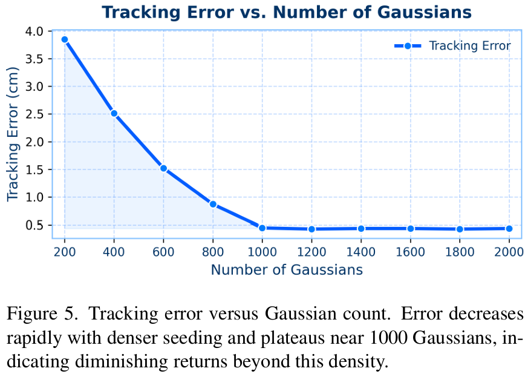
</div>


---
# Conclusion 

- RGS-SLAM: Robust Gaussian Splatting SLAM with One-Shot Dense Initialization
  - 단일 프레임에서 고밀도 Gaussian을 초기화하여 SLAM의 견고성과 효율성을 향상

- 기존의 residual 기반 densification 단계를 feature matching으로 대체

- feature는 DINO v3로 추출한 dense feature를 사용
  - DINO V3라서 가능한 방식이었던 것 같음
  - Real-time performance가 나올까?

- large-scale로 가져가려면 어떻게 해야할까?
